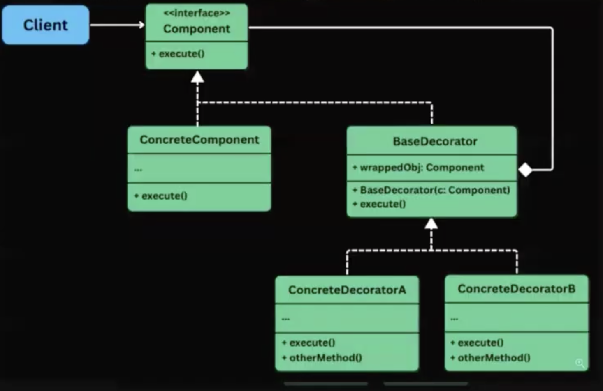

# Design Chat Application

## 1-Requirements

1. User 
    - Create a user
2. One-to-One Chat
    - Send and receive messages
3. Group Chat
    - Create group chat
    - Add and remove members
    - Send and receive messages in a group
4. Message
    - Text message
    - Timestamps
    - React on messages    👍 😂 ✌️ (critical and tricky part not much asked)
5. Online Status
    - Show whether a user is online and offline

## 2- Different Entities we can think of

1. Users
2. Messages
3. Groups
4. Reactions
5. Chat
   - Two Types - 1. One-One and 2. Group Chat

## 3- UML Diagram for the above part


## 4- Design Chat Application
----------

>[!NOTE]
> <span style="color:brown">**What is the similarity between one to one chat and group chat**</span>
>
>  Message Sending Mechanism, Broadcasting part (in one to one just braodcasting to that person and in group we are broadcasting to all members)


#### <span style="color:orange">**STEP 1**</span> 
----------

First made `User.ts` as that is the easiest kickoff and independent entity

> In the meantime we have also made `utils.ts` (<span style="color:orange">**Just a helper file consisting of some functions that are helpful like generating Random ID**</span>)

#### <span style="color:orange">**STEP 2**</span>
----------

Next will be `Chat.ts` 


Now inside the `Chat.ts`, a very important question arises 

:bulb: <span style="color:brown">**What do you think, should we make two seperate class for One-One Chat and Group Chat or `Chat.ts` can singly handle both the logic ?**</span>

=>   You might think that `Chat.ts` can handle both the logic as we just have to broadcast the message only, just limit the members count = 2 for one to one chat and the moment it exceeds 2 it will become group chat and broadcasting the message will work fine as there are 2 members only in one to one so the broadcasting simply means exactly same as sending the message to other person and case of group chat is already clear

<span style="color:brown">**BUT**</span>

**You forgot some problems that will come with this**

1. In one to one chat, you will end up adding lot of members even
2. In Group chats, we can remove some members also so even if you write some method named as `removeMemebers` in one to one what you will remove ?
3. How you come to know in whatsapp that this Group chat and this is one to one chat
   - Using <span style="color:orange">**NAME**</span> (Groups have some NAME) and one to one have primarily contact number being shown (unless you save that number with some name)


>[!NOTE]
> As class `Chat` has properties and methods which are common to both `OneToOneChat` and `GroupChat` so <span style="color:orange">**making `Chat` class ABSTRACT class**</span> and then <span style="color:orange">**Inheriting the common properties and method to the child class (Onetoone and Group)**</span> is a better way to implement them

```javascript
import {OneToOneChat } from "./src/chat/chat"; 
import { User } from "./src/users/users"; 
import { generateUUID } from "./src/util";

const harshit = new User(generateUID(), "harshit", "99777");
const rahul = new User(generateUUID(), "rahul", "99777");
const aditya = new User(generateUUID(), "aditya", "99777");
const harshit_rahul_11_chat = new OneToOneChat(harshit, rahul);

console.log(harshit_rahul_11_chat.getChatName(harshit));  // Output -> rahul (as it is one to one chat and except harshit, rahul is only 
// there)

const college_group = new GroupChat("college-2016-2020");

college_group.addGroupMemebers (harshit); 
college_group. addGroupMemebers (rahul);
college_group. addGroupMemebers (aditya);

console. log (college_group.getChatName(harshit));  // Output -> college-2016-20202
```

Now  you do the above code in `Server.ts` file just to check whether one to one chat and group chat logic is working or not ?

#### <span style="color:orange">**STEP 3**</span>

----------

Now comes the `message.ts` file

:bulb: <span style="color:brown">**How we are going to implement Seen status ?**</span>

-> Creating a Map which will have Key as Userid (string) and Value as Seen (boolean).

Basically you will store all the userID who have seen the message, the person who are absent from the map simply means they have not seen the message, Its that simple

#### <span style="color:orange">**STEP 5**</span>
----------

Now comes the part `chatService.ts`

This will have all that broadcasting logic of messages

:sparkle: See the below code

```javascript

// Ideally we are making users like this and that too in server.ts file
// 1
const harshit = new User(generateUID(), "harshit", "99777");
const rahul = new User(generateUUID(), "rahul", "99777");
const aditya = new User(generateUUID(), "aditya", "99777");

// and chat like this in server.ts file
// 2
const college_group = new GroupChat("college-2016-2020");
const harshit_rahul_11_chat = new OneToOneChat(harshit, rahul);

```
Now we need a **Database** in practical life to store these Users name and Chats name (group names) but as currently we dont have that hence we are going to store then **InMemory** using `chatService.ts` file and then making <span style="color:green">**Two Maps, one for Users and another for Chats**</span>

<span style="color:brown">**also i dont want to create users and chat like the above part see `//1` and `//2`**</span> and hence i will create <span style="color:orange">**methods like `createUser`, `createOneToOneChat`, `createGroupChat`**</span>

:bulb: <span style="color:brown">**Can you find the limitation of the above approach ?**</span>

-> Though Singleton pattern (which we have implemented also) guarantees one instance only within the current JavaScript process. If the application runs on multiple servers or processes, each process will have its own ChatService instance. A production chat application would generally store users and chats in a shared database rather than relying only on in-memory maps.

Inside this we implemented 3 methods (createUse, groupChat, oneToOneChat) so that you just have to expose single instance

Basically now in `server.ts`

you just have to write this instead of all the above things you have written previously inside `server.ts` (see above code present in it)

```javascript
import {ChatService} from "./src/chatService/chatService"

const chatService = ChatService.getInstance();
const harshit = chatService.createUser("Harshit", "9977");
const rahul = chatService.createUser("Rahul", "6677");
const aditya = chatService.createUser("Aditya", "5566");

chatService.createOneOneChat(harshit, rahul);
chatService.createneOneChat (harshit, aditya);

const college_group = chatService. createGroupChat("college-2016-2020");

college_group.addGroupMemebers(harshit);
college_group.addGroupMemebers(rahul);
college_group.addGroupMemebers (aditya);

chatService.sendMessage( harshit.getId(),
college_group.getId(), "welcome to the group");
chatService.sendMessage(harshit.getId(), college_group.getId(), "how are you");
chatService.sendMessage(harshit.getId(), college_group.getId(), "byyebyee");


chatService.getHistory(college_group.getId());
```

You can clearly see, you dont have to write `new` and **also here all the things are getting saved also**

> <span style="color:orange">**TODO**</span> -> You have to implement how you will or someone else will reply on a particular message ?
>
> > Though a small part has been already done by implementing reaction on a particular chat in this codebase

### **All about DECORATOR Pattern**
----------

#### **Decorator Pattern - Beginner-Friendly Explanation**

The **Decorator Pattern** lets you <span style="color:orange">**attach extra behavior to an object without changing its original class.**</span> 

In our code:

* `Message` contains the original message content.
* `ReactionDecorator` wraps that message.
* The decorator returns the original content plus reaction information.

So:

```text
Original Message
"Hi, good morning"

After decoration
"Hi, good morning ❤️ 2, 👍 4"
```

The original `Message` class does not need to know how reactions are formatted.

#### **Simple real-world analogy**
----------

Imagine you order plain coffee.

```text
Coffee
```

You can decorate it with:

```text
Coffee + Milk
Coffee + Sugar
Coffee + Milk + Sugar
Coffee + Milk + Sugar + Cream
```

The coffee remains the base object. Each additional ingredient wraps the previous object and adds something new.

The same idea applies to messages:

```text
Message
Message + Reactions
Message + Reactions + Timestamp
Message + Reactions + Encryption
Message + Reactions + Translation
```

---

#### **The main problem Decorator solves**
----------

Suppose you used inheritance instead.

You might create:

```text
Message
ReactionMessage
TimestampMessage
EncryptedMessage
ReactionTimestampMessage
ReactionEncryptedMessage
ReactionTimestampEncryptedMessage
```

As optional features increase, the number of subclasses grows rapidly.

For three optional features, you may need combinations such as:

```text
MessageWithReaction
MessageWithTimestamp
MessageWithEncryption
MessageWithReactionAndTimestamp
MessageWithReactionAndEncryption
MessageWithTimestampAndEncryption
MessageWithReactionTimestampAndEncryption
```

This is called a <span style="color:green">**Subclass Explosion**</span>

Decorator avoids that by allowing objects to be combined at runtime:

```ts
const decoratedMessage =
  new EncryptionDecorator(
    new TimestampDecorator(
      new ReactionDecorator(message),
    ),
  );
```

You build only the combination you need.

#### **The four roles in the Decorator Pattern**
----------

Your implementation contains four main roles.

```text
Component interface
       ↑
 ┌─────┴──────────┐
Message      BaseDecorator
                    ↑
             ReactionDecorator
```

#### <span style="color:orange">**Role 1: Component interface**</span> 

Your code:

```ts
interface IDecorator {
  getContent(): string;
}
```

This defines the <span style="color:green">**Common Operation**</span> that both the original object and decorators must provide.

However, `IDecorator` is not the best name.

This interface represents the common **component**, not specifically a decorator. better name can be :-

```ts
interface MessageComponent {
  getContent(): string;
}
```

>[!IMPORTANT]
> 
> The original object and every decorator must implement the same interface.
> > That is what allows one decorator to wrap another decorator.

#### <span style="color:orange">**Role 2: Concrete component**</span> 

Your code:

```ts
export class Message implements IDecorator {
  // ...

  getContent(): string {
    return this.content;
  }
}
```

`Message` is the <span style="color:lightgreen">**Concrete Component**</span>(It is the original object that contains the basic behavior)

```ts
message.getContent();
```

returns:

```text
Hi, good morning
```
It does not know anything about reaction formatting.

#### <span style="color:orange">**Role 3: Base decorator**</span> 

Your code:

```ts
abstract class BaseDecorator implements IDecorator {
  constructor(protected message: IDecorator) {}

  abstract getContent(): string;
}
```
The base decorator stores another object implementing the same interface:

```ts
protected message: IDecorator
```

This is the <span style="color:red">**most important line**</span> in the pattern.

It means the decorator can wrap:

```ts
new Message(...)
```
or another decorator:

```ts
new TimestampDecorator(
  new ReactionDecorator(message),
);
```
>[!IMPORTANT]
> The decorator relationship has two properties:
>
> >```text
> > A decorator IS an IMessageContent
>> A decorator HAS an IMessageContent

In code:

```ts
class BaseDecorator implements IMessageContent
```

means:

```text
Decorator IS a component
```

And:

```ts
constructor(protected message: IMessageContent)
```

means:

```text
Decorator HAS a component
```

<span style="color:green">**This combination is the heart of the Decorator Pattern.**</span> 

>[!TIP]
> A base decorator by itself does nothing useful.

For example:

```javascript
const decorator = new BaseDecorator(message);
```
What should this return?

```js
decorator.getContent();
```

Should it add reactions? A timestamp? Encryption? Nothing?

There is no clear answer right ?

Therefore,<span style="color:orange">**we prevent developers from directly creating BaseDecorator objects by declaring it ABSTRACT CLASS**</span> 

This class exists only to provide common structure for child decorators. Do not instantiate it directly.

#### <span style="color:orange">**Role 4: Concrete decorator**</span> 

Your code:

```ts
export class ReactionDecoator extends BaseDecorator {
  private reactionList: Reaction[] = [];

  getContent(): string {
    return this.message.getContent() + " " + this.getReaction();
  }
}
```

`ReactionDecoator` is the concrete decorator.

It performs two steps:

1. Calls the wrapped object's original behavior.
2. Adds its own behavior.

```ts
this.message.getContent()
```

gets the original content.

Then:

```ts
+ " " + this.getReaction()
```

adds reaction information.

Conceptually:

```text
Decorator result = wrapped object result + extra behavior
```

#### **Execution flow in your code**

Consider this example:

```ts
const message = new Message(
  "m1",
  user,
  "Hi, good morning",
  chat,
);

const messageWithReactions = new ReactionDecoator(message);

messageWithReactions.addReaction("❤️", "user-1");
messageWithReactions.addReaction("❤️", "user-2");
messageWithReactions.addReaction("👍", "user-3");

console.log(messageWithReactions.getContent());
```

When this executes:

```ts
messageWithReactions.getContent();
```

the following call chain happens:

```text
ReactionDecorator.getContent()
        |
        | calls
        v
Message.getContent()
        |
        | returns
        v
"Hi, good morning"
        |
        | ReactionDecorator adds reaction summary
        v
"Hi, good morning ❤️ 2, 👍 1"
```

The original message object still returns only:

```ts
message.getContent();
```

```text
Hi, good morning
```

The decorator returns:

```ts
messageWithReactions.getContent();
```

```text
Hi, good morning ❤️ 2, 👍 1
```

The original object has not been modified.

<span style="color:red">**UNL of DECORATOR PATTERN**</span>




#### :bulb:**Why is the pattern being used here?**
----------

The intended reason is that reactions are an optional addition to message content. Not every use of a message necessarily needs reaction information.

For example:

```ts
const plainMessage = new Message(...);
```

A normal message:

```text
Hi, good morning
```

With reactions:

```ts
const reactedMessage = new ReactionDecorator(plainMessage);
```

```text
Hi, good morning ❤️ 2
```

Later, another optional decorator could be added:

```ts
const messageWithTimestamp =
  new TimestampDecorator(reactedMessage);
```

Result:

```text
Hi, good morning ❤️ 2 - 10:30 AM
```

The benefits are:

* `Message` stays focused on basic message responsibilities.
* Reaction display logic stays in a separate class.
* Optional behaviors can be added dynamically.
* Decorators can be combined.
* Existing message code does not have to be changed whenever a new display feature is added.

This follows the **Open-Closed Principle**:

> Classes should be open for extension but closed for modification.

You extend message behavior by adding a new decorator rather than editing `Message`.

---

#### **Stacking multiple decorators**

Decorator becomes especially useful when you have multiple optional features.

For example:

```ts
const originalMessage = new Message(...);

const reactedMessage =
  new ReactionDecorator(originalMessage);

const timestampedMessage =
  new TimestampDecorator(reactedMessage);

const encryptedMessage =
  new EncryptionDecorator(timestampedMessage);
```

The structure becomes:

```text
EncryptionDecorator
    wraps
TimestampDecorator
    wraps
ReactionDecorator
    wraps
Message
```

Calling:

```ts
encryptedMessage.getContent();
```

could result in:

```text
Encrypted(
  Hi, good morning ❤️ 2 - 10:30 AM
)
```

The call travels inward:

```text
EncryptionDecorator.getContent()
    -> TimestampDecorator.getContent()
        -> ReactionDecorator.getContent()
            -> Message.getContent()
```

The results then travel outward:

```text
Message returns content
ReactionDecorator adds reactions
TimestampDecorator adds time
EncryptionDecorator encrypts result
```

#### *Decorator order matters*

Look at these two combinations:

```ts
new EncryptionDecorator(
  new TimestampDecorator(message),
);
```

and:

```ts
new TimestampDecorator(
  new EncryptionDecorator(message),
);
```

They may produce different results.

First case:

```text
Encrypt("Hello - 10:30 AM")
```

Second case:

```text
Encrypt("Hello") - 10:30 AM
```

This is an important Decorator Pattern rule:

>[!IMPORTANT]
> The order in which decorators wrap objects can change the final behavior.

#### <span style="color:orange">**How to identify the Decorator Pattern in code ?**</span>

Look for these four signs.

#### <span style="color:orange">**Sign 1: A common interface**</span>

```ts
interface MessageComponent {
  getContent(): string;
}
```

Both the base object and decorator implement it.

#### <span style="color:orange">**Sign 2: A wrapper stores the same interface**</span> 

```ts
class MessageDecorator implements MessageComponent {
  constructor(
    protected wrapped: MessageComponent,
  ) {}
}
```

The class implements `MessageComponent` and also contains another `MessageComponent`. (`IS` and `HAS` concept discussed above)

#### <span style="color:orange">**Sign 3: It delegates work**</span>

```ts
this.wrapped.getContent();
```

The decorator calls the wrapped object's method rather than completely replacing it.

#### <span style="color:orange">**Sign 4: It adds behavior before or after delegation**</span>

```ts
getContent(): string {
  return this.wrapped.getContent() + this.extraContent();
}
```

A wrapper that has the same interface, delegates to the wrapped object, and adds behavior is usually a decorator.

---

#### *The fastest pattern-recognition formula*

Remember this sentence:

>[!IMPORTANT]
> Same interface + wraps same interface + delegates + adds behavior = Decorator.

In your code:

```ts
class ReactionDecorator implements IDecorator
```

Same interface.

```ts
constructor(message: IDecorator)
```

Wraps the same interface.

```ts
this.message.getContent()
```

Delegates.

```ts
+ this.getReaction()
```

Adds behavior.

Therefore, it is a decorator.

---

#### :bulb: **How to identify where Decorator should be used**
----------

Ask the following questions.

#### <span style="color:orange">**Question 1: Is the behavior optional?**</span> 

Examples:

* Reactions may be shown or hidden.
* A message may or may not be encrypted.
* Logging may or may not be enabled.

> :pushpin: Optional behavior is a good signal.

#### :bulb: <span style="color:orange">**Question 2: Can multiple behaviors be combined?**</span>

For example:

```text
Message + Reaction
Message + Timestamp
Message + Reaction + Timestamp
Message + Reaction + Timestamp + Encryption
```

> :pushpin: When many combinations are possible, Decorator is useful.

#### <span style="color:orange">**Question 3: Must behavior be added at runtime?**</span>

For example:

```ts
let displayedMessage: MessageComponent = message;

if (showReactions) {
  displayedMessage = new ReactionDecorator(displayedMessage);
}

if (showTimestamp) {
  displayedMessage = new TimestampDecorator(displayedMessage);
}

if (translateMessage) {
  displayedMessage = new TranslationDecorator(displayedMessage);
}
```

This can be decided while the program is running.

Inheritance normally fixes the behavior when the class is declared. Decorator allows dynamic behavior.

#### <span style="color:orange">**Question 4: Would inheritance create too many classes?**</span>

When you start imagining classes such as:

```text
MessageWithReaction
MessageWithTimestamp
MessageWithReactionAndTimestamp
MessageWithReactionAndEncryption
```

stop and consider Decorator.

#### <span style="color:orange">**Question 5: Should the original class remain unchanged?**</span>

If `Message` is stable and you want to add new capabilities without repeatedly modifying it, Decorator may be appropriate.

#### **Where Decorator Pattern is commonly used**
----------

1. Messaing applications

```text
Message
EncryptedMessage
ReactionMessage
MentionHighlightedMessage
```
2. Notification systems

```text
Notification
EmailNotification
SMSNotification
SlackNotification
LoggingNotification
```

Example:

```ts
const notification =
  new LoggingDecorator(
    new RetryDecorator(
      new EmailNotification(),
    ),
  );
```

3. Input/output streams

Java uses Decorator heavily:

```java
new BufferedInputStream(
    new FileInputStream("file.txt")
);
```

* `FileInputStream` reads a file.
* `BufferedInputStream` wraps it and adds buffering.

Another example:

```java
new DataInputStream(
    new BufferedInputStream(
        new FileInputStream("file.txt")
    )
);
```

Each wrapper adds another capability.

4. File processing

```text
RawFile
CompressionDecorator
EncryptionDecorator
ChecksumDecorator
```

#### **Improved version of our implementation**
----------

Here is a cleaner version.

```ts
interface MessageComponent {
  getContent(): string;
}

export class Message implements MessageComponent {
  constructor(
    private readonly id: string,
    private readonly sender: User,
    private readonly content: string,
    private readonly chat: Chat,
    private readonly timeStamp: Date = new Date(),
    private readonly seenList: Map<string, boolean> = new Map(),
  ) {}

  getId(): string {
    return this.id;
  }

  getSender(): string {
    return this.sender.getName();
  }

  getContent(): string {
    return this.content;
  }

  getChat(): Chat {
    return this.chat;
  }

  getSeenList(): Map<string, boolean> {
    return this.seenList;
  }
}

abstract class MessageDecorator implements MessageComponent {
  constructor(
    protected readonly wrappedMessage: MessageComponent,
  ) {}

  getContent(): string {
    return this.wrappedMessage.getContent();
  }
}

type Reaction = {
  emoji: string;
  userId: string;
};

export class ReactionDecorator extends MessageDecorator {
  private readonly reactions: Reaction[] = [];

  addReaction(emoji: string, userId: string): void {
    const alreadyExists = this.reactions.some(
      reaction =>
        reaction.emoji === emoji &&
        reaction.userId === userId,
    );

    if (!alreadyExists) {
      this.reactions.push({ emoji, userId });
    }
  }

  getReactionSummary(): string {
    const summary: Record<string, Set<string>> = {};

    for (const reaction of this.reactions) {
      if (!summary[reaction.emoji]) {
        summary[reaction.emoji] = new Set();
      }

      summary[reaction.emoji].add(reaction.userId);
    }

    return Object.entries(summary)
      .map(([emoji, userIds]) => {
        return `${emoji} ${userIds.size}`;
      })
      .join(", ");
  }

  override getContent(): string {
    const originalContent = super.getContent();
    const reactionSummary = this.getReactionSummary();

    if (!reactionSummary) {
      return originalContent;
    }

    return `${originalContent} ${reactionSummary}`;
  }
}
```

Important improvements:

* `IDecorator` renamed to `MessageComponent`.
* `BaseDecorator` renamed to `MessageDecorator`.
* Base decorator delegates by default.
* `ReactionDecoator` typo corrected to `ReactionDecorator`.
* Strict equality `===` is used.
* `Set` prevents duplicate user IDs for an emoji.
* `join(", ")` avoids a trailing comma.
* Empty reaction summary does not create unnecessary spacing.

---

:bulb: *Why the base decorator should usually delegate by default ?*

Your current code has:

```ts
abstract getContent(): string;
```

A common alternative is:

```ts
getContent(): string {
  return this.message.getContent();
}
```

Then concrete decorators can call:

```ts
super.getContent();
```

Example:

```ts
getContent(): string {
  return super.getContent() + this.getReactionSummary();
}
```

This reduces repeated delegation code and makes the base decorator useful.

The base decorator says:

> By default, behave exactly like the wrapped object.

The concrete decorator says:

> Add this one extra responsibility.

---

#### <span style="color:orange">**Decorator versus similar patterns**</span> 

These patterns can look similar <span style="color:green">**because they all wrap or reference objects.**</span>

#### <span style="color:red">**Decorator**</span>

Purpose:

```text
Add behavior
```
It keeps the same interface.

```text
Message -> ReactionMessage
```
#### <span style="color:red">**Adapter**</span>

Purpose:

```text
Convert one interface into another interface
```

Example:

```text
LegacyPaymentGateway
        ↓ Adapter
ModernPaymentInterface
```

Decorator preserves the interface. Adapter changes it.

#### <span style="color:red">**Proxy**</span>

Purpose:

```text
Control access to an object
```

Examples:

* Lazy loading
* Authorization
* Remote calls
* Caching
* Access control

A proxy may look structurally similar, but its intent is access control rather than adding a feature.

#### <span style="color:red">**Strategy**</span>

Purpose:

```text
Replace an algorithm
```

Example:

```ts
message.setEncryptionStrategy(
  new AESStrategy(),
);
```
Strategy chooses one behavior or algorithm. Decorator layers multiple behaviors.

