# **LLD Notes**

- [**LLD Notes**](#lld-notes)
  - [**Gang of Four Design Patterns**](#gang-of-four-design-patterns)
  - [**Strategy  Pattern**](#strategy--pattern)
  - [**Factory Pattern**](#factory-pattern)
    - [**Simple factory pattern**](#simple-factory-pattern)
    - [**Factory Method Pattern**](#factory-method-pattern)
    - [**Abstract Factory Method**](#abstract-factory-method)
  - [**Singleton Pattern**](#singleton-pattern)
    - [**No Singleton**](#no-singleton)
    - [**Simple Singleton**](#simple-singleton)
    - [**Thread Safe Locking Singleton Pattern**](#thread-safe-locking-singleton-pattern)
    - [**Thread Safe Double Locking Singleton Pattern**](#thread-safe-double-locking-singleton-pattern)
    - [**Thread Safe Eager Singleton Pattern**](#thread-safe-eager-singleton-pattern)
    - [**Summary**](#summary)
    - [**Real-life use case**](#real-life-use-case)
    - [**Where you should not use ?**](#where-you-should-not-use-)
  - [**Observer Pattern**](#observer-pattern)
    - [**Summary**](#summary-1)
    - [**Code**](#code)
    - [**Real Life Use case**](#real-life-use-case-1)
  - [**Decorator Pattern**](#decorator-pattern)
    - [**UML Diagram**](#uml-diagram)
    - [**Summary**](#summary-2)
    - [**Code**](#code-1)
    - [**Real life use case**](#real-life-use-case-2)
  - [**Command Pattern**](#command-pattern)
    - [**Code**](#code-2)
    - [**Summary**](#summary-3)
    - [**Real life use case**](#real-life-use-case-3)
  - [**Adapter Pattern**](#adapter-pattern)
    - [**Need for this pattern**](#need-for-this-pattern)
    - [**UML Diagram**](#uml-diagram-1)
    - [**Summary**](#summary-4)
    - [**Code**](#code-3)
    - [**Real life use case**](#real-life-use-case-4)
  - [**Facade Pattern**](#facade-pattern)
      - [**Principle of least knowledge (Very Very Important)**](#principle-of-least-knowledge-very-very-important)
      - [**Rules or Guideline to make follow Principle of least knowledge**](#rules-or-guideline-to-make-follow-principle-of-least-knowledge)
    - [**UML Diagram**](#uml-diagram-2)
    - [**Summary**](#summary-5)
    - [**Code**](#code-4)
    - [**Difference between Adapter Pattern and Facade Pattern**](#difference-between-adapter-pattern-and-facade-pattern)
    - [**Real life use case**](#real-life-use-case-5)
- [**Specific Question/Problems use case Design Pattern**](#specific-questionproblems-use-case-design-pattern)
  - [**Template Method Design Pattern**](#template-method-design-pattern)
    - [**UML Diagram**](#uml-diagram-3)
    - [**Summary**](#summary-6)
    - [**Code**](#code-5)
    - [**Real Life Use Cases**](#real-life-use-cases)
  - [**Composite Pattern**](#composite-pattern)
    - [**Need for this Pattern**](#need-for-this-pattern-1)
    - [**UML Diagram**](#uml-diagram-4)
    - [**Summary**](#summary-7)
    - [**Code**](#code-6)
    - [**Real life use case**](#real-life-use-case-6)
  - [**Proxy Pattern**](#proxy-pattern)
    - [**UML Diagram**](#uml-diagram-5)
    - [**Virtual Proxy**](#virtual-proxy)
      - [**Summary**](#summary-8)
      - [**Code**](#code-7)
    - [**Protection Proxy**](#protection-proxy)
      - [**Summary**](#summary-9)
      - [**Code**](#code-8)
    - [**Remote Proxy**](#remote-proxy)
      - [**Summary**](#summary-10)
      - [**Code**](#code-9)
    - [**Summary**](#summary-11)
    - [**Real life use case**](#real-life-use-case-7)
  - [**Chain of Respnsiblity Pattern**](#chain-of-respnsiblity-pattern)
    - [**UML Diagram**](#uml-diagram-6)
    - [**Summary**](#summary-12)
    - [**Code**](#code-10)
    - [**Real life use case**](#real-life-use-case-8)
  - [**Bridge Pattern**](#bridge-pattern)
    - [**UML Diagram**](#uml-diagram-7)
    - [**Summary**](#summary-13)
    - [**Difference between Strategy and Bridge Pattern**](#difference-between-strategy-and-bridge-pattern)
    - [**Code**](#code-11)
    - [**Real life use case**](#real-life-use-case-9)
  - [**Builder Pattern**](#builder-pattern)
      - [**Without Builder**](#without-builder)
    - [**Simple Builder**](#simple-builder)
      - [**Code of Simple Builder**](#code-of-simple-builder)
      - [**UML Diagram of Simple Builder**](#uml-diagram-of-simple-builder)
    - [**Builder with Director**](#builder-with-director)
      - [**Code of Builder with Director**](#code-of-builder-with-director)
      - [**UML Diagram of Builder with Director**](#uml-diagram-of-builder-with-director)
    - [**Step Builder**](#step-builder)
      - [**Understanding Step Builder**](#understanding-step-builder)
      - [**Code for Step Builder**](#code-for-step-builder)
      - [**UML Diagram of Step Builder**](#uml-diagram-of-step-builder)
  - [**Iterator Pattern**](#iterator-pattern)
    - [**UML Diagram**](#uml-diagram-8)
    - [**Summary**](#summary-14)
    - [**Code**](#code-12)
    - [**Real life use case**](#real-life-use-case-10)
  - [**Flyweight Pattern**](#flyweight-pattern)
    - [**UML Diagram**](#uml-diagram-9)
    - [**Summary**](#summary-15)
    - [**Code**](#code-13)
      - [**Without Flyweight**](#without-flyweight)
      - [**With Flyweight**](#with-flyweight)
    - [**Real life use case**](#real-life-use-case-11)
  - [**Prototype Pattern**](#prototype-pattern)
    - [**UML Diagram**](#uml-diagram-10)
    - [**Shallow copy V/S Deep copy**](#shallow-copy-vs-deep-copy)
    - [**Summary**](#summary-16)
    - [**Code**](#code-14)
      - [**Without Prototype**](#without-prototype)
      - [**With Prtotype**](#with-prtotype)
    - [**Real life use case**](#real-life-use-case-12)
  - [**State Pattern**](#state-pattern)
    - [**UML Diagram**](#uml-diagram-11)
    - [**Code**](#code-15)
    - [**Summary**](#summary-17)
    - [**Real life use case**](#real-life-use-case-13)
  - [**Memento Pattern**](#memento-pattern)
    - [**UML Diagram**](#uml-diagram-12)
    - [**Summary**](#summary-18)
    - [**Code**](#code-16)
    - [**Real life use case**](#real-life-use-case-14)
  - [**Visitor Pattern**](#visitor-pattern)
    - [**UML Diagram**](#uml-diagram-13)
    - [**Double Dispatch**](#double-dispatch)
    - [**Difference between Strategy and Visitor Pattern**](#difference-between-strategy-and-visitor-pattern)
    - [**Summary**](#summary-19)
    - [**Code**](#code-17)
    - [**Real life use case**](#real-life-use-case-15)
  - [**Mediator Pattern**](#mediator-pattern)
    - [**Difference between Observer and Mediator Pattern**](#difference-between-observer-and-mediator-pattern)
    - [**UML Diagram**](#uml-diagram-14)
    - [**Summary**](#summary-20)
    - [**Code**](#code-18)
      - [**Without Mediator**](#without-mediator)
      - [**With Mediator**](#with-mediator)
    - [**Real life use case**](#real-life-use-case-16)
- [**Anti Pattern**](#anti-pattern)
  - [**God Object**](#god-object)
    - [**Solution to the above problem**](#solution-to-the-above-problem)
  - [**Sphagetti Code**](#sphagetti-code)
  - [**Hard coding things**](#hard-coding-things)
  - [**Gold plating or Over engineering**](#gold-plating-or-over-engineering)
  - [**DRY**](#dry)
    - [**Solution to the above problme**](#solution-to-the-above-problme)
  - [**Constructor Overloading**](#constructor-overloading)
  - [**Over use of getters-setters**](#over-use-of-getters-setters)
  - [**Premature Optimisation**](#premature-optimisation)
  - [**Overuse of Inheritance**](#overuse-of-inheritance)
  - [**Null Object Pattern**](#null-object-pattern)


> :warning: <span style="color:red">**Please refer to [LLD Notes Additional](LLD%20Notes%20Additional.pdf) pdf file for first 5 design patterns (i.e. Strategy, Factory, Singleton, Observer and Decorator pattern) Theory part**</span>


## **Gang of Four Design Patterns**

```text
Gang of Four Design Patterns
            │
            ↓
 ┌─────────------------─┼─────--------------───────┐
 ↓                      ↓                          ↓
Creational           Structural                   Behavioral
Patterns             Patterns                     Patterns
 │                      │                          │
 ↓                      ↓                          ↓
├──→ Singleton        ├──→ Adapter              ├──→ Chain of Responsibility
├──→ Factory Method   ├──→ Bridge               ├──→ Command
├──→ Abstract Factory ├──→ Composite            ├──→ Interpreter
├──→ Builder          ├──→ Decorator            ├──→ Iterator
└──→ Prototype        ├──→ Facade               ├──→ Mediator
                      ├──→ Flyweight            ├──→ Memento
                      └──→ Proxy                ├──→ Observer
                                                ├──→ State
                                                ├──→ Strategy
                                                ├──→ Template Method
                                                └──→ Visitor
```


## **Strategy  Pattern**
---


```java
// --- Strategy Interface for Walk ---
interface WalkableRobot {
    void walk();
}

// --- Concrete Strategies for walk ---
class NormalWalk implements WalkableRobot {
    public void walk() {
        System.out.println("Walking normally...");
    }
}

class NoWalk implements WalkableRobot {
    public void walk() {
        System.out.println("Cannot walk.");
    }
}

// --- Strategy Interface for Talk ---
interface TalkableRobot {
    void talk();
}

// --- Concrete Strategies for Talk ---
class NormalTalk implements TalkableRobot {
    public void talk() {
        System.out.println("Talking normally...");
    }
}

class NoTalk implements TalkableRobot {
    public void talk() {
        System.out.println("Cannot talk.");
    }
}

// --- Strategy Interface for Fly ---
interface FlyableRobot {
    void fly();
}

class NormalFly implements FlyableRobot {
    public void fly() {
        System.out.println("Flying normally...");
    }
}

class NoFly implements FlyableRobot {
    public void fly() {
        System.out.println("Cannot fly.");
    }
}

// --- Robot Base Class ---
abstract class Robot {
    protected WalkableRobot walkBehavior;
    protected TalkableRobot talkBehavior;
    protected FlyableRobot flyBehavior;

    public Robot(WalkableRobot w, TalkableRobot t, FlyableRobot f) {
        this.walkBehavior = w;
        this.talkBehavior = t;
        this.flyBehavior = f;
    }

    public void walk() {
        walkBehavior.walk();
    }

    public void talk() {
        talkBehavior.talk();
    }

    public void fly() {
        flyBehavior.fly();
    }

    public abstract void projection(); // Abstract method for subclasses
}

// --- Concrete Robot Types ---
class CompanionRobot extends Robot {
    public CompanionRobot(WalkableRobot w, TalkableRobot t, FlyableRobot f) {
        super(w, t, f);
    }

    public void projection() {
        System.out.println("Displaying friendly companion features...");
    }
}

class WorkerRobot extends Robot {
    public WorkerRobot(WalkableRobot w, TalkableRobot t, FlyableRobot f) {
        super(w, t, f);
    }

    public void projection() {
        System.out.println("Displaying worker efficiency stats...");
    }
}

// --- Main Function ---
public class StrategyDesignPattern {
    public static void main(String[] args) {
        Robot robot1 = new CompanionRobot(
                            new NormalWalk(),
                            new NormalTalk(),
                            new NoFly()
                        );
        robot1.walk();
        robot1.talk();
        robot1.fly();
        robot1.projection();

        System.out.println("--------------------");

        Robot robot2 = new WorkerRobot(
                            new NoWalk(),
                            new NoTalk(),
                            new NormalFly()
                    );
        robot2.walk();
        robot2.talk();
        robot2.fly();
        robot2.projection();
    }
}

// // --------------------------------------
// Main Code in javascript (as only main function will get change if you change the language from java to javascript)
// --------------------------------------
const robot1 = new CompanionRobot(
    new NormalWalk(),
    new NormalTalk(),
    new NoFly()
);

robot1.walk();
robot1.talk();
robot1.fly();
robot1.projection();

console.log("--------------------");

const robot2 = new WorkerRobot(
    new NoWalk(),
    new NoTalk(),
    new NormalFly()
);

robot2.walk();
robot2.talk();
robot2.fly();
robot2.projection();

```

## **Factory Pattern**

---

It has three types -

- Simple factory pattern
- Factory method
- Abstract factory 

### **Simple factory pattern**

---

```java
// --- Burger Interface ---
interface Burger {
    void prepare();
}

// --- Concrete Burger Implementations ---
class BasicBurger implements Burger {
    @Override
    public void prepare() {
        System.out.println("Preparing Basic Burger with bun, patty, and ketchup!");
    }
}

class StandardBurger implements Burger {
    @Override
    public void prepare() {
        System.out.println("Preparing Standard Burger with bun, patty, cheese, and lettuce!");
    }
}

class PremiumBurger implements Burger {
    @Override
    public void prepare() {
        System.out.println("Preparing Premium Burger with gourmet bun, premium patty, cheese, lettuce, and secret sauce!");
    }
}

// --- Burger Factory ---
class BurgerFactory {
    public Burger createBurger(String type) {
        if (type.equalsIgnoreCase("basic")) {
            return new BasicBurger();
        } else if (type.equalsIgnoreCase("standard")) {
            return new StandardBurger();
        } else if (type.equalsIgnoreCase("premium")) {
            return new PremiumBurger();
        } else {
            System.out.println("Invalid burger type!");
            return null;
        }
    }
}

// --- Main Class ---
public class SimpleFactory {
    public static void main(String[] args) {
        String type = "standard";

        BurgerFactory myBurgerFactory = new BurgerFactory();

        Burger burger = myBurgerFactory.createBurger(type);

        if (burger != null) {
            burger.prepare();
        }
    }
}

// If the same code to be written in javascript language then only MAIN function changes rest all code will remain same
// --- Main Code for javascript ---
const type = "standard";

const myBurgerFactory = new BurgerFactory();

const burger = myBurgerFactory.createBurger(type);

if (burger !== null) {
    burger.prepare();
}
```

### **Factory Method Pattern**

---

```java
// Product Interface and subclasses
interface Burger {
    void prepare();
}

class BasicBurger implements Burger {
    public void prepare() {
        System.out.println("Preparing Basic Burger with bun, patty, and ketchup!");
    }
}

class StandardBurger implements Burger {
    public void prepare() {
        System.out.println("Preparing Standard Burger with bun, patty, cheese, and lettuce!");
    }
}

class PremiumBurger implements Burger {
    public void prepare() {
        System.out.println("Preparing Premium Burger with gourmet bun, premium patty, cheese, lettuce, and secret sauce!");
    }
}

class BasicWheatBurger implements Burger {
    public void prepare() {
        System.out.println("Preparing Basic Wheat Burger with bun, patty, and ketchup!");
    }
}

class StandardWheatBurger implements Burger {
    public void prepare() {
        System.out.println("Preparing Standard Wheat Burger with bun, patty, cheese, and lettuce!");
    }
}

class PremiumWheatBurger implements Burger {
    public void prepare() {
        System.out.println("Preparing Premium Wheat Burger with gourmet bun, premium patty, cheese, lettuce, and secret sauce!");
    }
}

// Factory Interface and Concrete Factories
interface BurgerFactory {
    Burger createBurger(String type);
}

class SinghBurger implements BurgerFactory {
    public Burger createBurger(String type) {
        if (type.equalsIgnoreCase("basic")) {
            return new BasicBurger();
        } else if (type.equalsIgnoreCase("standard")) {
            return new StandardBurger();
        } else if (type.equalsIgnoreCase("premium")) {
            return new PremiumBurger();
        } else {
            System.out.println("Invalid burger type!");
            return null;
        }
    }
}

class KingBurger implements BurgerFactory {
    public Burger createBurger(String type) {
        if (type.equalsIgnoreCase("basic")) {
            return new BasicWheatBurger();
        } else if (type.equalsIgnoreCase("standard")) {
            return new StandardWheatBurger();
        } else if (type.equalsIgnoreCase("premium")) {
            return new PremiumWheatBurger();
        } else {
            System.out.println("Invalid burger type!");
            return null;
        }
    }
}

// Main Class
public class FactoryMethod {
    public static void main(String[] args) {
        String type = "basic";

        BurgerFactory myFactory = new SinghBurger();
        Burger burger = myFactory.createBurger(type);

        if (burger != null) {
            burger.prepare();
        }
    }
}
// If the same code to be written in javascript language then only MAIN function changes rest all code will remain same

// --------------------
// Main Code in javascript
// --------------------
const type = "basic";

// Choose the factory
const myFactory = new SinghBurger();
// const myFactory = new KingBurger();

const burger = myFactory.createBurger(type);

if (burger !== null) {
    burger.prepare();
}

```

### **Abstract Factory Method**

---

```java
// --- Product 1 --> Burger ---
interface Burger {
    void prepare();
}

class BasicBurger implements Burger {
    public void prepare() {
        System.out.println("Preparing Basic Burger with bun, patty, and ketchup!");
    }
}

class StandardBurger implements Burger {
    public void prepare() {
        System.out.println("Preparing Standard Burger with bun, patty, cheese, and lettuce!");
    }
}

class PremiumBurger implements Burger {
    public void prepare() {
        System.out.println("Preparing Premium Burger with gourmet bun, premium patty, cheese, lettuce, and secret sauce!");
    }
}

class BasicWheatBurger implements Burger {
    public void prepare() {
        System.out.println("Preparing Basic Wheat Burger with bun, patty, and ketchup!");
    }
}

class StandardWheatBurger implements Burger {
    public void prepare() {
        System.out.println("Preparing Standard Wheat Burger with bun, patty, cheese, and lettuce!");
    }
}

class PremiumWheatBurger implements Burger {
    public void prepare() {
        System.out.println("Preparing Premium Wheat Burger with gourmet bun, premium patty, cheese, lettuce, and secret sauce!");
    }
}

// --- Product 2 --> GarlicBread ---
interface GarlicBread {
    void prepare();
}

class BasicGarlicBread implements GarlicBread {
    public void prepare() {
        System.out.println("Preparing Basic Garlic Bread with butter and garlic!");
    }
}

class CheeseGarlicBread implements GarlicBread {
    public void prepare() {
        System.out.println("Preparing Cheese Garlic Bread with extra cheese and butter!");
    }
}

class BasicWheatGarlicBread implements GarlicBread {
    public void prepare() {
        System.out.println("Preparing Basic Wheat Garlic Bread with butter and garlic!");
    }
}

class CheeseWheatGarlicBread implements GarlicBread {
    public void prepare() {
        System.out.println("Preparing Cheese Wheat Garlic Bread with extra cheese and butter!");
    }
}

// --- Abstract Factory ---
interface MealFactory {
    Burger createBurger(String type);
    GarlicBread createGarlicBread(String type);
}

// if above was written in javascript
interface MealFactory {
    createBurger(type)
    createGarlicBread(type)
}

// --- Concrete Factory 1 ---
class SinghBurger implements MealFactory {
    public Burger createBurger(String type) {
        if (type.equalsIgnoreCase("basic")) {
            return new BasicBurger();
        } else if (type.equalsIgnoreCase("standard")) {
            return new StandardBurger();
        } else if (type.equalsIgnoreCase("premium")) {
            return new PremiumBurger();
        } else {
            System.out.println("Invalid burger type!");
            return null;
        }
    }

    public GarlicBread createGarlicBread(String type) {
        if (type.equalsIgnoreCase("basic")) {
            return new BasicGarlicBread();
        } else if (type.equalsIgnoreCase("cheese")) {
            return new CheeseGarlicBread();
        } else {
            System.out.println("Invalid Garlic bread type!");
            return null;
        }
    }
}

// --- Concrete Factory 2 ---
class KingBurger implements MealFactory {
    public Burger createBurger(String type) {
        if (type.equalsIgnoreCase("basic")) {
            return new BasicWheatBurger();
        } else if (type.equalsIgnoreCase("standard")) {
            return new StandardWheatBurger();
        } else if (type.equalsIgnoreCase("premium")) {
            return new PremiumWheatBurger();
        } else {
            System.out.println("Invalid burger type!");
            return null;
        }
    }

    public GarlicBread createGarlicBread(String type) {
        if (type.equalsIgnoreCase("basic")) {
            return new BasicWheatGarlicBread();
        } else if (type.equalsIgnoreCase("cheese")) {
            return new CheeseWheatGarlicBread();
        } else {
            System.out.println("Invalid Garlic bread type!");
            return null;
        }
    }
}

// --- Main Class ---
public class AbstractFactory {
    public static void main(String[] args) {
        String burgerType = "basic";
        String garlicBreadType = "cheese";

        MealFactory mealFactory = new SinghBurger();

        Burger burger = mealFactory.createBurger(burgerType);
        GarlicBread garlicBread = mealFactory.createGarlicBread(garlicBreadType);

        if (burger != null) burger.prepare();
        if (garlicBread != null) garlicBread.prepare();
    }
}

// If the same code to be written in javascript language then only MAIN function changes rest all code will remain same

// --------------------------------------
// Main Code in javascript
// --------------------------------------
const burgerType = "basic";
const garlicBreadType = "cheese";

// Choose the factory
const mealFactory = new SinghBurger();
// const mealFactory = new KingBurger();

const burger = mealFactory.createBurger(burgerType);
const garlicBread = mealFactory.createGarlicBread(garlicBreadType);

if (burger !== null) {
    burger.prepare();
}

if (garlicBread !== null) {
    garlicBread.prepare();
}
```

> **You might think that i can implement the same above thing with Strategy Pattern also, <span style="color:orange">**and you are totally right, Its all about what do you feel goes better in a particular scenario**</span>**
>
> <mark>**.THERE CAN BE MULTIPLE PATTERNS FOR A PARTICULAR SUB-PROBLEM.**</mark>

## **Singleton Pattern**

---

### **No Singleton**

---

```java
public class NoSingleton {
    public NoSingleton() { // constructor made
        System.out.println("Singleton Constructor called. New Object created.");
    }

    public static void main(String[] args) {
        NoSingleton s1 = new NoSingleton();
        NoSingleton s2 = new NoSingleton();

        System.out.println(s1 == s2);  // check to see whether the above two objects made are same or not
    }
}

// Output ->
// Singleton Constructor called
// Singleton Constructor called
// 0 // as both the above objects are NOT SAME.
```

Now we can easily able to create multiple object of same class

:bulb: **Why ?**

-> **Because we are able to call the constructor which is <span style="color:orange">**PUBLIC**</span>**

> <mark>**.Make the constructor <span style="color:orange">**PRIVATE**</span>.**</mark>

Now Singleton pattern can be implemented in many ways :-

### **Simple Singleton**

---

```java
public class NoSingleton {
    private NoSingleton() { // constructor made private
        System.out.println("Singleton Constructor called. New Object created.");
    }

    public static void main(String[] args) {
        NoSingleton s1 = new NoSingleton(); // Moment you made constructor private, both the lines will show Compilation Error as NoSingleton cannot be accessed now
        NoSingleton s2 = new NoSingleton();

        System.out.println(s1 == s2);  // check to see whether the above two objects made are same or not
    }
}
```

So we did one thing -> **Object creation of the class has STOPPED**<span style="color:red">**BUT**</span>, we dont have to stop the object creation, instead <span style="color:orange">**We just want ONE Object to get created of that class, If someone again create object then return the first created object**</span>

Now we have studied that to achieve the data privacy, we use **Access Modifiers** but in order to access those values for the user point of view, we create **GETTERS and SETTERS**

```java
public class SimpleSingleton {

    private SimpleSingleton() { // Constructor made private
        System.out.println("Singleton Constructor called");
    }

    // Hence made getInstance method (ab koi v object bnana chahta h to bas getInstance use krke he bna payega)

    // Made "static" as if mujhe iss method ko call krna h to iska ek object banana pdega(s1.getInstance kaise call kroge), ab object to bna he nhi h av tk isliye made STATIC taki bina object bnaye directly class ko use krke call kr lu function

    public static SimpleSingleton getInstance() {
        return instance;
    }

    public static void main(String[] args) {
        SimpleSingleton s1 = SimpleSingleton.getInstance();
        SimpleSingleton s2 = SimpleSingleton.getInstance();

        System.out.println(s1 == s2);
    }
}
```

But still the above code is making multiple objects of same class, Output will have "0" (s1 and s2 will not be equal).

So what to do now ?

-> Now we just need something which can control the number of instance to be created which should be 1

so **We will create a variable which will hold the singleton class instance (basically jo v singleton ka heap memory me pointer bnega usko hold krega ek variable) and it will see whether it has already been created or not, if yes then dont create it and if no then create it**

```java
public class SimpleSingleton {
    private static SimpleSingleton instance = null;  // Created variable and initialised with "null" value

    private SimpleSingleton() {
        System.out.println("Singleton Constructor called");
    }

    public static SimpleSingleton getInstance() {
        if (instance == null) {  // Made check for only 1 time object creation only, meaning if instance has no object then only create object otherwise RETURN the same instance.
            instance = new SimpleSingleton();
        }
        return instance;
    }

    public static void main(String[] args) {
        SimpleSingleton s1 = SimpleSingleton.getInstance();
        SimpleSingleton s2 = SimpleSingleton.getInstance();

        System.out.println(s1 == s2);
    }
}

// Now if you see Output
// Singleton Constructor called // Only 1 time called
// 1 -> indicating both s1 and s2 have same objects
```

### **Thread Safe Locking Singleton Pattern**
----------

The above code is only **Singleton pattern** <span style="color:red">**BUT, it has some issues as well**</span>

1. **Multithreading case is not being handled here** -> Lets say the above code is running inside a multithreading env. then there are high chances that two threads (t1 and t2) may be able to access getInstance at same time (as they are executing parallely) and hence they will be able to create mutiple object instance of same class.

**To make them thread safe -> you will use LOCKING so that any particular thread does not enter any critical section**


> Locking, Unlocking process is **Very Expensive process**, as you **HOLD** many processes or basically threads

:large_blue_diamond: so we should avoid lock as much as possible and as much time as possible

so above, you can do one optimisation while implementing lock, **if `instance`, `null` hota he nhi to thread iske andar ghusta he nhi (i.e. new object bnta he nhi), purana object return kr deta (dikkat he nhi h iss approach me)**

so we should check

```javascript

if (instance == null) {
    tbhi lock lagao
}else {
    return purana instance
}
```

so implementing the above and optimising the above code

```java
public class ThreadSafeLockingSingleton {
    private static ThreadSafeLockingSingleton instance = null;

    private ThreadSafeLockingSingleton() {
        System.out.println("Singleton Constructor Called!");
    }

    public static ThreadSafeLockingSingleton getInstance() {
        synchronized (ThreadSafeLockingSingleton.class) { // Lock for thread safety, this will enable this whole getInstance method (which is the critical part of the code which we want to make thread safe) block of code to be entered by threads ONE BY ONE (synchronized keyword name only suggests)
            if (instance == null) {
                instance = new ThreadSafeLockingSingleton();
            }
            return instance;
        }
    }

    public static void main(String[] args) {
        ThreadSafeLockingSingleton s1 = ThreadSafeLockingSingleton.getInstance();
        ThreadSafeLockingSingleton s2 = ThreadSafeLockingSingleton.getInstance();

        System.out.println(s1 == s2);
    }
}

// In C++ -> we use MUTEX to achieve thread safety and Locking
```

### **Thread Safe Double Locking Singleton Pattern**
----------

<span style="color:red">**STILL there is a problem**</span>

-> Lets suppose two threads enter `getInstance`, now as two threads have entered at same time,

1. `synchronized` will enable only one thread to go 
2. Lets say t1 enters, check instance == null (lets say condition is true) will make an object and returns.
3. On the moment of returning, it will now activate the lock **but the lock will get activated for the upcoming threads**
4. as t2 has entered the moment t1 exited, lock became uneffective for it and hence it caused another object creation.

**so for this we will have to double check so that though t2 enters from first hurdle, it does not able to cross the second one**

```java
public class ThreadSafeDoubleLockingSingleton {
    private static ThreadSafeDoubleLockingSingleton instance = null;

    private ThreadSafeDoubleLockingSingleton() {
        System.out.println("Singleton Constructor Called!");
    }

    // Double check locking..
    public static ThreadSafeDoubleLockingSingleton getInstance() {
        if (instance == null) { // First check (no locking)
            synchronized (ThreadSafeDoubleLockingSingleton.class) { // Lock only if needed
                if (instance == null) { // Second check (after acquiring lock)
                    instance = new ThreadSafeDoubleLockingSingleton();
                }
            }
        }
        return instance;
    }

    public static void main(String[] args) {
        ThreadSafeDoubleLockingSingleton s1 = ThreadSafeDoubleLockingSingleton.getInstance();
        ThreadSafeDoubleLockingSingleton s2 = ThreadSafeDoubleLockingSingleton.getInstance();

        System.out.println(s1 == s2);
    }
}
```

> **The above concept is called DOUBLE LOCKING**


### **Thread Safe Eager Singleton Pattern**
----------
<span style="color:red">**You dont have to do any of the above things (control the threads and locks), the below code will handle all these things without any difficulty**</span>

```java
public class ThreadSafeEagerSingleton {
    private static ThreadSafeEagerSingleton instance = new ThreadSafeEagerSingleton();  // The moment you created instance, you initialised it with the class leading it to create and object of the class inside the heap

    // Fayda -> As ye "main" function se phle execute ho rha hoga, hence object phle he ban gyi hogi heap me 

    private ThreadSafeEagerSingleton() {
        System.out.println("Singleton Constructor Called!");
    }

    public static ThreadSafeEagerSingleton getInstance() {
        return instance;  // now no matter how much time you call getInstance, it will return the same instance which has been created firstly and one time.
        // If else likhne ka koi dikkat nhi, as we know ye kbhi "null" nhi ho skta hme creation ke time pe he de diya h isko
    }

    public static void main(String[] args) {
        ThreadSafeEagerSingleton s1 = ThreadSafeEagerSingleton.getInstance();
        ThreadSafeEagerSingleton s2 = ThreadSafeEagerSingleton.getInstance();

        System.out.println(s1 == s2);
    }
}
```

<span style="color:red">**BUT it also has some problem**</span>

-> Lets suppose, `singleton` class h ek jo **boht expensive h**, means it takes lot of resources, memory, time to make that class.

Now you have made it before the main function (means main application load hone se phle he uska object bnake rkh liya) and **unfortunately, wo object kbhi call he nhi hua (means uske method kbhi call he nhi hua)**, to you have **wasted your memory, resources and most important time as well**

Hence this method known as <span style="color:orange">**EAGER INITIALISATION**</span> (as we have created object very quickly or eagerly), is **NOT very practical**, makes sense only when the **Class is very LightWeight**

### **Summary**
----------
1. Create a Pvt. Constructor
2. Create a `static` instance (`getInstance` method) that returns the same instance every time 


### **Real-life use case**
----------

1. **Logging System** -> Object will get created in huge amount which is of no use, i mean we just have to know the logs for the purpose of monitoring hence it makes sense to make it singleton so that only one object gets created and give the relevant info.
2. **Database Connection** -> database connection is itself a very **expensive operation (takes lot of memory and resources)**, making everytime objects of database class will **overwhelm** this process thus requiring even more resources
3. **Configuration Manager** ->   Your application has configuration files which is required by your all files, for ex - API key (so every app for authentication use a key) and you have stored API key inside any configuration file, now if every config file hold different object then they might change that config file, hence i want a single `config manager` object being holded by every config file.

### **Where you should not use ?**
----------

1. **Multiple Instances jahan pr chahiye** -> ex -> lets say there is a game where there are different player, each player will be diff. object (they should not share same instance)
2. **Thread prone operations** -> <span style="color:orange">**Whenever you are dealing with Singleton pattern, thread safety becomes very imp.**</span>, so avoid using it there where thread handling is very complex.

> So try to avoid it as much as possible till you see usecase like real life use case

## **Observer Pattern**
----------

You have subscribed to many channels on youtube and whenever that channel puts on a new video, a notification comes right ? How your account and channels account are able to communicate ?

This is Observer design pattern which solves specific type of problem and that problem is :-

"<span style="color:orange">**Lets suppose there are 2 objects and they want to know whenever either of them changes their values, they should get info. regarding changing of the values, basically communicate to the objects that want to know the changed value of the current object**</span>

The above concept is used by Observer Design Pattern

Done by **Pushing**

Lets see how this is done

lets take example of youtube, now youtube maintains data of its observers who have subscribed to the channel (or basically objects), it can be stored in any form (like `list` or `map`) 

The moment someone subscribe, the channel (observable) knows about that particular person

We have Observable whom observer wants to observe.


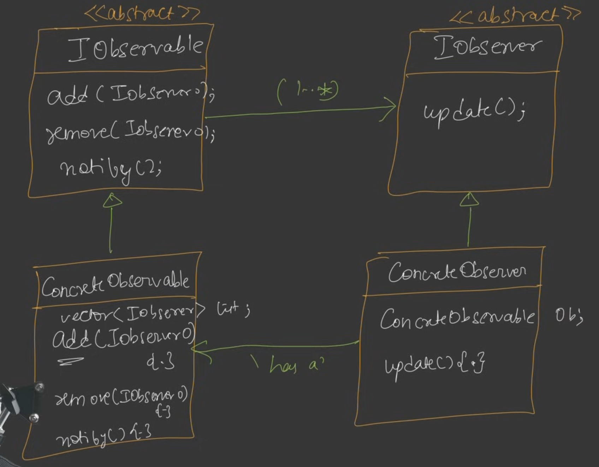

**Methods inside `IObservable`**
 
1. **add** -> `add` method will **add** the observer (when someone subscribe then only channel gets to know about it) [takes `IObserver` as parameter as observer to yhi add krna h]
2. **remove** -> `remove` method will **remove** the observer.
3. **notify** -> `notify` method when called will notify all the observer that a change has happened


**Methods inside `IObserver`**

1. **update** -> **Updates** observer according to the change done by channel [`notify` method will call `update` method]

-> **Basically whenever channel will upload video or make some change, its `notify` method will get active (will iterate to all the observers stored inside it) and then call their corresponding `update` method** 

Now concrete implementation of the corresponding interfaces has been done, `add (IObserver O)` will take any object `O` and then add it in the `list` made of type `IObserver` and same goes with `remove` just that it **removes** from the made list.

`notify` method will loop to all the `list` members and then it will **call every observer `update` method so that it can say that i have changed**

:bulb: **Why we have passed concrete class also inside the `IObserver` ?**

-> Though `notify` has call the `update` method of every observer and observer's `update` method has been called **but this `update` method should also know that though update is happening but whose update is happening (basically observer kisko kr rha h ye to chahiye isko), as maybe multiple channels ko subscribe kiya ho isne, kisse aaya wo to dekhna pdega na**, for this we have passed **instance concrete implementation of `IObservable`**

Now we have always discussed that relationship should exist always between **abstract classes** not between the concrete classes
<span style="color:red">**BUT in Observer Pattern**</span>

> We implement relationship from one concrete class to other concrete class
>
> This eases the process that when its `update` method is called it knows that i have to read from that particular Observable

### **Summary**
----------
Observer Design Pattern defines a **One-to-Many** Relationship between objects so that when one object changes state, all of its observers are notified and updated automatically 


 **UML diagram of youtube example implementing Observer Design Pattern**

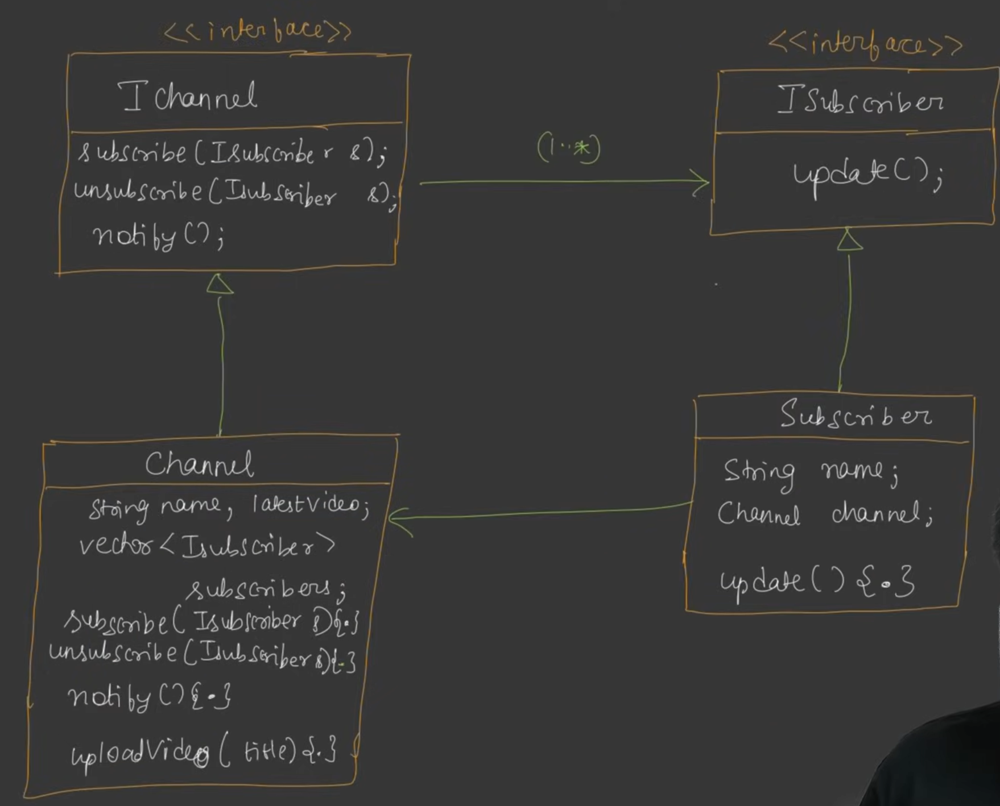

Lets see how new video is getting notified ?

-> Concrete class `Channel` has maintained a `list` of subscribers, now whenever new video will get uploaded using `uploadVideo` method, internally after uploading will call the `notify` method, `notify` method will then go to the **list** of `ISubscriber` and then call every `ISubscriber` corresponding  `update` method. Now moment `update` method is called, it knows that the youtube channel which i have been observing has changed its value, i have its **instance** named as `channel`, using this instance i will access its (`channel.getTitle()`, `channel.getDesc.()` and other video related data)

### **Code**
----------

```java
import java.util.ArrayList;
import java.util.List;

interface ISubscriber {
    void update();
}

// Observable interface: a YouTube channel interface
interface IChannel {
    void subscribe(ISubscriber subscriber);
    void unsubscribe(ISubscriber subscriber);
    void notifySubscribers();
}

// Concrete Subject: a YouTube channel that observers can subscribe to
class Channel implements IChannel {
    private List<ISubscriber> subscribers;
    private String name;
    private String latestVideo;

    public Channel(String name) {
        this.name = name;
        this.subscribers = new ArrayList<>();
    }

    @Override
    public void subscribe(ISubscriber subscriber) {
        if (!subscribers.contains(subscriber)) {  // Push in the list only when that subscriber is not present
            subscribers.add(subscriber);
        }
    }

    @Override
    public void unsubscribe(ISubscriber subscriber) {
        subscribers.remove(subscriber);
    }

    @Override
    public void notifySubscribers() {
        for (ISubscriber sub : subscribers) { // Loop through every subsc. and call its corresponding update method
            sub.update();
        }
    }

    public void uploadVideo(String title) {
        latestVideo = title;
        System.out.println("\n[" + name + " uploaded \"" + title + "\"]");
        notifySubscribers();  // finally calls this internally
    }
    
    // Read Video data (subscriber will call this method to fetch the video data)
    public String getVideoData() {
        return "\nCheckout our new Vid eo : " + latestVideo + "\n";
    }
}

// Concrete Observer: represents a subscriber to the channel
class Subscriber implements ISubscriber {
    private String name;
    private Channel channel;

    public Subscriber(String name, Channel channel) {
        this.name = name;
        this.channel = channel;
    }

    @Override
    public void update() {
        System.out.println("Hey " + name + "," + channel.getVideoData());
    }
}

public class ObserverDesignPattern {
    public static void main(String[] args) {
        // Create a channel and subscribers
        Channel channel = new Channel("CoderArmy");

        Subscriber subs1 = new Subscriber("Varun", channel);
        Subscriber subs2 = new Subscriber("Tarun", channel);

        // Varun and Tarun subscribe to CoderArmy
        channel.subscribe(subs1);
        channel.subscribe(subs2);

        // Upload a video: both Varun and Tarun are notified
        channel.uploadVideo("Observer Pattern Tutorial");

        // Varun unsubscribes; Tarun remains subscribed
        channel.unsubscribe(subs1);

        // Upload another video: only Tarun is notified
        channel.uploadVideo("Decorator Pattern Tutorial");
    }
}

// Ouput ->

// [CoderArmy uploaded "Observer Pattern Tutorial"]
// Hey Varun,
// Checkout our new Video: Observer Pattern Tutorial
// Hey Tarun,
// Checkout our new Video: Observer Pattern Tutorial

// As in the second term, Varun has unsubscribed hence it will not get notification about the video. (see below)

// [CoderArmy uploaded "Decorator Pattern Tutorial"]
// Hey Tarun,
// Checkout our new Video: Decorator Pattern Tutorial

```

But if you have noticed carefully, <span style="color:red">**Observer Pattern violates SRP (Single Responsiblity Principle)**</span>

-> concrete class `Channel` is doing here 2 things :-
1. Subscribe, Unsubscribe and notify [**Observer pattern logic**]
2. Upload video, get Video [**Business Logic**]

 hence it is breaking SRP, but you can mould the above observer pattern to make follow it SRP,

 1. you can pass all the concrete `Channel` method implementation (`subscribe`, `unsubscribe` and `notify`) along with `List` to `IChannel` and implement the concrete methods there only so that `Channel` is left only with `uploadVideo`, `getVideo` (basically Business logic only)
 2. Apart from this, other can be done but that is irrelevant.

### **Real Life Use case**
----------

1. **Notification Service**
2. **Newsfeed or Socialmedia feed**
3. **Event Handling** -> When a particular event occurs, you want some part to get notified that this has occured, ex -> eventListeners used in the frontend, they also use Observer design pattern.

## **Decorator Pattern**
----------

Before starting lets know about the **AIM** of this particular pattern 

We have an Object (`obj1`) and we want to **provide it additional responsiblities (additional functionalities) at RUN TIME not on COMPILE TIME (as compile time pe to bas ek aur method bna do thats it new feature added)**

For ex -> Object `obj1` calls a method inside it `doSomething()` and this return a msg "I did something", now i want this output to change **dynamically** so that if i change something accordingly it changes its output lets say "I did something great"

Now for this, you can say we have **Inheritance** (thats what we use to dynamically change or enhance the functionalities)

<span style="color:red">**But lets understand the problem with inheritance**</span>

Then why are we not using Inheritance ?

-> One simple answer is 

**Inheritance is Bad** -> as it created **Multiple Hiearchy**, **Class Explosion**, and many others out of which one of them we are going to see below.

> Always remember to use <span style="color:orange">**Composition ("Has-a" relationship) over Inheritance ("Is-a" relationship)**</span>

If you see carefully, decorator pattern is using both inheritance and composition but for different purpose :-

1. **Inheritance** is being used to make the `dec1` behave like `obj` so that it can also call `doSomething` method present inside the `obj` (basically to be like base class, you have to behave like base class).

2. **Composition** is beging used to dynamically change or basically changing the behaviour


now lets see how it is going to help 

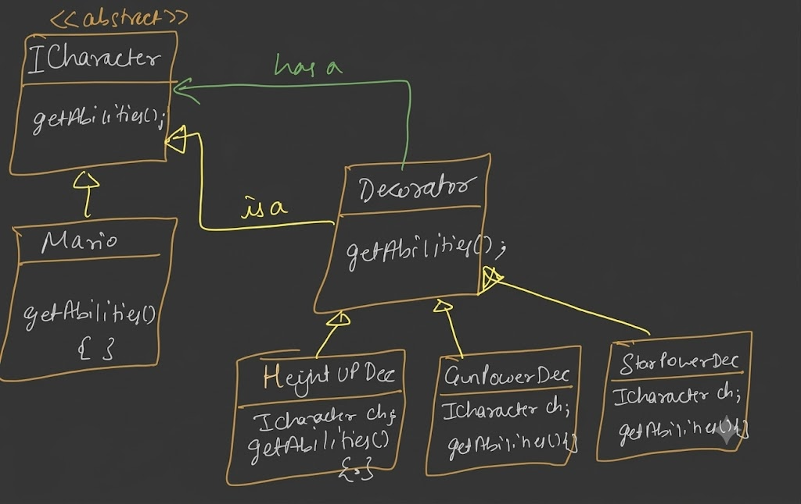

```java
ICharacter mario = new HeightUpDeco(new Mario());
mario.getAbilities();  // 2

// 2 getAbilities will call the HeightUpDeco getAbilities which in turn calls the Mario getAbilities which will return something to HeightUpDeco which in turn finally return with some extra additions (HeightUp functionality) finally to the user.

// Now you can stack as many features as possible
```

> :large_blue_diamond:<span style="color:orange">**If you will see we are using here RECURSION to recursively go through all the functions and finally come out returning something from everyone and stacking it at last**</span>

Below diagram clearly will make you understand

```java
ICharacter mario = new StarPower(new GunPower
                                    new HeightUp(
                                        new Mario()
                                    )
                                )

mario.getAbilities();  // 1
```

Looks something like the below diagram

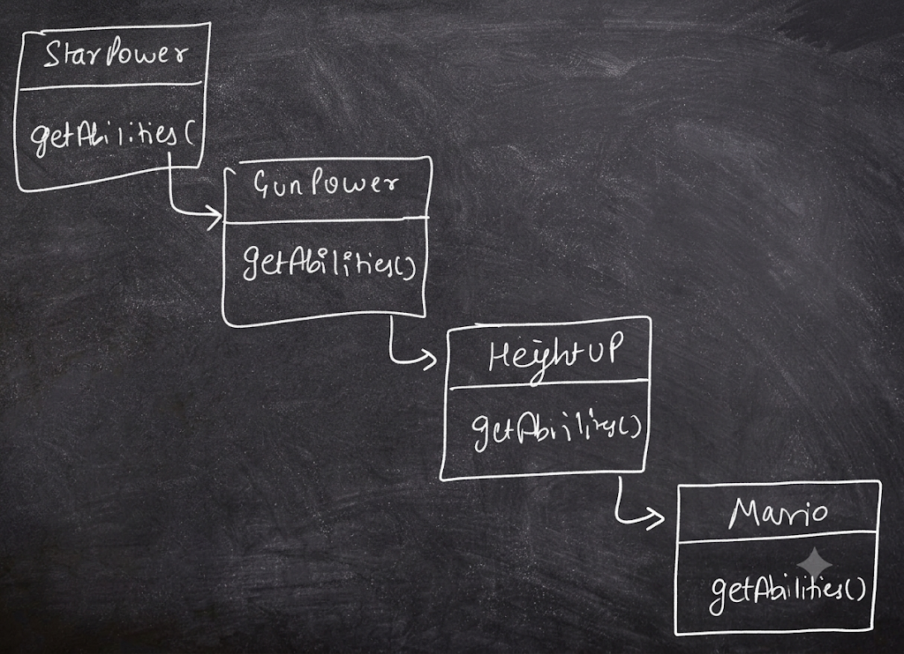

So if we execute `// 1` line then
1. `StarPower` ki `getAbilities` call hui which then 
2. call jo v `ICharacter` h `StarPower` ki constructor me uski `getAbilities` execute kro, so `GunPower` ki `getAbilities` call hui
3. and so on ..... till main `Mario` gets called, now it returns something 
4. and on returning every decorator **adds up something** till it reached last decorator `StarPower`

### **UML Diagram**
----------

for the above part, we only have one component as Mario but in future we may have many components like Superman, Batman etc... for that we have made multiple concrete and abstract components.

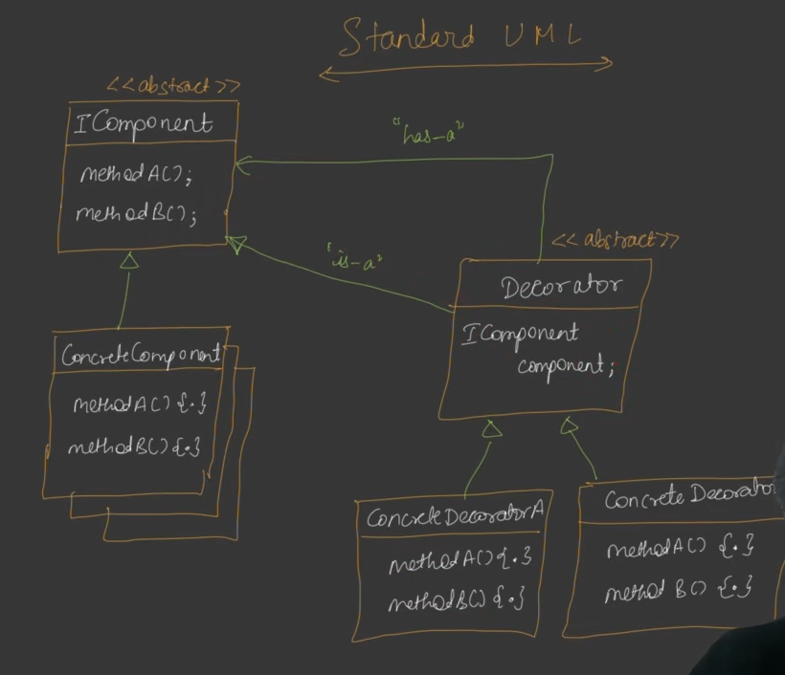


### **Summary**
----------
Decorator Pattern attaches additional responsiblities to an object dynamically, decorator provides a **flexible alternative to subclassing for extending functionality (inheritance)**

### **Code**
----------

```java
// Component Interface: defines a common interface for Mario and all power-up decorators.
interface Character {
    String getAbilities();
}

// Concrete Component: Basic Mario character with no power-ups.
class Mario implements Character {
    public String getAbilities() {
        return "Mario";  // will just return Mario character
    }
}

// Abstract Decorator: CharacterDecorator "is-a" Character and "has-a" Character.
abstract class CharacterDecorator implements Character { // implemented "is-a" relationship
    protected Character character;  // Wrapped component or basically implemented "has-a" relationship (as we have object of that character)

    public CharacterDecorator(Character c) { // takes reference of Character inside its constructor 
        this.character = c; // and assigns it
    }
}

// Concrete Decorator: Height-Increasing Power-Up.
class HeightUp extends CharacterDecorator {
    public HeightUp(Character c) { // take Character reference
        super(c); // and then sends it to parent 
    }

    public String getAbilities() {
        return character.getAbilities() + " with HeightUp";
    }
}

// Concrete Decorator: Gun Shooting Power-Up.
class GunPowerUp extends CharacterDecorator {
    public GunPowerUp(Character c) {
        super(c);
    }

    public String getAbilities() {
        return character.getAbilities() + " with Gun";
    }
}

// Concrete Decorator: Star Power-Up (temporary ability).
class StarPowerUp extends CharacterDecorator {
    public StarPowerUp(Character c) {
        super(c);
    }

    public String getAbilities() {
        return character.getAbilities() + " with Star Power (Limited Time)";
    }
}

public class DecoratorPattern {
    public static void main(String[] args) {
        // Create a basic Mario character.
        Character mario = new Mario();
        System.out.println("Basic Character: " + mario.getAbilities());

        // Decorate Mario with a HeightUp power-up.
        mario = new HeightUp(mario);
        System.out.println("After HeightUp: " + mario.getAbilities());

        // Decorate Mario further with a GunPowerUp.
        mario = new GunPowerUp(mario);
        System.out.println("After GunPowerUp: " + mario.getAbilities());

        // Finally, add a StarPowerUp decoration.
        mario = new StarPowerUp(mario);
        System.out.println("After StarPowerUp: " + mario.getAbilities());
    }
}

// Output 
// Basic Character: Mario
// After HeightUp: Mario with HeightUp
// After GunPowerUp: Mario with HeightUp with Gun
// After StarPowerUp: Mario with HeightUp with Gun with Star Power (Limited Time)
// Destroying StarPowerUp Decorator

```

### **Real life use case**
----------

1. **Google Docs or Doucment Editor tools** -> In google docs, you have seen feature of doing **BOLD**, *ITALIC* and <span style="text-decoration: underline; text-decoration-color: orange; text-decoration-thickness: 2px;">UNDERLINE</span>, now you can make a particular bold only, or bold with italic or even bold, italic, underline as well and these three can be done even in any order as well so here Decorator pattern comes into action
2. **Validation** -> Lets say on frontend, you have created a form now this form will go thorugh some validation in backend, be it data validation, or some security related validation (like SQL injection present or not) so all these validation will be implemented through decorator pattern only
3. **Food Delivery app** -> You use decorator to decorate the Menu items especially **addons functionality** like for pizza base can be thincrust, pantossed, or handmade and so on..


## **Command Pattern**
----------

Lets take a scenaio where thers is sender who want to **request or command** to reciever on the other end to do some work

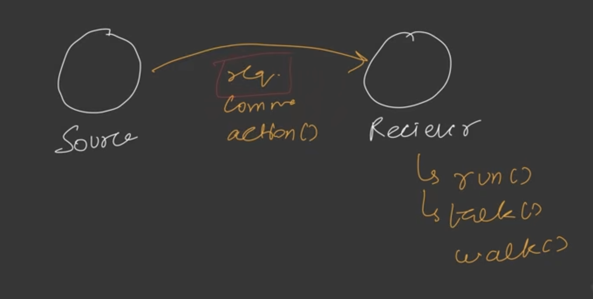

Now we can do the above task by calling the reciever part some method call and the moment you will call reciever method it will give its output

But, other thing can be **the request which i am sending why not make it a seperate OBJECT**

so now we have three objects -> source, reciever, and command

:bulb:**Why we introduced a new object of command in between source and reciever ?**

-> Source and Reciever **gets loosely coupled**

to get deeper dive, lets take and example of **smart home automation system** to understand this pattern better

You have a remote consisting of many buttons and every button controls(ON/OFF or other features) some smart devices present in your house then how will you approach this problem

->  You will do something like the below 

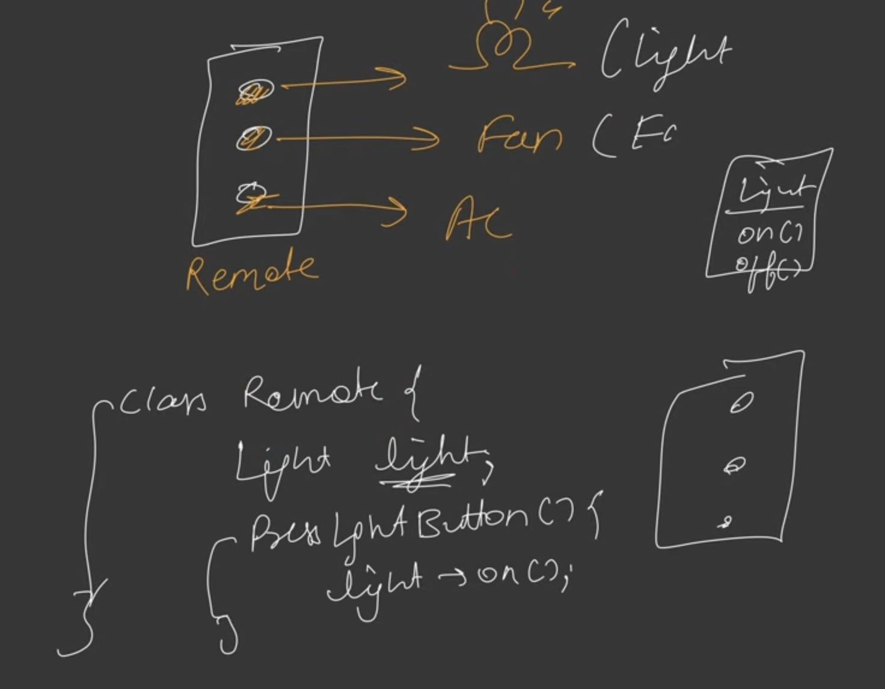

You will make a class of `Remote` and inside it pass the Light instance and then it will have methods consisting like `PresLightButton()` so inside it we will just call `light.on` and thats it we will be able to ON the light

<span style="color:red">**But you can see the problem -> You have coupled tightly Remote with different buttons**</span>

I want to make the remote **Dynamic**, lets say in the future some extra smart device comes and now you want to assign some button to it and remove the prev. smart appliance  present on that button

so for the above problem, you will go through class `Remote`, and then inside it will change the content of the `Remote` which will <span style="color:red">**Break OCP (Open Closed Principle)**</span>

If handled in best way, remote should never communicate with buttons instead there should be a command and this command  will take orders from remote and also will find out that whose appliance i have to change its value

**UML design of the above example**

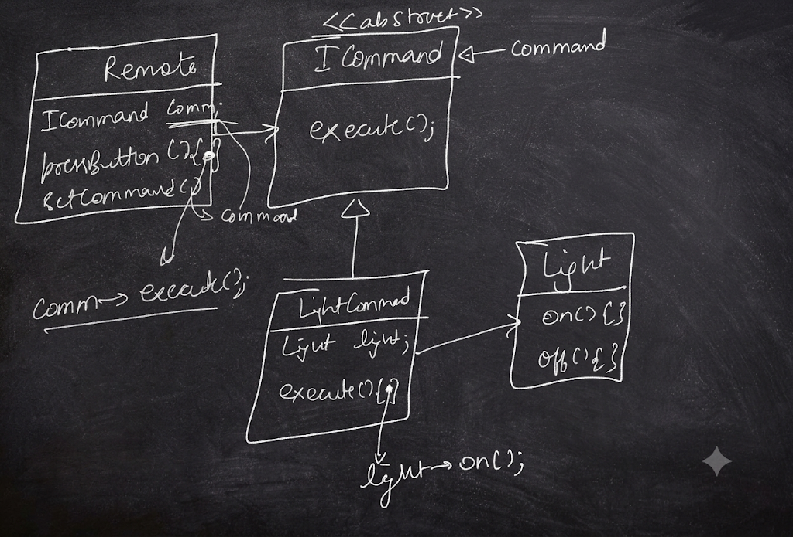

`setCommand` will give the knowledge about which command is going to get executed.

Now `Remote` only knows, whenever the user presses the button, it will exceute the `ICommand` `comm` method ka `excute` method call krna h, now the moment `comm` method is called it calls or runs the `light.on` command which in turn turns on the light 

-> **In this way remote was not able to know about which button will be doing which task**

<span style="color:orange">**All the above things were only for the remote with only 1 buttons, how to do in case of multiple buttons**</span>

so just make these changes 

```java
ICommand comm[] // as there are multiple so will keep command ka array 
pressButton(index){} // will also have to take index in pressButton ki hme kaun sa button press krna h and same will be done with 
setCommand(comm, index) // along with command we will also take index ki hm kaun se index pe wo command set kr rhe h so that jb v hm button press kre, wo us particular index ki command ko execute kr de
```

uml looks something like the below

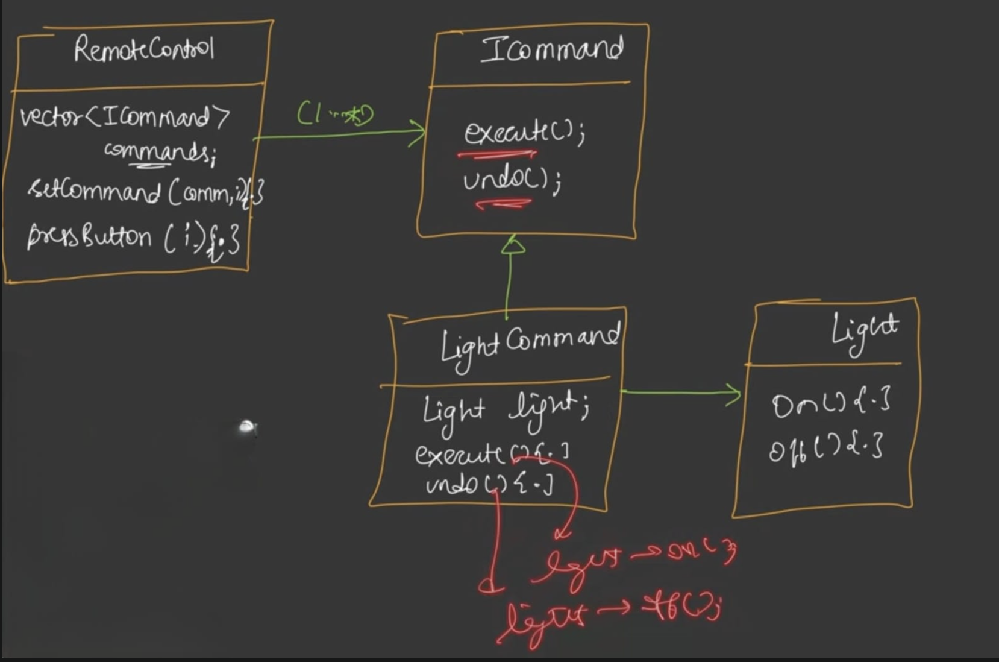

use of `undo` method is just **reverse of `execute`** (it will help in getting exact button behaviour that is one time click On then next time click OFf and vice-versa) so `execute` will call `light.on` and `undo` will call `light.off`

:bulb:**How will we able to know that whether the button is in On or Off position ?**

-> Simple, we will just keep a **boolen `pressed` variable and by default give all the button value to `False`**, then moment a button is pressed, its corresponding `pressed` value will change to `True` and now **before pressing the button again** we will just check if the `pressed` value has `True` value inside it, if yes then just call the `undo` method which will in turn call `light.off`

### **Code** 

```java
// ----------------------------
// Command Interface
// ----------------------------
interface Command {
    void execute();
    void undo();
}

// ----------------------------
// Receivers
// ----------------------------
class Light {
    public void on()  {
        System.out.println("Light is ON");
    }
    public void off() {
        System.out.println("Light is OFF");
    }
}

class Fan {
    public void on()  {
        System.out.println("Fan is ON");
    }
    public void off() {
        System.out.println("Fan is OFF");
    }
}

// ----------------------------
// Concrete Command for Light
// ----------------------------
class LightCommand implements Command {
    private Light light;

    public LightCommand(Light l) {
        this.light = l;
    }

    public void execute() {
        light.on();
    }

    public void undo() {
        light.off();
    }
}

// ----------------------------
// Concrete Command for Fan
// ----------------------------
class FanCommand implements Command {
    private Fan fan;

    public FanCommand(Fan f) {
        this.fan = f;
    }

    public void execute() {
        fan.on();
    }

    public void undo() {
        fan.off();
    }
}

// ----------------------------
// Invoker: Remote Controller with static array of 4 buttons
// ----------------------------
class RemoteController {
    private static final int numButtons = 4;
    private Command[] buttons;
    private boolean[] buttonPressed; // same size as that of buttons

    public RemoteController() {
        buttons = new Command[numButtons];
        buttonPressed = new boolean[numButtons];
        for (int i = 0; i < numButtons; i++) { // before setting any command on button loop through to all the buttons and then assign them null (as koi v button av kaam nhi kr rha jb tk command set nhi hua h uss button pe) and not pressed
            buttons[i] = null;
            buttonPressed[i] = false;  // false = off, true = on
        }
    }

    public void setCommand(int idx, Command cmd) {
        if (idx >= 0 && idx < numButtons) {
            buttons[idx] = cmd;
            buttonPressed[idx] = false;
        }
    }

    public void pressButton(int idx) {
        if (idx >= 0 && idx < numButtons && buttons[idx] != null) { // buttons[idx] != null means it must have some command being set on it 
            if (!buttonPressed[idx]) {  // buttonPressed true h us index ka to uska jo v execute method call kr denge
                buttons[idx].execute();
            } else {
                buttons[idx].undo();  // otherwise false ya off krne ka method call kr denge 
            }
            buttonPressed[idx] = !buttonPressed[idx];  //  change the value also after execution so that next time False true ho and vice-versa
        } else { 
            System.out.println("No command assigned at button " + idx);
        }
    }
}

// ----------------------------
// Main Application
// ----------------------------
public class CommandPattern {
    public static void main(String[] args) {
        Light livingRoomLight = new Light();
        Fan ceilingFan = new Fan();

        RemoteController remote = new RemoteController();

        remote.setCommand(0, new LightCommand(livingRoomLight));
        remote.setCommand(1, new FanCommand(ceilingFan));

        // Simulate button presses (toggle behavior)
        System.out.println("--- Toggling Light Button 0 ---");
        remote.pressButton(0);  // ON
        remote.pressButton(0);  // OFF

        System.out.println("--- Toggling Fan Button 1 ---");
        remote.pressButton(1);  // ON
        remote.pressButton(1);  // OFF

        // Press unassigned button to show default message
        System.out.println("--- Pressing Unassigned Button 2 ---");
        remote.pressButton(2);  // as Button 2 pe kuch assign nhi kiya h to error (no button assigned wala part of string) print ho jana chahiye 
    }
}

// Output
// --- Toggling Light Button 0 ---
// Light As ON
// Light is OFF
// - Toggling Fan Button 1---
// Fan is ON
// Fan is OFF
// -- Pressing Unassigned Button 2 ---
// No command assigned at button 2
```

<span style="color:red">**It was violating LISKOV principle**</span> and for that part only, we have made a concrete command that will deal with concrete object/reciever

### **Summary**
----------
Encapsulate a Request as an Object, therby letting you parametrize clients with different request, queue or log request(internally maintains a stack to jo v tmne kaam kiya wo command ke form me daalte rhte h and if you do UNDO then stack se nikalte rhte h) and support undoable(UNDO) operations. 

### **Real life use case**
----------

1. **Editors app** -> Ex -> text editor, photoshop anything which has **UNDO** feature there we use this pattern
    - basically under the hood, lets take example of bold, italic and underline feature, now command pattern internally makes every feature as command and that command has 2 functions -> either `execute` or `undo`, so if Bold is done and you want to undo it then it will call the `bold.undo` method to make it normal
    - **Anywhere you have to implement UNDO feature, it will be implemented by Command design pattern**
2. **Keyboard shortcuts and mapping** -> Ex -> lets suppose you have set some key to perform particular function so under the hood, keyboard shortcut will make another command and that command will be knowing that what i have to do
3. <span style="color:orange">**Whenever you are implementing any command or feature that you want to change in future (av kuch aur kr rhi baad me kuch aur kre) there we use Command pattern**</span> 


## **Adapter Pattern**
----------

The **Adapter Pattern** is a structural design pattern that allows two incompatible interfaces to work together. It acts as a translator between the client and an existing class, library, or API without requiring either side to change its original code.

Use it when you want to reuse a legacy component, integrate a third-party service, or expose an existing class through the interface expected by your application. This keeps conversion logic in one place and reduces tight coupling.

**Adapter** -> as the name suggests, it helps to adapt according to the situation.

In the same way, in terms of programming, an adapter helps to **make communication between two entirely different Class, Abstract class or Interface**

### **Need for this pattern**
----------

Whenever you are making some application, you need to integrate some third party application or library or api in your app to make it more useful and feature rich 

Now to make it happen you can do two things

1. **Reserve some space in your existing code for integration of that 3rd party app**
    - But this will lead to Tight Coupling of your code with the 3rd party app code
    -  For ex -> if library gets changed, then maybe you can face some issue and similar to this lets say now i have found a better library then you have to change the code you have written for the previous library in your existing code

2. **Introduction of Adapter** -> It will communicate with existing code as well as 3rd party library (**Existing code knows i have to call adapter and adapter knows how to communicate with 3rd party library and meet the requirements**)

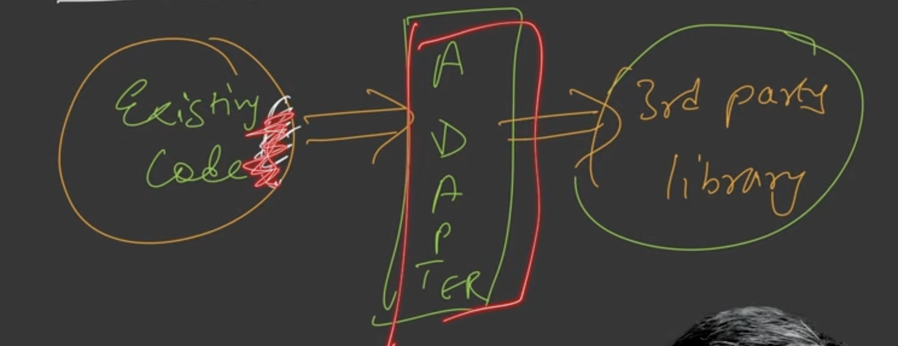 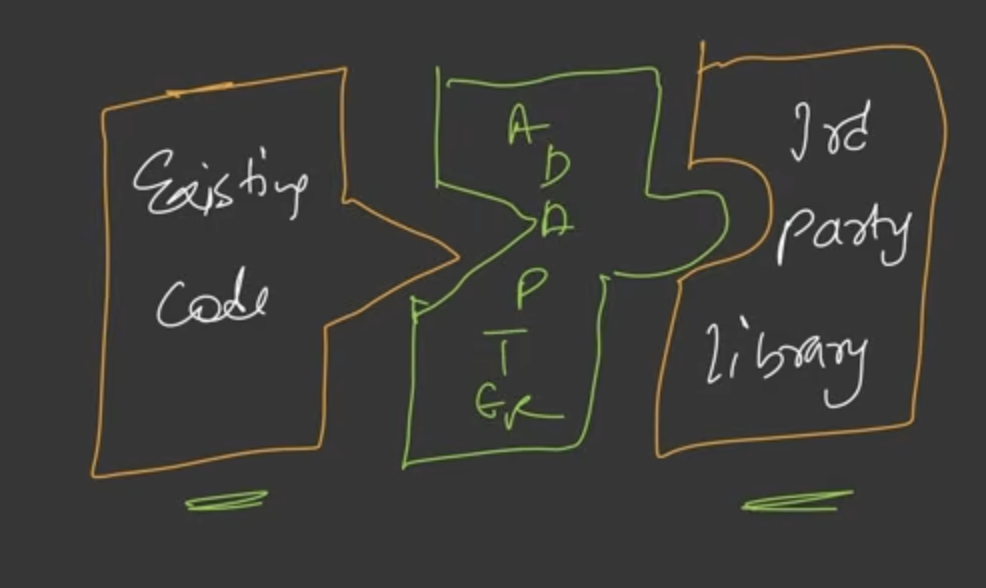


Lets take an example of `Client` which wants to fetch data from any Reports in form of `JSON`, but now we know that we have 3rd party library (let name it `XML Data provider`) which convert the data in `XML` form, we just have to change the data from `XML` format to `JSON` format.

:large_blue_diamond:Now we will introduce an Adapter(`XMLDataProviderAdapter`) which will override or basically **inherit (means "is-a" relationship)** the `IReport` to get the `JSON` data (method named as `getJSONData`) and `XMLDataProviderAdapter` will have a **reference (means "has-a" relationship)** of `XMLDataProvider`

Now if you look into inside of `getJSONData` method, it will be doing something like the below ->
it will take the reference named as `Pro` and calls `Pro.getXMLdata()` to get the `XML` data and the moment it gets the `XML` data it **converts into JSON data**

**UML Diagram of the above scenario**

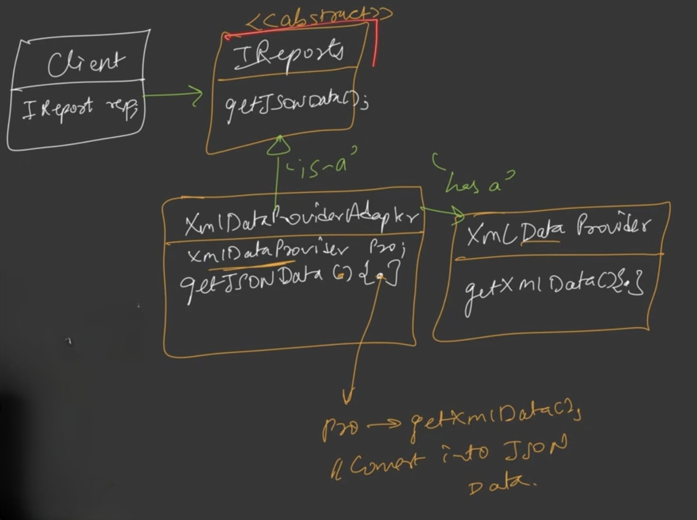

**Hence it made the communication between two different interface `IReport` and `XMLDataProvider` possible**

### **UML Diagram**
----------
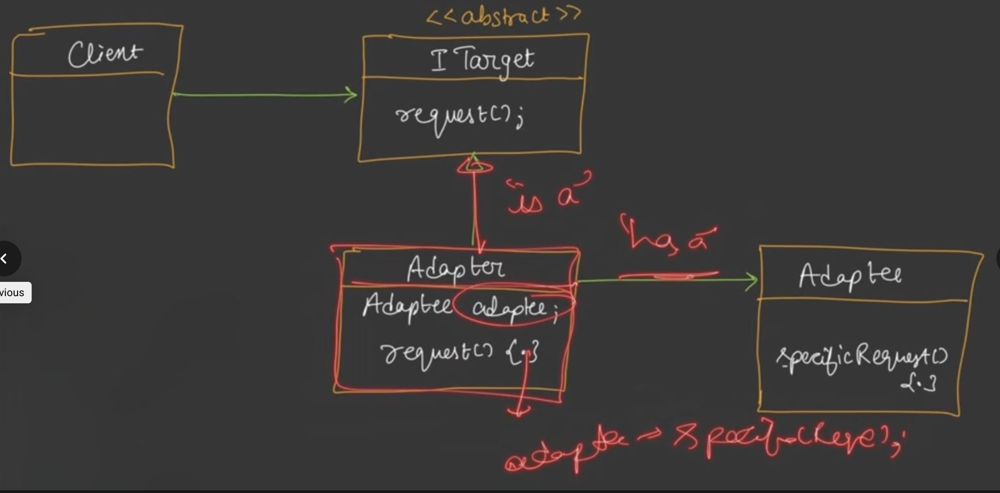

### **Summary**
----------
Adapter converts the interface of a class into another interface that client expects. It lets class work together that couldn't, otherwise because of incompatible interface.

### **Code**
----------
```java
// 1. Target interface expected by the client
interface IReports {
    // takes the raw data string and returns JSON (the class that will inherit this will do this as that will only implement or basically override this method)
    String getJsonData(String data);
}

// 2. Adaptee (from where adapter will take reference or adapt): provides XML data from a raw input
class XmlDataProvider {
    // Expect data in "name:id" format (e.g. "Alice:42")
    String getXmlData(String data) {
        int sep = data.indexOf(':');
        String name = data.substring(0, sep);
        String id   = data.substring(sep + 1);
        // Build an XML representation
        return "<user>"
                + "<name>" + name + "</name>"
                + "<id>"   + id   + "</id>"
                + "</user>";
    }
}

// 3. Adapter: implements IReports by converting XML → JSON
class XmlDataProviderAdapter implements IReports {
    private XmlDataProvider xmlProvider;  // Reference of xmlProvider to establish "has-a" relationship 
    public XmlDataProviderAdapter(XmlDataProvider provider) {
        this.xmlProvider = provider;
    }

    public String getJsonData(String data) {
        // 1. Get XML from the adaptee
        String xml = xmlProvider.getXmlData(data);

        // 2. Naïvely parse out <name> and <id> values
        int startName = xml.indexOf("<name>") + 6;
        int endName   = xml.indexOf("</name>");
        String name   = xml.substring(startName, endName);

        int startId = xml.indexOf("<id>") + 4;
        int endId   = xml.indexOf("</id>");
        String id    = xml.substring(startId, endId);

        // 3. Build and return JSON
        return "{\"name\":\"" + name + "\", \"id\":" + id + "}";
    }
}

// 4. Client code works only with IReports
class Client {
    public void getReport(IReports report, String rawData) {
        System.out.println("Processed JSON: "
            + report.getJsonData(rawData));
    }
}

public class AdapterPattern {
    public static void main(String[] args) {
        // 1. Create the adaptee
        XmlDataProvider xmlProv = new XmlDataProvider();

        // 2. Make our adapter
        IReports adapter = new XmlDataProviderAdapter(xmlProv);

        // 3. Give it some raw data
        String rawData = "Alice:42";

        // 4. Client prints the JSON
        Client client = new Client();

        client.getReport(adapter, rawData);
        // → Processed JSON: {"name":"Alice", "id":42}
    }
}

// Output -
// Processed JSON: {"name": "Alice", "id": 42}
```

Types of Adapters ->

1. Object Adapters
2. Class Adapters

All the above things which we have done till now comes under **Object Adapter**

Class Adapter has uml something like the below 

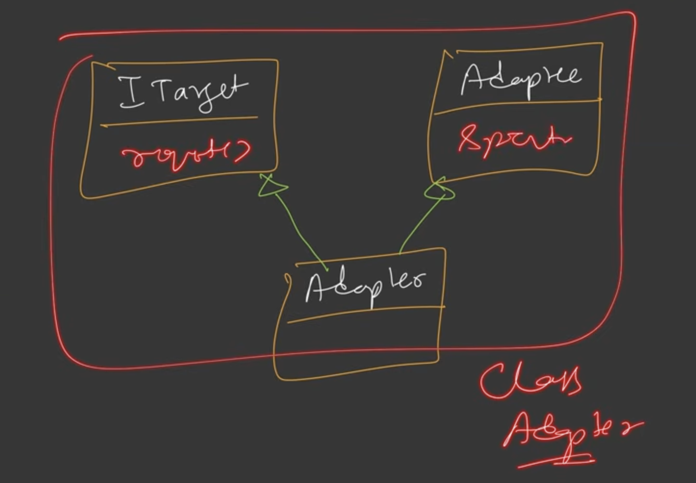

You can clearly see **Multiple Inheritance is getting above implemented and hence it is not possible in many languages like java**, hence better go with Object Adapter.

> Both **work same just one used INHERITANCE (Object Adapter) and second uses COMPOSITION**

### **Real life use case**
----------
1. **Integrating 3rd party library, app or api**
2. **Using Legacy code** -> Many legacy code are written in any languages that your current project does not supports so you will use the adapter to call some legacy code methods and legacy code will via adapter gives you corresponding output and lets you use that method in your code.


## **Facade Pattern**
----------
Imagine a complex subsystem of classes A, B, C, D and E (basically they all are connected in a complex way to do a particular task, whole subsystem is doing only one task, as for doing that task there are smaller subtask so that's why made this much classes).

Now there is a client which want to use the susbsystem and we dont want the client to communicate with this complex subsystem (maybe it first communicate with A then comes to know that B is doing the work with A so then starts to communicate with B and goes on so)

**to solve the above problem, we introduce a new class known as `facade` and it communicates with the complex subsystem and client only deals with `facade`**

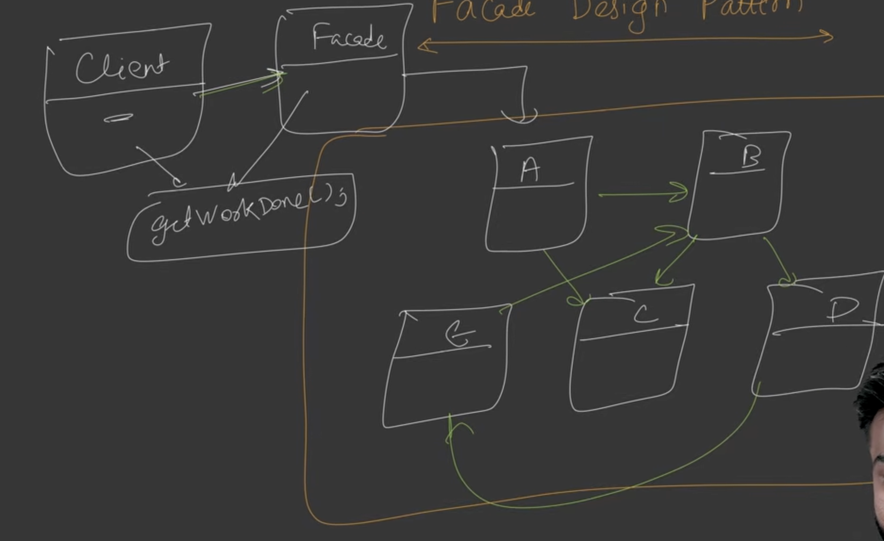

Helps in :-

1. It basically introduces a gateway for the client so that client dont have to interact with the complex subsystem.
2. No matter how much you change the complex subsystem, client is never gonna know (abstraction).
3. **Principle of least knowledge**

#### **Principle of least knowledge (Very Very Important)**
---------

Lets suppose there are 3 classes A, B and C and they are linked in such a way that A is linked to B and B is linked to C now this principle says that <span style="color:orange">**Talk only to your immediate friends**</span>, which means A should call only B methods(as it is directly connected to B) not C methods, ex - lets say A have `m1` method, B have `m2` method and C have `m3` method so this principle says that  A should not by using B's methods try to get C object (if this will happen then A will be able to call `c.m3()` which should not happen according to this principle as A is not linked to C)

:bulb: **Why this principle makes interaction strict ?**

-> Because from the first day, we are learning that we should try to make **that system which is loosely coupled**, If any class can call another class method then what's the point of loose coupling (the less knowledge of one class by the other, the more **loosely coupled you will make the system and hence more Abstraction will be achieved**) 

> <span style="color:skyblue">**Less interaction means loosely coupled**</span>

#### **Rules or Guideline to make follow Principle of least knowledge**
----------
Take any object, now from any method in that object, principle tells you to invoke only methods that belong to :-
1. **The object methods itself.** (lets say Object itself is named main object and shorform as `A`)
2. **The object passed in as a parameter to the methods of the main object `A`.**(ex -> `m1(B b)`, `m1` is method inside `A`, now as `B` is some other class whose object `b` is passed as parameter inside `A`'s method `m1` hence `A`'s object can call `B`'s methods also)
3. **Any object that some method of main object creates.** (ex -> `m2` is `A`'s method executing which something like this `D d = new D()` is written so `m2` is basically creating `D` and its object `d` so `A`'s method can call `D`'s method also).
4. **Any object with ("has-a") relationship.** 

Lets take an example of something where actually facade pattern is used 

You turn on the computer just with one button but under the hood, there are many things happening (classes getting active)

For now, lets assume there are classes like `CPU`, `Memory`, `OS`, `BIOS`, `Hard disk`, part of complex subsystem. now there will be `facade` class which will have `startComp()` method.

`startComp` internally interacts with the complex subsystem

A better and extended UML version of the above example is 

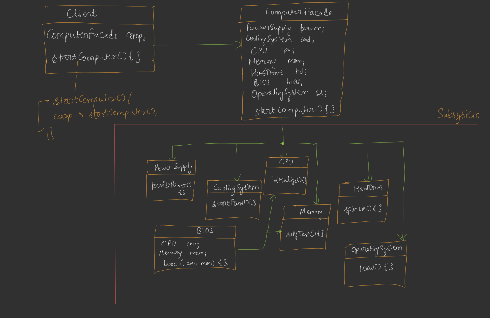


### **UML Diagram**
----------
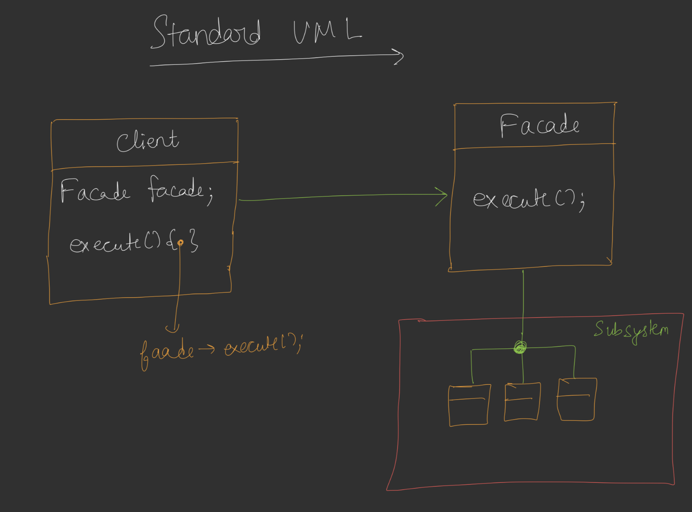

### **Summary**
----------
Facade Pattern provides a simplified, unified interface to a set of complex subsystem. It hides the complexity of the system and exposes only what is necessary.

### **Code**
----------

```java
// Subsystems
class PowerSupply {
    public void providePower() {
        System.out.println("Power Supply: Providing power...");
    }
}

class CoolingSystem {
    public void startFans() {
        System.out.println("Cooling System: Fans started...");
    }
}

class CPU {
    public void initialize() {
        System.out.println("CPU: Initialization started...");
    }
}

class Memory {
    public void selfTest() {
        System.out.println("Memory: Self-test passed...");
    }
}

class HardDrive {
    public void spinUp() {
        System.out.println("Hard Drive: Spinning up...");
    }
}

class BIOS {
    public void boot(CPU cpu, Memory memory) {
        System.out.println("BIOS: Booting CPU and Memory checks...");
        cpu.initialize();
        memory.selfTest();
    }
}

class OperatingSystem {
    public void load() {
        System.out.println("Operating System: Loading into memory...");
    }
}

// Facade
class ComputerFacade {
    private PowerSupply powerSupply = new PowerSupply();
    private CoolingSystem coolingSystem = new CoolingSystem();
    private CPU cpu = new CPU();
    private Memory memory = new Memory();
    private HardDrive hardDrive = new HardDrive();
    private BIOS bios = new BIOS();
    private OperatingSystem os = new OperatingSystem();

    public void startComputer() {
        System.out.println("----- Starting Computer -----");
        powerSupply.providePower();
        coolingSystem.startFans();
        bios.boot(cpu, memory);
        hardDrive.spinUp();
        os.load();
        System.out.println("Computer Booted Successfully!");
    }
}

// Client
public class FacadePattern {
    public static void main(String[] args) {
        ComputerFacade computer = new ComputerFacade();
        computer.startComputer();
    }
}
 
// Output -
// --- Starting Computer ----
// Power Supply: Providing power...
// Cooling System: Fans started...
// BIOS: Booting CPU and Memory checks...
// CPU: Initialization started...
// Memory: Self-test passed...
// Hard Drive: Spinning up...
// Operating System: Loading into memory...
// Computer Booted Successfully!
```

### **Difference between Adapter Pattern and Facade Pattern**
----------
The main difference is 

**Facade** -> Hides the complexity
**Adapter** -> To make the interaction possible between completely different interfaces

### **Real life use case**
----------
1. **Gaming Engines** -> All game engines (ex - unity), behind the hood activates many classes(memory, physicsengine etc..) methods the moment they load up.
2. **Any system in which you just do one thing or technically call one method and behind the hood many SUBSYSTEM occurs and starts** -> be it the above example or your computer bootup process, payment system(you do payment but under the hood it is checking balance, threat analysis, fraud analysis and so on..) or any similar process.

# **Specific Question/Problems use case Design Pattern**
----------
From here on whatever the pattern is present, **they solve specific problems**

## **Template Method Design Pattern**
----------
This design pattern is useful when you are dealing with **pipeline (list of steps in strict serial order)**

This pattern needs to be known as the problem where this design pattern applies, **it solves that problem fully.**

Suppose we are training a model, now there is a pipeline which exists in it which is 

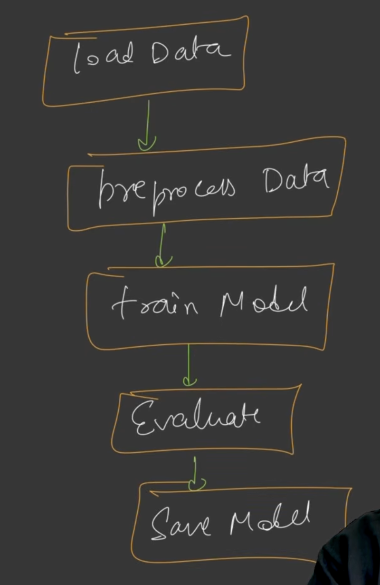

>[!NOTE]
> Can you see the benefit, now no matter who comes we can give **this template and that person can easily using this template can train any model which will come in the future**

Lets see how this happens and implemented 
 
`ModelTrainer` is **not pure abstract** (it will have some methods as well which will be defined in it also, in the below example -> `templateMethod` is defined also apart from being initialised)

Now two models (`NeuralNWModel` and `DesignTWModel`) are inheriting from `ModelTrainer` so they will implement the process function present in `ModelTrainer`

But <span style="color:red">**here comes the problem, we also want the serial order in which the function needs to get executed**</span>

For that we have or rather say this design pattern has **Defined and implemented function `templateMethod`** which will have the order in which the functions are going to get executed(**basically PIPELINE**) and we will mark **`final`** **so that this method does not gets override by the child classes**

 > They can override the function process (for the above ex - different model can have some different strategies to compute the data, or any other process shown above) but not the order in which they are going to get executed.

Now `client` will have a method `m1` and reference of `ModelTrainer` named as `Mt` which will just call `Mt.templateMethod` to exectute the `templateMethod` function.

**UML diagram of the above example** 

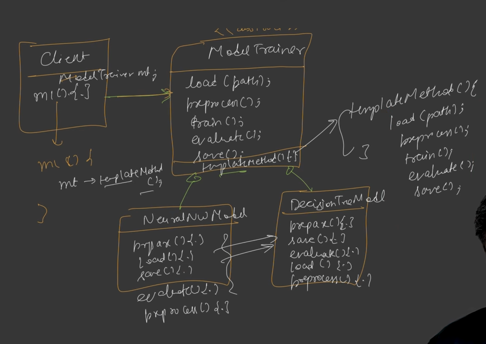


:large_blue_diamond: Also in some cases, we can even make some process method **implemented inside parent only apart from `templateMethod` that should be necessarily implemented** (for example -> in the above part we know tat data is going to `load` from one point only so you can declare as well as **implement** also in the `ModelTrainer` itself and then make it `final` to avoid overriding of this method)

<span style="color:skyblue">**Using this pattern, we can define the pipeline or basically make some order gets followed**</span>


 ### **UML Diagram**
 ----------
 
 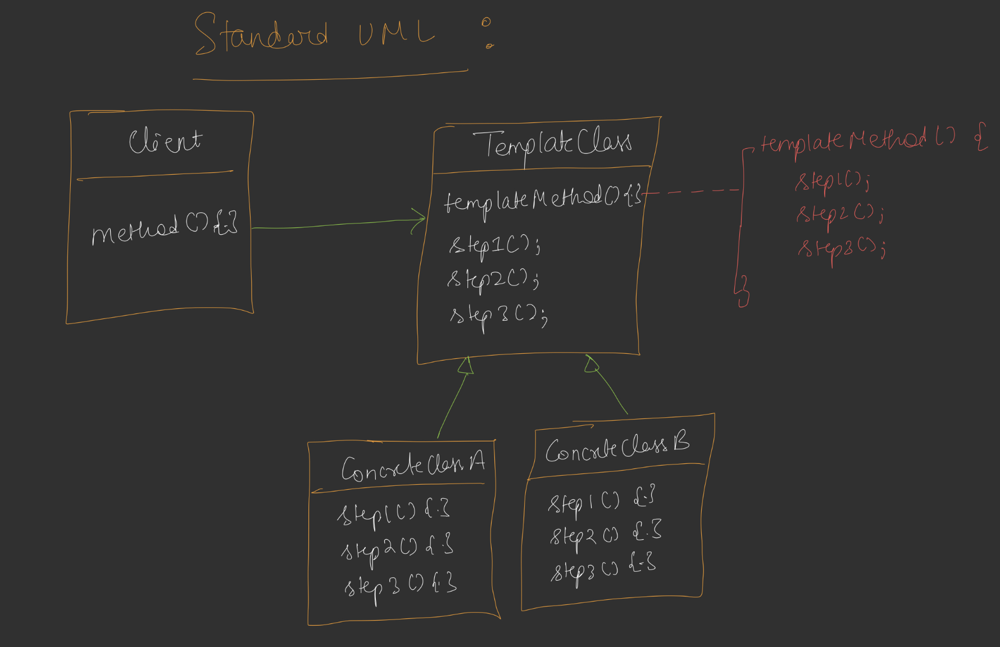

### **Summary**
----------
Template method pattern **designs the skeleton of an algorithm**, for an operation defering some steps to some subclasses. Template method lets subclasses redefine certain steps of an algorithm without changing the algorithm structure.

### **Code**
----------
```java
// ───────────────────────────────────────────────────────────
// 1. Base class defining the template method
// ───────────────────────────────────────────────────────────
abstract class ModelTrainer {
    // The template method — final so subclasses can’t change the sequence
    public final void trainPipeline(String dataPath) {
        loadData(dataPath);
        preprocessData();
        trainModel();      // subclass-specific
        evaluateModel();   // subclass-specific
        saveModel();       // subclass-specific or default
    }

    protected void loadData(String path) {
        System.out.println("[Common] Loading dataset from " + path);
        // e.g., read CSV, images, etc.
    }

    protected void preprocessData() {
        System.out.println("[Common] Splitting into train/test and normalizing");
    }

    protected abstract void trainModel();
    protected abstract void evaluateModel();

    // Provide a default save, but subclasses can override if needed
    protected void saveModel() {
        System.out.println("[Common] Saving model to disk as default format");
    }
}

// ───────────────────────────────────────────────────────────
// 2. Concrete subclass: Neural Network
// ───────────────────────────────────────────────────────────
class NeuralNetworkTrainer extends ModelTrainer {
    @Override
    protected void trainModel() {
        System.out.println("[NeuralNet] Training Neural Network for 100 epochs");
        // pseudo-code: forward/backward passes, gradient descent...
    }

    @Override
    protected void evaluateModel() {
        System.out.println("[NeuralNet] Evaluating accuracy and loss on validation set");
    }

    @Override
    protected void saveModel() {
        System.out.println("[NeuralNet] Serializing network weights to .h5 file");
    }
}

// ───────────────────────────────────────────────────────────
// 3. Concrete subclass: Decision Tree
// ───────────────────────────────────────────────────────────
class DecisionTreeTrainer extends ModelTrainer {
    // Use the default preprocessData() (train/test split + normalize)

    @Override
    protected void trainModel() {
        System.out.println("[DecisionTree] Building decision tree with max_depth=5");
        // pseudo-code: recursive splitting on features...
    }

    @Override
    protected void evaluateModel() {
        System.out.println("[DecisionTree] Computing classification report (precision/recall)");
    }
    // use the default saveModel()
}

// ───────────────────────────────────────────────────────────
// 4. Usage
// ───────────────────────────────────────────────────────────
public class TemplateMethodPattern {
    public static void main(String[] args) {
        System.out.println("=== Neural Network Training ===");
        ModelTrainer nnTrainer = new NeuralNetworkTrainer();
        nnTrainer.trainPipeline("data/images/");

        System.out.println("\n=== Decision Tree Training ===");
        ModelTrainer dtTrainer = new DecisionTreeTrainer();
        dtTrainer.trainPipeline("data/iris.csv");
    }
}

// Output

// === Neural Network Training ===
// [Common] Loading dataset from data/images/
// [Commoğl Splitting into train/test and normalizing 
// [NeuralNet] Training Neural Network for 100 epochs 
// [NeuralNet] Evaluating accuracy and loss on validation set 
// [NeuralNet] Serializing network weights to .h5 file


// === Decision Tree Training ===
// [Common] Loading dataset from data/iris. csv
// [Common] Splitting into train/test and normalizing
// [DecisionTree] Building decision tree with max_depth=5
// [DecisionTree] Computing classification report (precision/recall)
// [Common] Saving model to disk as default format
```
### **Real Life Use Cases**
----------
<span style="color:red">**Wherever you know that there is a fixed order of execution going to happen, there this pattern will be used**</span>

For ex -> 

1. **Payment Transaction ->** You go though a particular order something like 
    - Check whether account has that amount or not 
    - If yes then debit from the account
    - Credit into the reciever account 
    - End the transaction
You can clearly see order in the above step is very important.

<span style="color:red">**FLOW SHOULD BE SAME NO MATTER HOW THEY ARE GETTING IMPLEMENTED**</span>


## **Composite Pattern**
----------

If you in DSA know about the TREES, then that is what composite design pattern is -

<span style="color:red">**Any design problems which can be expressed in form of HEIRCHIAL order and which conisits of two types of nodes - Leaf node and Intermediate node is solved by composite design pattern**</span>

Classic example is **designing folder system**

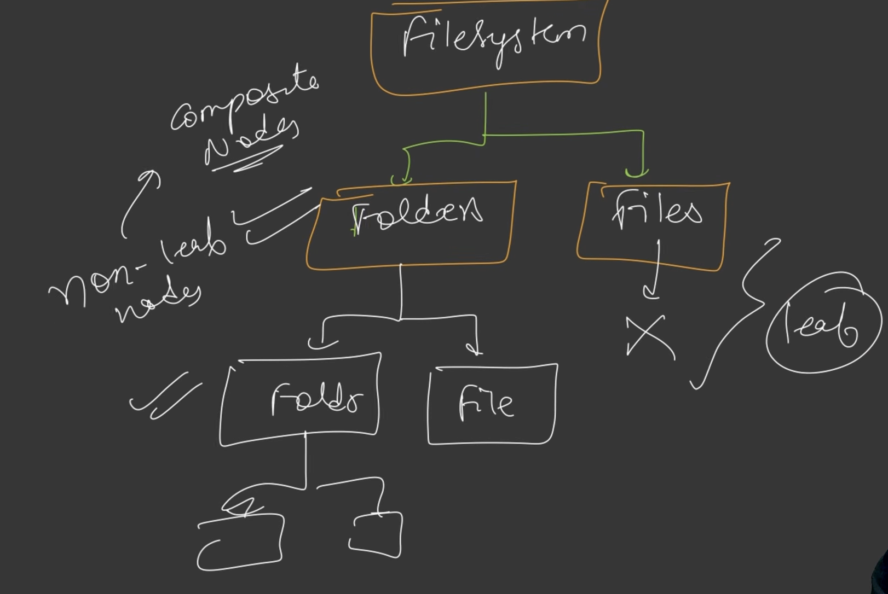

Node where hiearchy is not possible further is called **Leaf node** and where hiearchy is possible further is called **Non-Leaf node or Composite node** (ex - `folder` can have further `folder` and `files` hence it composite node and `files` cannot have further anything else hence leaf node)

### **Need for this Pattern**
----------

Lets assume the case where this design was not being used for the above use case then how we will be designing the file system then we will have something like this 

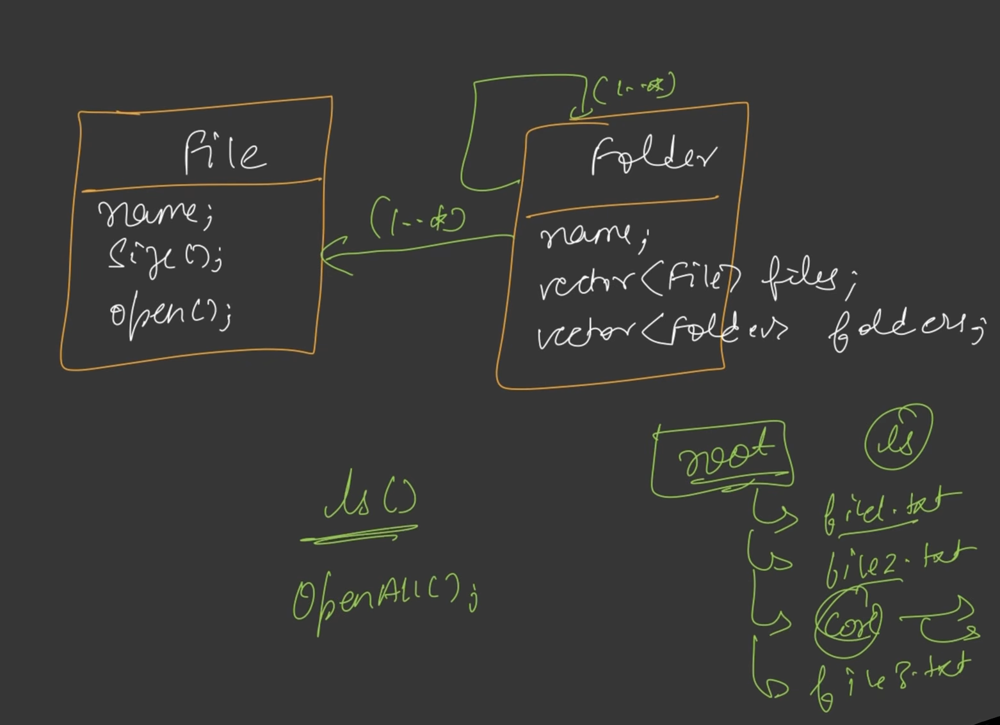

We will be making two seperate class - `file` and `folder` where 

1. `file` - consists of `name` (name of the file), `size()` (size of the file) and `open()` (gives content of the file)
2. `folder` - consists of `name` (name of the folder), `vector<file>Files` (consists of list of **list** of all the `files` present inside this particular `folder`) and `vector<folder>Folders` (consists of **list** of all the `folders` present inside this particular `folder`)

Now lets say there is a method called `ls()` which **opens all**
thing inside a particular `file` and `folder`. Now we are in the ROOT named folder in which the ordering is something like `file1.txt`, `file2.txt`, `core` and `file3.txt`(present inside `core` folder) now if you run `ls()` method, can you see the problem ?

-> It will print first the `name` of the folder which is ROOT, then will go through all the `file` list made (i.e. `Files`) which will make it print `file1. txt`, `file2.txt` and finally `file3.txt` (though it was inside `core` folder so should be printed after `core`), <span style="color:red">**Hence ORDERING is the main issue which we faced here**</span> 

Now to solve it, we have to make a **common list** not the seperate list to maintain `Files` and `Folders`.

so we will inside `Folder` class implement a common list `vector<common>CommonList` which will consists of both `file` and `folder` (remove the seperate list of `file` and `folder` made) and then traversing login will be something like the below

```java
for (element in CommonList){
    if(element == file){
        cout << element.name;
    } else if (element == folder){
        element.openAll();  // Recursively this will call another function and hence the corresponding folder will call another folder openAll method
    }
}
```

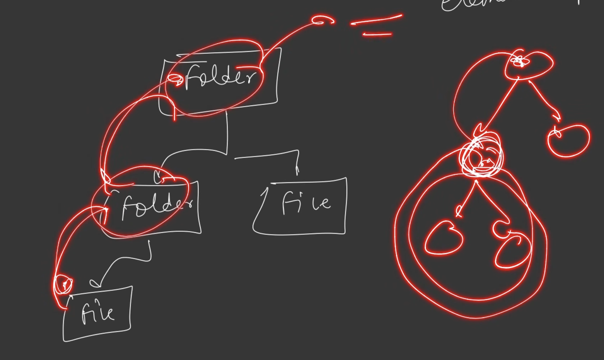

<span style="color:red">**But whole things above used is bit complicated and will grew even more complex as new function/commands gets added on**</span>

So all the above things can be easily implemented by **composite design pattern**

:bulb:<span style="color:red">**What does this design says ?**</span>

-> The core idea of this design pattern is **Treat both the `Composite` and `Leaf` as same means they will be having same INTERFACE (common abstract class or common interface)**

Benefit of it ->

We can treat the `file` and `folder` to be same hence no need of writing those complex `if-else` statement for a particular case.

**UML diagram of the above example**

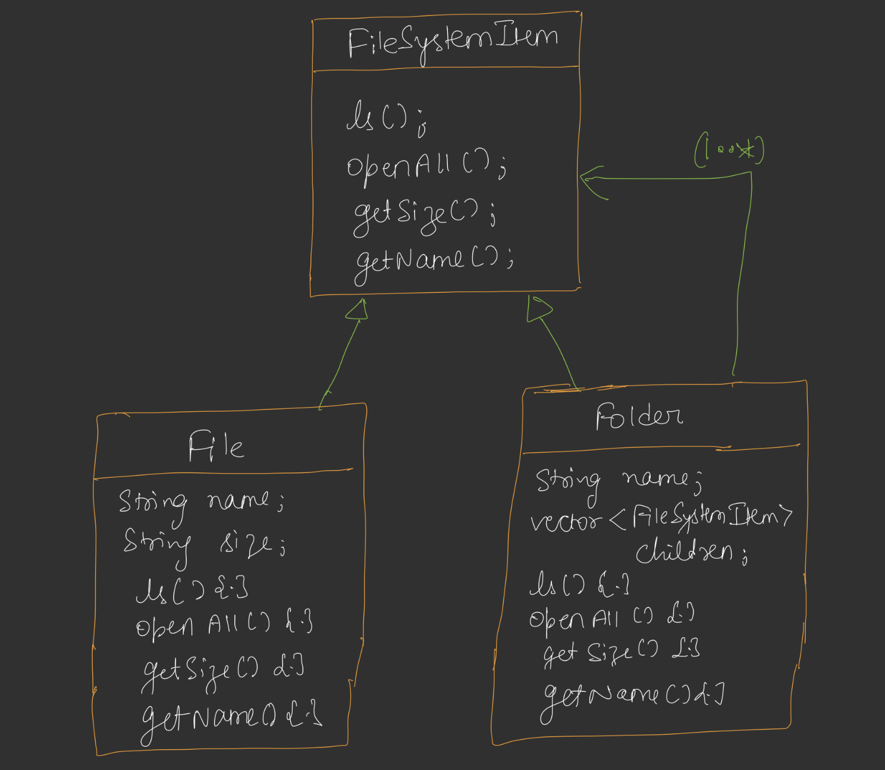

Now if you see precisely, two relationship are happening here -

1. `File` and `Folder` **is-a** `FileSystemItem`
2.  also as `Folder` **has** list of `FileSystemItem`(**1 to Many relationship**) hence **has-a** relationship.

Remember where we have seen these two relationship being used - it was **Decorator Pattern**.

Lets see how this will work in the practical scenario by taking a practical folder structure

```javascript
+Root
    --- file1.txt
    --- file2.txt 
    --- +Core
        --- file3.txt 
        --- file4.txt
    --- +User
        --- file5.txt
```
Now lets call `openAll()` method inside `Root` folder then it will go through or traverse thorugh all the  list `FileSystemItem` (`file1.txt`, `file2.txt`, `Core` and `User` are list of `FileSystemItem` stored inside the list of `FileSystemItem` present inside the `Root` folder) now traversing thorugh it, it does not know which is `file` or `folder`, for it both `file` and `folder` are `FileSystemItem` and are treated equally

```java
for(FileSystemItem item : childern){
    cout << item.openAll(); 
}
```
Without even thinking anything else, it will call every `FileSystemItem`'s `openAll()`, now its upto us that how we implement `file`'s `openAll()` method and `folder`'s `openAll()` method

`file`'s `openAll` method looks something like the below 

```java
openAll(){
    getName();  // will just return the name of the file 
}
```
and if `folder`'s `openAll` method is called then same above process gets repeated (**Think Recursively**). 

looks something like this 

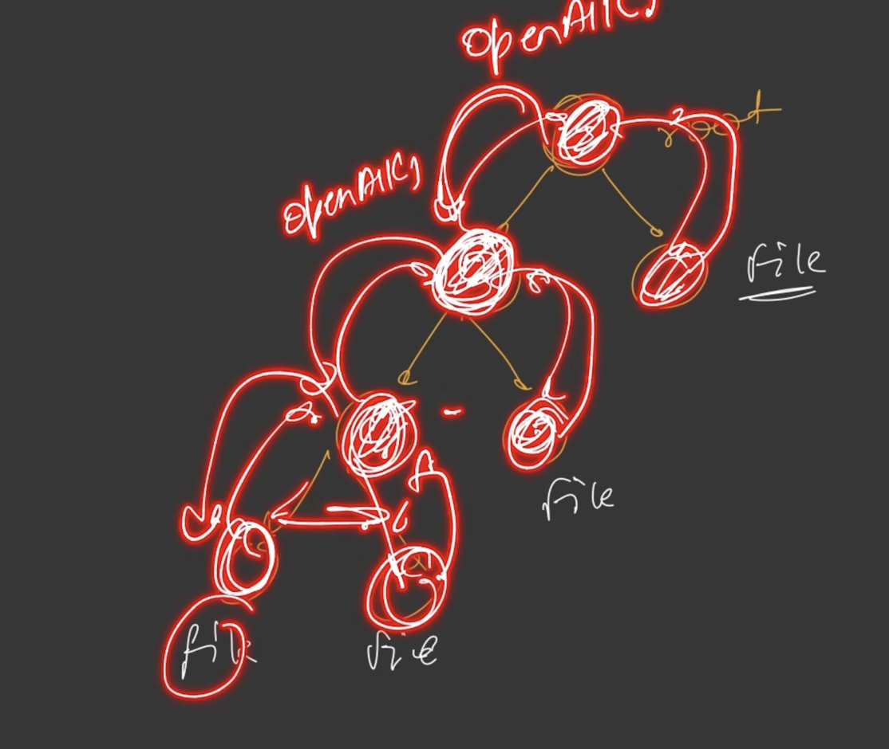

### **UML Diagram**
----------

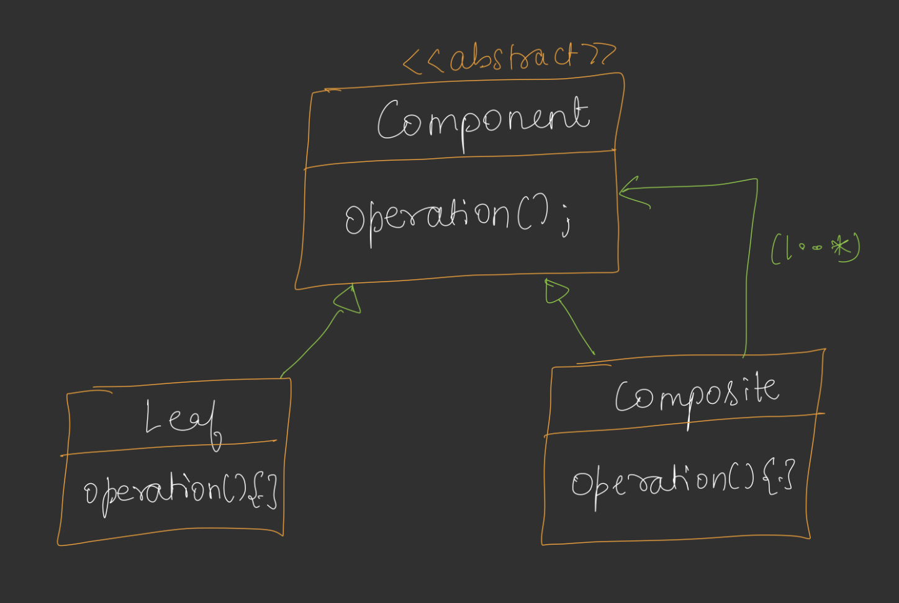

### **Summary**
----------
Composite Pattern **composes object into tree like structure** representing a part-whole hiearchy. It let client treats individual object and composition of object uniformly(client does not know whether it is interacting with leaf node or composite node)

### **Code**
----------

```java
import java.util.ArrayList;
import java.util.List;

// Base interface for files and folders
interface FileSystemItem {
    void ls(int indent);            
    void openAll(int indent);      
    int getSize();                  
    FileSystemItem cd(String name);  // new command also added to get more insight about this pattern 
    String getName();
    boolean isFolder();
}

// Leaf: File
class File implements FileSystemItem {
    private String name;
    private int size;

    public File(String n, int s) {
        name = n;
        size = s;
    }

    @Override
    public void ls(int indent) {
        String indentSpaces = " ".repeat(indent);
        System.out.println(indentSpaces + name);
    }

    @Override
    public void openAll(int indent) {
        String indentSpaces = " ".repeat(indent);
        System.out.println(indentSpaces + name);
    }

    @Override
    public int getSize() {
        return size;
    }

    @Override
    public FileSystemItem cd(String name) {
        return null;
    }

    @Override
    public String getName() {
        return name;
    }

    @Override
    public boolean isFolder() {
        return false;
    }
}

class Folder implements FileSystemItem {  // "is-a" relationship
    private String name;
    private List<FileSystemItem> children;  // "has-a" relationship

    public Folder(String n) {
        name = n;
        children = new ArrayList<>();
    }

    public void add(FileSystemItem item) {
        children.add(item);
    }

    @Override
    public void ls(int indent) {
        String indentSpaces = " ".repeat(indent);
        for (FileSystemItem child : children) {
            if (child.isFolder()) {  // This is not required, this "if-else" is just for the prefix "+" addition for the folder indication so that it looks better while viewing.  
                System.out.println(indentSpaces + "+ " + child.getName());
            } else {
                System.out.println(indentSpaces + child.getName());
            }
        }
    }
    // If it will be folder, its getName will call corresponding folder's and file's getName and if file will be there then it will call just the getName for the file (i.e. simply print the file name of particular file)  

    @Override
    public void openAll(int indent) { // mean OPEN ALL POSSIBLE files and folder present inside any folder.
        String indentSpaces = " ".repeat(indent);
        System.out.println(indentSpaces + "+ " + name);  // First print itself name  // 2
        for (FileSystemItem child : children) { 
            child.openAll(indent + 4);  // if the child will be file then it will call its openAll (which is just printing the // 2 line and if folder then again using recusrion will again call openAll method defined till it meets any file (leaf node))
        }
    }

    @Override
    public int getSize() { // This will also loop through recusrsively
        int total = 0;
        for (FileSystemItem child : children) {
            total += child.getSize();
        }
        return total;
    }

    @Override
    public FileSystemItem cd(String target) {
        for (FileSystemItem child : children) {
            if (child.isFolder() && child.getName().equals(target)) {
                return child;
            }
        }
        // not found or not a folder
        return null;
    }

    @Override
    public String getName() {
        return name;
    }

    @Override
    public boolean isFolder() {
        return true;
    }
}

public class CompositePattern {
    public static void main(String[] args) {
        // Build file system
        Folder root = new Folder("root");
        // "1" here and below represents the file size present 
        root.add(new File("file1.txt", 1));
        root.add(new File("file2.txt", 1));

        Folder docs = new Folder("docs");
        docs.add(new File("resume.pdf", 1));
        docs.add(new File("notes.txt", 1));
        root.add(docs);

        Folder images = new Folder("images");
        images.add(new File("photo.jpg", 1));
        root.add(images);

        root.ls(0);  // 2

        docs.ls(0); // 3

        root.openAll(0);  // 1

        FileSystemItem cwd = root.cd("docs"); // 4 as root folder has docs folder so cd to docs
        if (cwd != null) {
            cwd.ls(0);  // if docs exists then it should print the content of it
        } else {
            System.out.println("\nCould not cd into docs\n");
        }

        System.out.println(root.getSize());  // 5
    }
}

// Output
// Running just // 1 (printing whole hiearchy), we get something like the below
// + root
//      file1.txt
//      file2.txt
//      + docs
//          resume.pdf 
//          notes.txt
//      + images
//          photo-jpg 


// Running just // 2 (all content inside root folder), we get something like the below
// filel.txt
// file2.txt
// + docs 
// + images


// Running just // 3 (all contents inside docs folder), we get something like the below
// resume.pdf 
// notes.txt

// Running just // 4 (change directory command to change the directory from root to docs), we get something like the below 
// resume.pdf
// notes.txt

// Running just // 5 (Printing the total size of all the content present inside the root or current folder)
// 5
``` 


### **Real life use case**
----------

> <span style="color:orange">**Any design problem which consists of tree like structure (consists of leaf node and composite node) can be solved directly by this design pattern**</span>

Examples are -

1. **File Manager app** -> We have already see the above example
2. **Dropdown feature** -> You have noticed dropdown being used in frontend extensively be it on the navbar, or faq section that can be easily implemented by composite design pattern.


## **Proxy Pattern**
----------

Lets say there is a request which is sent from `User` to get the `resource`, now we have introduced a `proxy` in between to handle these requests and responses as shown below

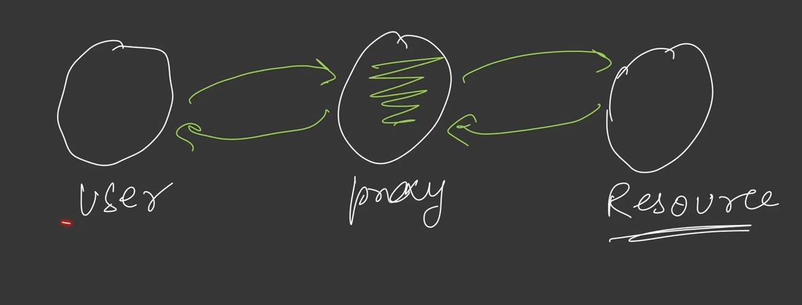

:bulb:**Why we introduced proxy in between ?**

-> There can be multiple reason to this
1. **Resource can be critical data** -> There can be a chance that Resource is critical data and we dont want it to get directly accessed by the user hence introduced a `proxy` which will authenticate the user and then give the access to resource.
2. **Validation and Check for the incoming data** -> `proxy` can act as a security guard which will validate the data through some checks and validation so that the user is sending the correct data or not.
3.  **Proxies in real life** -> `proxy` are used in real life in a way that `resource` are present in some other server (i.e. on some cloud server) and `User` and `proxy` are present locally now `User` just calls the `proxy` which is present locally and `proxy` further calls the `resource` present on some other server. In this way, `User` does not able to know that it said `resource` has came through internet.

For now, you can assume that `proxy` act **same as** `resource` so `User` is not able to distinguish between `proxy` and `resource`.

Proxy has 3 types 
1. **Virtual Proxy**
2. **Protection Proxy**
3. **Remote Proxy**

<span style="color:orange">**In all of them, proxy concept (or base concept) will be applied and will be same throughout these 3 patterns.**</span>

### **UML Diagram**
----------

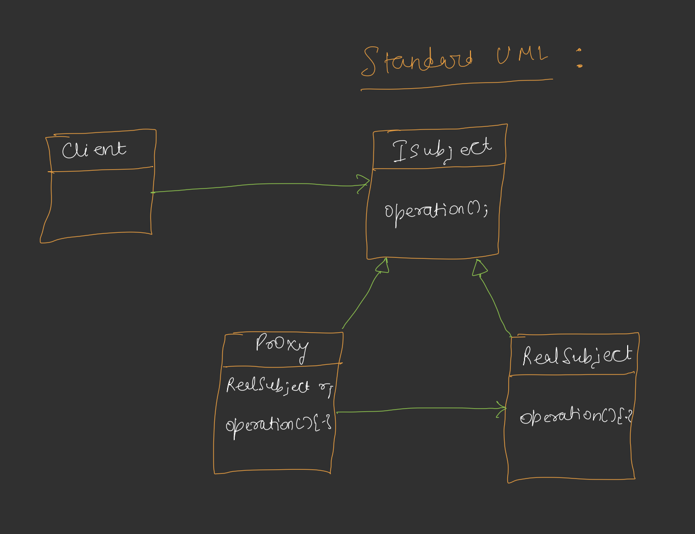

### **Virtual Proxy**
----------
Lets take a class `ImageDisplay` which will take an image path and then using it will display the image using `display()` method.

Now there is a high chance that before displaying the image, it does some precomputation work like loading the image, compressing the image, making it black and white(or some filter) and so on..., so that **thing will go inside the constructor.**

You might even think that all these task can be done inside the `display()` method as well and you are perfectly right, we can do all the above task inside `display()` method but then **it will make the process slow as after calling `display()`, it will start to do the above things eventually making it slow**, but now as we have shifted it to constructor so the moment `display()` is called, it quickly shows the ouput as constructor is called first and its output has been already determined(but every time constructor is called and loaded that will also take time right, that is also expensive operation so keep this in mind as well, we will see how this thing is also handled by proxy.)

<span style="color:red">**But have you figured out the drawback of this logic ?**</span>

-> What if `User` does not calls `display()` ?

In this case, **you just wasted your resource on an operation which never got used**

Also, **loading constructor and precomputing the output of it is itself an expensive operation**

So to solve the above problem, we introduce a `proxy` in between and this will hold a **reference of `ImageDisplay`** (will not make object directly of `ImageDisplay`) and **Object will be made only when the `User` will call `ImageDisplay(path)[]` present inside `ImageDisplay`**

Now again there can be a question coming in your mind that the same above thing can be done by making change in `ImageDisplay` class itself, for this you can give many reasons one of them being - 
Maybe you dont have access to `ImageDisplay` class (as it is 3rd party library)

Now as `ImageDisplay` is a concrete class, so making a super class named as `IDisplay` so that currently we have only 1 thing known as `ImageDisplay` but in future, maybe we can get `PdfDisplay`, `VideoDisplay` or `TextDisplay`.

As `ImageDisplay()` method present (which is constructor) present inside `ImageDisplay` class has an expensive operation so to make it load only when someone calls it we will introduce a proxy, lets name it as `ImageProxy`

**UML Diagram**

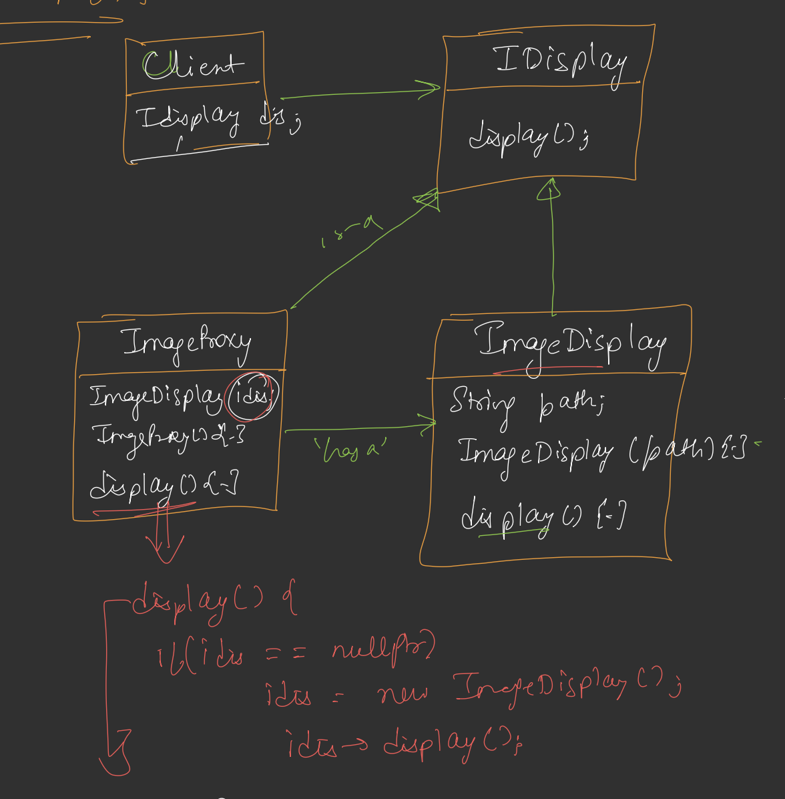

As already discussed above, `ImageProxy` is a representative of `ImageDisplay` means **"has-a" relationship** exists here.

so inside `ImageProxy` class, there will be a reference `ImageDisplay iDisp` and it will also have a constructor (`ImageProxy(){}`), inside which there will be for now `iDisp` pointed to the `nullptr`.

Also if we have said that `ImageProxy` **should behave as** `ImageDisplay` so it will have another relation **"is-a" relationship** with `IDisplay` and hence as it is inheriting so it will get `display()` method as well and its `display()` method will look something like the below 

```java
display(){
    if (iDisp == nullptr){
        iDisp == new ImageDisplay();
        return iDisp.display();
    }
}
```
Summing up, the client has a reference of just `IDisplay` named `disp` and it will just call `disp.display()` (he/she is not knowing that whether it is calling `ImageProxy` `display()` method or `ImageDisplay` `display()` method).

Now even if the `User` or `Client` calls `disp = new ImageProxy()`, it will call the constructor of `ImageProxy` and calling `ImageProxy` constructor **leads you to nothing** as the pointer gets pointed to `nullptr` and hence no object creation happens, Only when the `Client` calls `disp.display()`, it calls the `ImageProxy`'s `display()` method which in turn checks whether the `iDisp` that whether till now it is pointed to `nullptr` if yes then creates the real object of `ImageDisplay` gets created  and then calls the `ImageDisplay`'s `display()` method hence avoiding **unnecessary heavy operation problem** and if no then again calls the `display()` method as **expensive operation has already been done previously.**


#### **Summary**

Work of Virtual Proxy is to  **just to protect a expensive operation using Proxy** by not creating the object of it till it is actually required to get used (i.e. its methods is called)

#### **Code**

```java
interface IImage {
    void display();
}

class RealImage implements IImage {
    private String filename;

    public RealImage(String file) {
        this.filename = file;
        System.out.println("[RealImage] Loading image from disk: " + filename);
    }

    @Override
    public void display() {
        System.out.println("[RealImage] Displaying " + filename);
    }
}

class ImageProxy implements IImage {
    private RealImage realImage;
    private String filename;

    public ImageProxy(String file) {
        this.filename = file;
        this.realImage = null;
    }

    @Override
    public void display() {
        if (realImage == null) {
            realImage = new RealImage(filename);
        }
        realImage.display();
    }
}

public class VirtualProxy {
    public static void main(String[] args) {
        IImage image1 = new ImageProxy("sample.jpg");
        image1.display();
    }
}

// Output
// [RealImage] Loading image from disk: sample-jpg
// [RealImage] Displaying sample-jpg
```

### **Protection Proxy**
----------
For understanding this, lets take an example we have a class named as `IDocumentReader` which has a method named as `unlockPDF()` which will take a file path as input and unlocks it. Inherting `IDocumentReader` is the concrete class `realDocReader` which also has `unlockPDF(){}` implemented.

Now i want that anyone cant call this `unlockPDF(){}` (basically unlock the pdf when the user is premium) so we will introduce a **proxy in between** and it will be implemented in the same way as that implemented above (i.e. should have "has-a" and "is-a" relationship).


**UML Diagram**
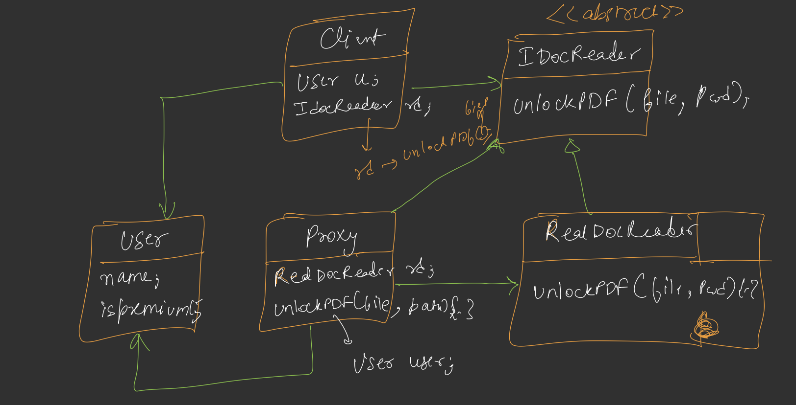

Now `Client` will have a reference of `User` named as `u` and `IDocumentReader` as `rd` so that `Client` can call `rd.unlockPDF(path, password)`, now we already know that for `IDocumentReader` we are passing the reference of `Proxy` not `realDocReader` so when `rd.unlockPDF` is called it calls the `Prxoy`'s `unlockPDF` and as `Proxy` also has reference of `User` as `user` so it will check now whether the `user` is `isPremimum` so `unlockPDF` method `Proxy` looks something like the below 

```java
unlockPDF(path, password){
    if(user.isPremium){
        rd.unlockPDF();
    }else {
        throw new error ("Please upgrade to premium"); 
    }
}
```

#### **Summary**

Work of Protection Proxy is to **Protect a particular resource, authenticate the user so that he/she can access that resource**.

Use case includes -> Distinction between premium and normal user.

**Difference between Protection Proxy and Virtual Proxy**

<div align="center">

| Protection Proxy | Virtual Proxy |
|---|---|
| Protects a resource which is critical | Resource which is expensive is protected by this |
| used where you dont want any user to access that critical resource | used where a particular resource is taking expensive operation |

</div>

#### **Code**

```java
interface IDocumentReader {
    void unlockPDF(String filePath, String password);
}

class RealDocumentReader implements IDocumentReader {
    @Override
    public void unlockPDF(String filePath, String password) {
        System.out.println("[RealDocumentReader] Unlocking PDF at: " + filePath);
        System.out.println("[RealDocumentReader] PDF unlocked successfully with password: " + password);
        System.out.println("[RealDocumentReader] Displaying PDF content...");
    }
}

class User {
    public String name;
    public boolean premiumMembership;

    public User(String name, boolean isPremium) {
        this.name = name;
        this.premiumMembership = isPremium;
    }
}

class DocumentProxy implements IDocumentReader {
    private RealDocumentReader realReader;
    private User user;

    public DocumentProxy(User user) {
        this.realReader = new RealDocumentReader();
        this.user = user;
    }

    @Override
    public void unlockPDF(String filePath, String password) {
        if (!user.premiumMembership) {
            System.out.println("[DocumentProxy] Access denied. Only premium members can unlock PDFs.");
            return;
        }
        realReader.unlockPDF(filePath, password);
    }
}

public class ProtectionProxy {
    public static void main(String[] args) {
        User user1 = new User("Rohan", false);
        User user2 = new User("Rashmi", true);

        System.out.println("== Rohan (Non-Premium) tries to unlock PDF ==");
        IDocumentReader docReader = new DocumentProxy(user1);
        docReader.unlockPDF("protected_document.pdf", "secret123");

        System.out.println("\n== Rashmi (Premium) unlocks PDF ==");
        docReader = new DocumentProxy(user2);
        docReader.unlockPDF("protected_document.pdf", "secret123");
    }
}
```

### **Remote Proxy**
----------
As the name suggests, an object representative (or Proxy) which exists on some other server means to call it you have to initiate a connection and then only you can fetch data from it.

Now lets take an exmaple where there is a class in some other server which connects to the database and brings the fetched data named as `DataService` which has `fetchData(){}` (connects with db and fetch data from it), as it is concrete class so abstracting it by making interface named as `IDataService` as shown below.

Now lets understand if we do not introduce a proxy in between then what would have happen, then `Client` will be having a reference of `IDataService` and then its `fetchData` is being called but it cant be directly get called, first `Client` has to make connection through server and then it will be able to call `fetchData`.

**UML Diagram**

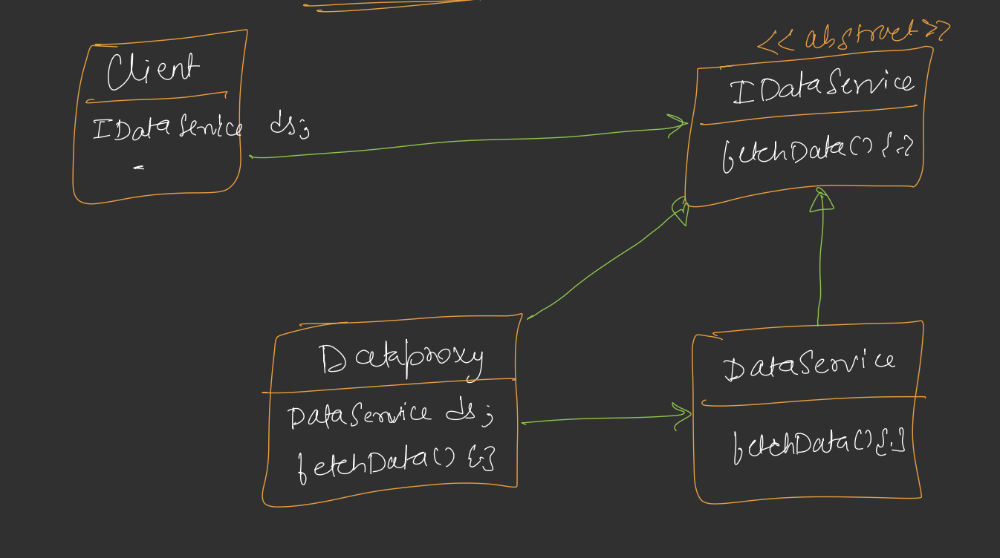

For this problem, we introduced a `DataProxy` and it will work same as the other proxy ( will have "has-a" and "is-a" relationship) so it will have `fetchData` method ("is-a" relationship) and reference of `DataService` `ds` ("has-a" relationship)

Now from here, you have two ways to fetchdata, 

1. **Fast Loading**

Pass the reference of `DataProxy` in `ds` in `Client` code through writing `ds = new DataProxy()` after `IDataService ds`, the moment this is done, then at that moment only **establish the connection with `DataService` (means FAST LOADING)**

1. **Lazy Loading**

The moment you call `ds.fetchData()` (means `DataProxy`'s `fetchData` is called as it has reference of `DataProxy` only), inside `DataProxy`'s `fetchData` method, below is the logic written, then only establish the connection (**means LAZY LOADING, this concept is same to same as Virtual Proxy one**)

inside `DataProxy`'s `fetchData` it is written something like the below 

```java
fetchData(){
    if(ds == nullptr){
        // connection establish with DataService logic
        return ds.fetchData();  // called fetchData of DataService class
    }
}
```
`DataService` will give output to `RemoteProxy` which in turn will give the output to `Client`.

#### **Summary**

Work of Remote Proxy is to be a **representative of resouce which is over the internet exists somewhere else.** 

#### **Code**

```java
interface IDataService {
    String fetchData();
}

class RealDataService implements IDataService {
    public RealDataService() {
        // Imagine this connects to a remote server or loads heavy resources.
        System.out.println("[RealDataService] Initialized (simulating remote setup)");
    }

    @Override
    public String fetchData() {
        return "[RealDataService] Data from server";
    }
}

// Remote proxy
class DataServiceProxy implements IDataService {
    private RealDataService realService;

    public DataServiceProxy() {
        realService = new RealDataService();
    }

    @Override
    public String fetchData() {
        System.out.println("[DataServiceProxy] Connecting to remote service...");
        return realService.fetchData();
    }
}

public class RemoteProxy {
    public static void main(String[] args) {
        IDataService dataService = new DataServiceProxy();
        dataService.fetchData();
    }
}
```
### **Summary**

The proxy design pattern provides a **surrogate or placeholder or basically a representative** for another object to control access to it.

### **Real life use case**

1. **Authentication for specific case** -> You have to make a gateway for the user who are **logged in, or premium** then use **Protection Proxy**
2. **Over the Internet calling** -> Any framework like django, react over the internet calls an API but locally some services also exists (imagine **Microservices**) like User, Cart now they both exist on other server due to different service and User communicates with Cart, in this case **Remote Proxy** is used

## **Chain of Respnsiblity Pattern**
----------
Assume there is a `Client` which sends **request** to a **Chain of Object tied together**

:bulb: <span style="color:red">**How they are tied together ?**</span>

-> Basically they have reference of each other in serial manner means `R1` has reference of `R2`, `R2` has reference of `R3` and so on.. hence they are connected in chain

Now when the `Client` sends request to `R1` or basically the list of chains, now first `R1` **will check whether it can fulfill the request if YES, then return the response to `Client` from here only and if NO, then pass on to `R2`** and the process goes on.. and the response will also traverse in this way only. (**Recursively they call each other and come in the same manner as well**)

 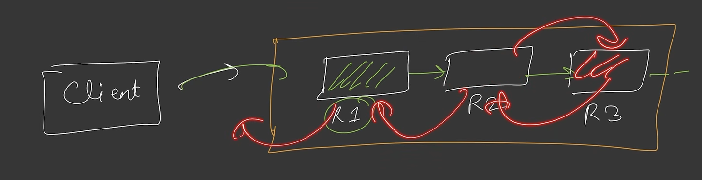

You can guess it, its **very similar to LINKED LIST** but it is slightly different, we will see it later.

> <span style="color:orange">**From Composite Design Pattern, Tree comes in the mind, in the same way from Chain of Responsiblity Design Pattern, Linked List should come in the mind.**</span>

:bulb: <span style="color:red">**Why we want this usecase ?**</span>

-> There are many reason to this one of them being discussed below (it is also the standard example) 

When you go to the ATM machine, there are different handlers present inside it like there are different handlers for Rs 50, 100, 200 and 500 rupees as they are of different denomination value, different size, different quantity.

Now when you request for lets say Rs 3050, then the request goes to all these handlers, so first it goes to Rs 500 handler (checks whether the request can be fulfilled yes (assuming there are enough Rs 500 notes inside ATM) but partially Rs 500 6 notes gets added to make Rs 3000), then it goes to Rs 200 handler (it cannot fulfill the request so pass to Rs 100 handler), it also cannot handle the request so finally goes to Rs 50 handler (now already Rs 3000 has been fulfilled, rest Rs 50 can be fulfilled by 1 note of Rs 50) and in this way the whole Request has been fulfilled.

But here another case exists lets say, user wants to debit Rs 170 then going through all the handler Rs 100 handler will partially fulfill the request of Rs 100 and forward the request to Rs 50 handler, now from here we have two ways to give the output 

1. Either return **Warning or Exception** that this type of Denomination can't be fulfilled and hence transation is declined.
2. Or return the **Nearest possible amount that can be debited** i.e. in the above case Rs 150 closet to Rs 170 and which is possible will get returned to user

Now you understood why this pattern is known as Chain of Responsiblity pattern.

Making the **UML Diagram for the above case**

There are two ways to show the "has-a" relationship for the above case -

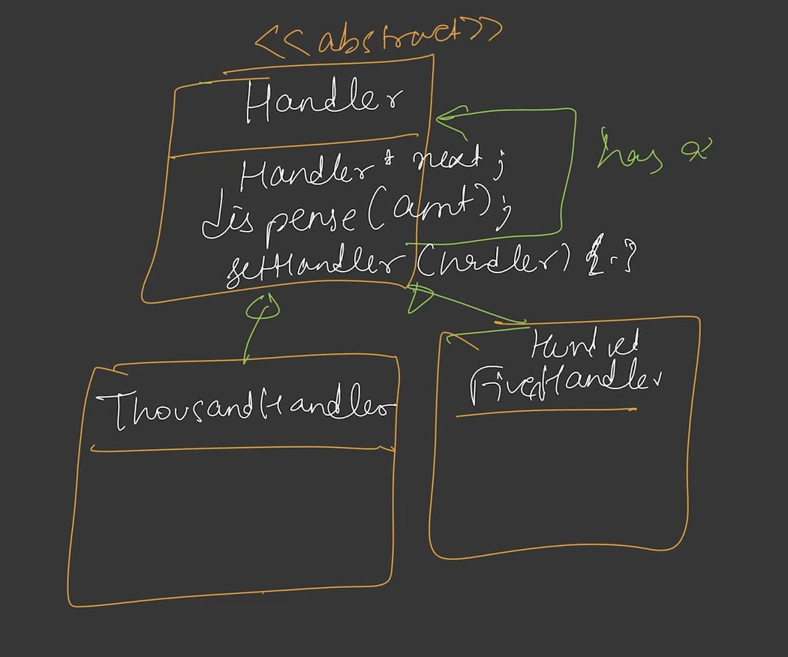 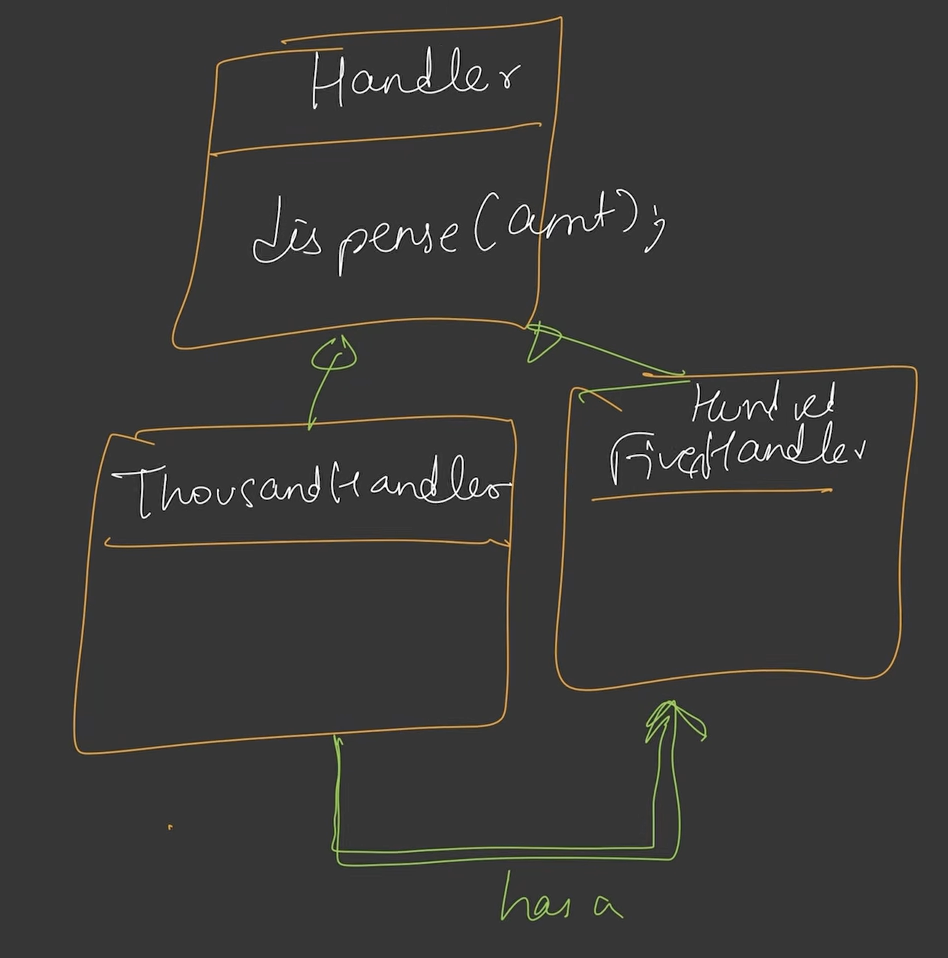

Logically first one is the **Best one** as Second one is **hard-coded**, though it might seem logically right that we have passed reference of Rs 500 handler to Rs 1000 handler 

but here comes the problem, <span style="color:red">**What if in the future demonetization occurs and Rs 500 notes gets discontinued**</span>, then you have to break that chain (basically make the change in existing code) and then shift to the next denomination currency which is **bad code logic as per OCP and tight coupling problem** hence, first (**One Interface (`Handler`) has reference of another Interface (`next`) which is itself as shown in first picture**) is referred.

So `ThousandHandler` does not know that his next handler is `FiveHundredHandler` and vice versa, its the `Handler` which has reference of itself named as `next` which will guide them using `setHandler(handler){}` method (we will define it here only so that it can define the chain, basically will take the handler and set it). so `Handler` has only one method which is abstract or virtual which is `dispense(amount)` method.

**UML Diagram of the above case**

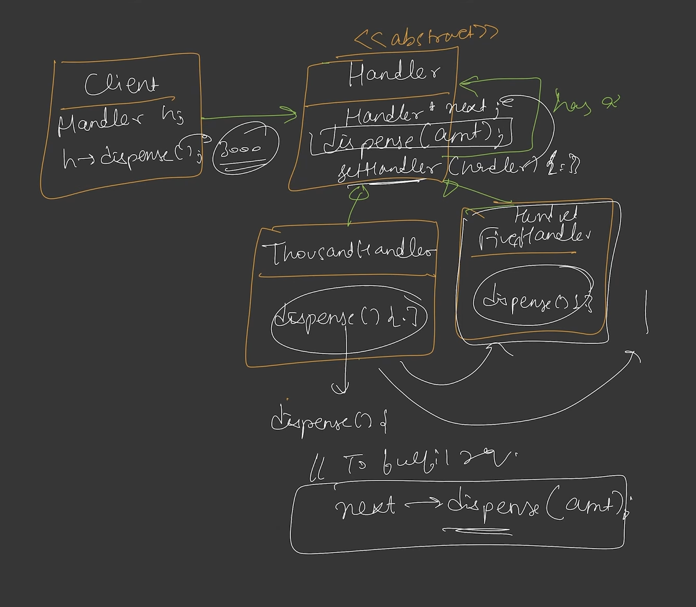

Now `Client` wants to withdraw the money, so it will have reference of `Handler` named as `h` due to which it will call `h.dispense(amount)` now as `h` has first reference of `ThousandHandler` so its `dispense(amount){}` method definition will get called which looks something like the below 

```java
dispense(amount){
    // Logic to fulfill request first then
    next.dispense(amount);   // its "next" is present in the parent "Handler" and this line will call its NEXT handler with rest amount left 
    // so lets say its "next" dispense is FiveHundred handler dispense so it will get run and the process will go on 
}
```

### **UML Diagram**
----------
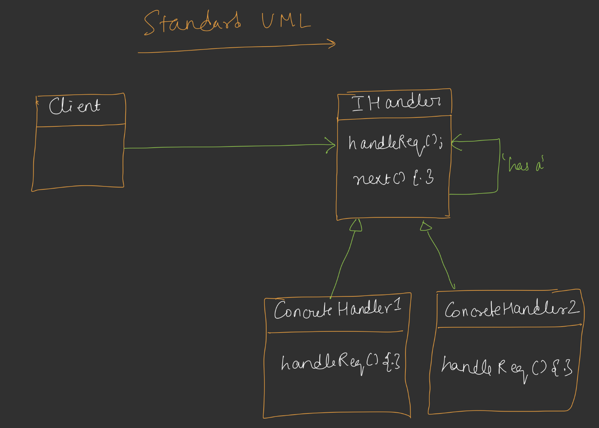

### **Summary**
----------
This pattern allows an **object to pass a request along a chain of potential handlers.** Each handler in the chain decides either to process the request or pass it to the next handler.

### **Code**
----------

```java
abstract class MoneyHandler {
    protected MoneyHandler nextHandler; // Kept protected so that its child classes can use it  

    public MoneyHandler() {
        this.nextHandler = null;
    }

    public void setNextHandler(MoneyHandler next) {
        this.nextHandler = next;
    }

    public abstract void dispense(int amount);  // made abstract as different handler will handle this dispense differently
}

class ThousandHandler extends MoneyHandler {
    private int numNotes;  // Number of Thousand notes which exists

    public ThousandHandler(int numNotes) {
        this.numNotes = numNotes;
    }

    @Override
    public void dispense(int amount) {
        int notesNeeded = amount / 1000;

        if (notesNeeded > numNotes) {
            notesNeeded = numNotes;
            numNotes = 0;
        } else {
            numNotes -= notesNeeded;
        }

        if (notesNeeded > 0)
            System.out.println("Dispensing " + notesNeeded + " x ₹1000 notes.");

        int remainingAmount = amount - (notesNeeded * 1000);
        if (remainingAmount > 0) {
            if (nextHandler != null) nextHandler.dispense(remainingAmount);
            else {
                System.out.println("Remaining amount of " + remainingAmount + " cannot be fulfilled (Insufficinet fund in ATM)");
            }
        }
    }
}

class FiveHundredHandler extends MoneyHandler {
    private int numNotes;

    public FiveHundredHandler(int numNotes) {
        this.numNotes = numNotes;
    }

    @Override
    public void dispense(int amount) {
        int notesNeeded = amount / 500;

        if (notesNeeded > numNotes) {
            notesNeeded = numNotes;
            numNotes = 0;
        } else {
            numNotes -= notesNeeded;
        }

        if (notesNeeded > 0)
            System.out.println("Dispensing " + notesNeeded + " x ₹500 notes.");

        int remainingAmount = amount - (notesNeeded * 500);
        if (remainingAmount > 0) {
            if (nextHandler != null) nextHandler.dispense(remainingAmount);
            else {
                System.out.println("Remaining amount of " + remainingAmount + " cannot be fulfilled (Insufficinet fund in ATM)");
            }
        }
    }
}

class TwoHundredHandler extends MoneyHandler {
    private int numNotes;

    public TwoHundredHandler(int numNotes) {
        this.numNotes = numNotes;
    }

    @Override
    public void dispense(int amount) {
        int notesNeeded = amount / 200;

        if (notesNeeded > numNotes) {
            notesNeeded = numNotes;
            numNotes = 0;
        } else {
            numNotes -= notesNeeded;
        }

        if (notesNeeded > 0)
            System.out.println("Dispensing " + notesNeeded + " x ₹200 notes.");

        int remainingAmount = amount - (notesNeeded * 200);
        if (remainingAmount > 0) {
            if (nextHandler != null) nextHandler.dispense(remainingAmount);
            else {
                System.out.println("Remaining amount of " + remainingAmount + " cannot be fulfilled (Insufficinet fund in ATM)");
            }
        }
    }
}

class HundredHandler extends MoneyHandler {
    private int numNotes;

    public HundredHandler(int numNotes) {
        this.numNotes = numNotes;
    }

    @Override
    public void dispense(int amount) {
        int notesNeeded = amount / 100;

        if (notesNeeded > numNotes) {
            notesNeeded = numNotes;
            numNotes = 0;
        } else {
            numNotes -= notesNeeded;
        }

        if (notesNeeded > 0)
            System.out.println("Dispensing " + notesNeeded + " x ₹100 notes.");

        int remainingAmount = amount - (notesNeeded * 100);
        if (remainingAmount > 0) {
            if (nextHandler != null) nextHandler.dispense(remainingAmount);
            else {
                System.out.println("Remaining amount of " + remainingAmount + " cannot be fulfilled (Insufficinet fund in ATM)");
            }
        }
    }
}

// Client code
public class COR {
    public static void main(String[] args) {

        // Creating Handlers for each type 
        MoneyHandler thousandHandler = new ThousandHandler(3);
        MoneyHandler fiveHundredHandler = new FiveHundredHandler(5);
        MoneyHandler twoHundredHandler = new TwoHundredHandler(10);
        MoneyHandler hundredHandler = new HundredHandler(20);

        // Making the chain of Handlers or basically setting up chain of responsiblity
        thousandHandler.setNextHandler(fiveHundredHandler);
        fiveHundredHandler.setNextHandler(twoHundredHandler);
        twoHundredHandler.setNextHandler(hundredHandler);

        int amountToWithdraw = 4000;

        // Initiating the chain
        System.out.println("\nDispensing amount: ₹" + amountToWithdraw);
        thousandHandler.dispense(amountToWithdraw);
    }
}

// Output 
// Dispensing amount: ₹4000
// Dispensing 3 x ₹1000 notes.
// Dispensing 2 x ₹500 notes.
```

:bulb:<span style="color:red">**At this point you might think that why we have defined every handler and made them seperately cant we just make a single MoneyHandler and then using if-else statement can handle all the handlers code ?**</span>

-> The answer to the above question lies in the past itself, remember **SOLID** principle doing the above said approach violates it  

like suppose if new Rs 50 handler comes then you just have to make a new class instead of making changes in the existing code (which will violate OCP and SRP as well (as Rs 50 handler will handle just Rs 50)).

**Difference between LinkedList and COR**

<div align="center">

| Linked List | COR  |
|---|---|
| Intent is to store the data | Intent is to handle the request which is coming |
| It refers to one object only | It has interface which refers to itself and it has many classes inheriting but has logic where one class is refering to the other  |

</div>

### **Real life use case**
----------

1. **Logger** -> In real app, there are different types of logs coming like Information Log, Debug Log, Error Log etc.., here we can directly use COR. With this the client can get information about the log he/she wants to know.
2. **Leave request system** -> [Asked in interviews as well], problem statement is there is a company and an employee has applied for leave, now this leave goes through a hiearchy or chain  (ex - if less than 2 days, then Team Lead itself approves it, if between 2 to 5 then Manager approves it, if between 6 to 10 days then Director and if Director disapproves it then return an exception or error), here you can use COR.

## **Bridge Pattern**
----------
Before discussing about this pattern, lets understand why this pattern was needed 

Lets say we have an interface class named as `Car` inside which there will be method known as `drive()`. 

Take a look at the table now - 

<div align="center">

| <div align="center">Car types</div> | <div align="center">Engine types</div> |
|---|---|
| Sedan | Petrol |
| Hatchback | Diesel|
| SUV | Electric |

</div>

Now can you imagine the number of permutation and combinations of car that can be made from the above table - like PetrolSedan, DieselSedan, ElectricSedan and so on.. so will you make seperate class for all of these permutation and combination possible ?? then what will happen if new car types will come in the future

Problem is -> Every Pair of Cartypes can pair with any of the Enginetypes, so if there are `m` types of car and `n` types of engine then total number of classes to be formed =  `n * m` (**It will exponentially rise leading to CLASS EXPLOSION.**)

So the above problem is solved by Bridge pattern, lets see how this is done

Imagine you have a **Concept** (i.e. class, problem, etc..) and you break it into **HLP (High Level Part)** and **LLP (Low Level Part)**

<div align="center">

| <div align="center">HLP</div> | <div align="center">LLP</div> |
|---|---|
|It is basically Abstraction (dont commonise it with abstract class definition, it is different) |It is basically Implementation (dont commonise it with concrete class as implementation, it is different) |
| Ex -> Cartypes(SUV, Sedan, etc..) come in this as  they tell how the car looks like(High level part)  | Ex -> Enginetypes(Electric, Petrol, etx..) come in this as they tell how the car is actually implemented (low level part) |
</div>

<span style="color:orange">**Abstraction here means look any particular thing from high level perspective and Implementation here means to look inside a particular thing (i.e. Low level analysis)**</span>

Now to solve the problem, **we will just seperate out Abstraction from Implementation** as shown below

**UML Diagram for the above case**

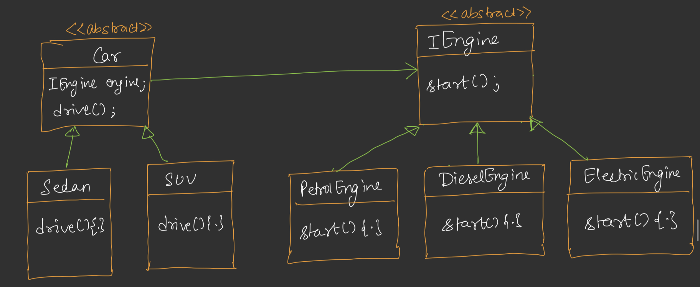

Now to get the Car with any Engine just establish **"has-a" relationship** between `Car` and `IEngine` which has been highlighted in `Car` class by passing a reference of `IEngine` (i.e. `IEngine engine`)

<span style="color:red">**Dont get confuse with real abstraction and implementation, its just that here they mean different**</span>

> <span style="color:orange">**For Rememberance you can instead of calling them abstraction and implementation, call them High Level and Low level which will clear the confusion**</span>
>
>>  But use Abstraction and Implementation when sitting in the interview

So now if you see carefully, total classes that will be made now after implementing bridge pattern is `m + n`, comparted to what was previously as `m * n`.


### **UML Diagram**
----------
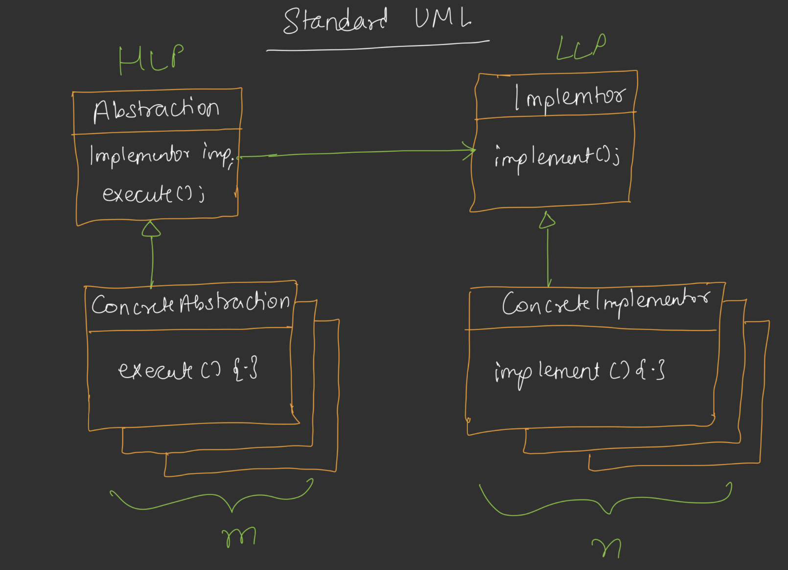

### **Summary**
----------
Bridge **decouples an abstractions (high level part) from its implementations (low level part) so that both can vary independently**

- **Abstraction** -> High level layer (ex -> Car)
- **Implementation** -> Low level layer (ex -> Engine)

### **Difference between Strategy and Bridge Pattern**
----------
You might then think that this same problem can be solved with Strategy Pattern as well and this is <span style="color:red">**asked in the interview as well**</span>

In Strategy also, if you have noticed carefully there also there were many permutation and combination creation was the main problem, there also class explosion was the issue.

In fact, implementing the same above problem using strategy pattern -

We can basically make the `Engine` as a strategy and then using it we can make different types of car.

So confusion seems perfectly valid and there can be times when you can get confused that both the design are working in same manner so which to use.

**The only difference between them is the INTENT.**

<div align="center">

| <div align="center">Strategy Pattern</div> | <div align="center">Bridge Pattern</div> |
|---|---|
| Here there is generally one client (here `Cartypes`) and that has multiple algorithm(here `Enginetypes`) (obviously you can put the client into different sub classes but that is not necessary in strategy)| Here both client (basically in this called as High level) and algorithms (basically low level) they can vary by making their own subclasses and you can pair them up |
| Intent -> Here you can dynamically change the permutation and combination  | Intent -> Though you can dynamically change the permutation and combination but generally it is not recommended to do so.. in this|
| Ex -> Today you gave a SUV petrol variant, maybe next day you can give it diesel variant | Ex -> Although you can do the same thing discussed in the example of strategy, but in bridge it is not recommended, i.e. here it is seen as if SUV has been given petrol variant at first then it will have parts and motor according to that only, now making it diesel engine next day will make that SUV to malfunction as all things were customised according to petrol variant|

</div>


### **Code**
----------
```java

// Implementation Hierarchy: Engine interface (LLL)
interface Engine {
    void start();
}

// Concrete Implementors (LLL)
class PetrolEngine implements Engine {
    @Override
    public void start() {
        System.out.println("Petrol engine starting with ignition!");
    }
}

class DieselEngine implements Engine {
    @Override
    public void start() {
        System.out.println("Diesel engine roaring to life!");
    }
}

class ElectricEngine implements Engine {
    @Override
    public void start() {
        System.out.println("Electric engine powering up silently!");
    }
}

// Abstraction Hierarchy: Car (HLL)
abstract class Car {
    protected Engine engine;
    public Car(Engine e) {
        this.engine = e;
    }
    public abstract void drive();
}

// Refined Abstraction: Sedan
class Sedan extends Car {
    public Sedan(Engine e) {
        super(e);
    }

    @Override
    public void drive() {
        engine.start();
        System.out.println("Driving a Sedan on the highway.");
    }
}

// Refined Abstraction: SUV
class SUV extends Car {
    public SUV(Engine e) {
        super(e);
    }

    @Override
    public void drive() {
        engine.start();
        System.out.println("Driving an SUV off-road.");
    }
}

public class BridgePattern {
    public static void main(String[] args) {
        // Create Engine implementations
        Engine petrolEng = new PetrolEngine();
        Engine dieselEng = new DieselEngine();
        Engine electricEng = new ElectricEngine();

        // Create Car abstractions, injecting Engine implementations
        Car mySedan = new Sedan(petrolEng);
        Car mySUV = new SUV(electricEng);
        Car yourSUV = new SUV(dieselEng);

        // Use the cars
        mySedan.drive();   // Petrol engine + Sedan
        mySUV.drive();     // Electric engine + SUV
        yourSUV.drive();   // Diesel engine + SUV
    }
}

// Output

// Petrol engine starting with ignition!
// Driving a Sedan on the highway.
// Electric engine powering up silently!
// Driving an SUV off-road.
// Diesel engine roaring to life!
// Driving an SUV off-road.
```

### **Real life use case**
----------
1. **Remote control system** -> this is standard example of this pattern, lets suppose there is a Sony TV as it can have variant like LED, LCD, QLED so it is basically Low level part and as TV has remotes also and that can also have remote like bluetooth, one with dedicated netflix, screentouch. so if we want that Sony remote should work with any of the Sony TV then we can use this Pattern. 
2. **GUI** -> It have some Dropdowns, Textbox(GUIs)[high level part]  and also OS (windows, macOs)[low level part] now you have seen these GUIs look differently in windows and macOS, this is implemented using this pattern only.

## **Builder Pattern**
----------

On the industry level or more commoly saying, in the company **whenever object creation will come into picture, this pattern is most widely used.** It is the most widely used pattern.

We never create object as we normally do which is by using `new` keyword in real life or while facing working in the company.

**Standard Definition**

Builder Pattern **seperates the construction of a complex object from its representation.**

To understand this, we are going to take a real life example where this builder pattern is being used ->

**HTTP Request**

We send request fromm one server to other, one microservice to other and so on.. by using HTTP Request. so what is present inside this `HTTP` request 

```markdown
HTTP Request
    ----------> URL (https://www.exmaple.com/target, ......)
    ----------> Method (GET, POST, PUT, DELETE, .....)
    ----------> Headers (content-type: application/json/....)
    ----------> Query Params (optional)
    ----------> Body 
    ----------> Timeout (after this, if the response does not comes, another request is sent)

    and many more ......
```
As `HTTP` Request consists of the above properties and variables, now there is a task to make an `HTTP Request` class inside which there will be one method called as `execute()` and the moment `execute()` method is called, a `HTTP` request shall go from client to server.

```java

class HTTPRequest{
    String url;
    String methods;
    Map<String, String> headers; // as headers are key-value pairs
    Map<String, String> queryParams; // as query parameters are also key-value pairs
    -------/// and so on

    HTTPRequest(url, methods, headers, queryParams, ...){
        this.url = url;
        this.methods = methods;
        this.headers = headers;
        this.queryParams = queryParams;
        -------/// and so on
    }

    // part 2

    HTTPRequest(url, methods){
        this.url = url;
        this.methods = methods;
    }

    void execute(){
        // Logic for actual http call or request sending
    }

}

// Using the above made class
public class NormalClass {
    public static void main(String[] args) {
        HTTPRequest req = new HTTPRequest(fill all the values required and declared above);
        HTTPRequest req2 = new HTTPRequest(url, method);  // for part 2
    }
}

```
Now lets counter the problem that i have only url and method information, regarding the rest, of them some are optional and some values are not known by me so now what to do

A simple approach can be -> CONSTRUCTOR OVERLOADING [which will have only important things] (see part 2), now for part 2 making object will look like above

Now lets say another HTTP request is required in which only url, methods and headers are required, then in this case again you will make another constuctor with url, method and headers passed and then assigned to its own and finally declaring another object to use it.

Even there will be Default HTTP request as well consisting of no parameter.

:bulb: **Can you see the problem ?**

1. **Constructor Overloading/Telescoping ->** You have to make constructor frequently and **different constructor combination are being made** as the object is complicated (taks too much arguments).

2. **Mutable ->** Normally when we give any class `getters` and `setters`, it becomes mutable (**we can easily change the values using `setters`)** [Why this is problem -> because many times we want that the values and properties to not change once its object has been made, even not by using `setters`]
   - one way can be removing the setters but from start we know that we should always use getters and setters as variables are always made private and to access them, getters and setters is the only option.

3. **Inconsistent State ->** Lets say 3 properties are important to give (`url`, `method`, `headers`) and rest all are optional field, now you have given some of the optional values using `req.setTimeout(30)` [basically `setters`](ignore mutable problem here) but not all of them now the moment you called `req.exectue()`, now lets suppose the Sever needs all the things to proceed and you didnt knew of this so in this case now, you will be dealing with **Run time error** (which is one of the worst error form) as at compile time all things will go as you expected.

4. **Scattered Validation ->** Now lets assume you are very intelligent, you never forgets anything so you have set all the values required by the other end (problem which existed above) using setters and now you want to validate the user who in future tries to set these values again with some updated value.
    - For this, we can use `execute()` and add a check `if(req.getURL() == NULL){throw error} if (req.getMethod == NULL){throw error}`
    - You will use validation wherever object `req` has been used as you dont know at which point our object can go to the inconsistent state (means going at third problem).


<span style="color:red">**The above 4 problems generally comes whenever you make an object or object creation takes place (though not important that all of these come in same design case)**</span>

**The detailed code of the above case discussed is given here [Without Builder](#without-builder)**

#### **Without Builder**
----------

```java
import java.util.*;

class HttpRequest {
    private String url;                     // required
    private String method;                  // required
    private Map<String, String> headers;
    private Map<String,String> queryParams;
    private String body;
    private int timeout;                    // required

    // Constructor with only required parameter (1-arg)
    public HttpRequest(String url) {
        this.url = url;
        this.method = "GET";       // Default method
        this.timeout = 30;         // Default timeout
        this.headers = new HashMap<>();
        this.queryParams = new HashMap<>();
    }

    // 2 - args Constructor
    public HttpRequest(String url, String method) {
        this.url = url;
        this.method = method;
        this.timeout = 30;
        this.headers = new HashMap<>();
        this.queryParams = new HashMap<>();
    }

    // 3 - args Constructor
    public HttpRequest(String url, String method, int timeout) {
        this.url = url;
        this.method = method;
        this.timeout = timeout;
        this.headers = new HashMap<>();
        this.queryParams = new HashMap<>();
    }

    // 4 - args Constructor
    public HttpRequest(String url, String method, int timeout, Map<String, String> headers) {
        this.url = url;
        this.method = method;
        this.timeout = timeout;
        this.headers = headers;
        this.queryParams = new HashMap<>();
    }

    // 5 - args Constructor
    public HttpRequest(String url, String method, int timeout,
                       Map<String, String> headers, Map<String,String> queryParams) {
        this.url = url;
        this.method = method;
        this.timeout = timeout;
        this.headers = headers;
        this.queryParams = queryParams;
    }

    // 6 - args Constructor
    public HttpRequest(String url, String method, int timeout,
                       Map<String, String> headers, Map<String,String> queryParams, String body) {
        this.url = url;
        this.method = method;
        this.timeout = timeout;
        this.headers = headers;
        this.queryParams = queryParams;
        this.body = body;
    }

    // Setters (leads to mutable object)
    public void setUrl(String url) {
        this.url = url;
    }

    public void setMethod(String method) {
        this.method = method;
    }

    public void addHeader(String key, String value) {
        headers.put(key, value);
    }

    public void addQueryParam(String key, String value) {
        queryParams.put(key, value);
    }

    public void setBody(String body) {
        this.body = body;
    }

    public void setTimeout(int timeout) {
        this.timeout = timeout;
    }

    // Method to execute the HTTP request
    public void execute() {
        System.out.println("Executing " + method + " request to " + url);

        if (!queryParams.isEmpty()) {
            System.out.println("Query Parameters:");
            for (Map.Entry<String,String> param : queryParams.entrySet()) {
                System.out.println("  " + param.getKey() + "=" + param.getValue());
            }
        }

        System.out.println("Headers:");
        for (Map.Entry<String,String> header : headers.entrySet()) {
            System.out.println("  " + header.getKey() + ": " + header.getValue());
        }

        if (body != null && !body.isEmpty()) {
            System.out.println("Body: " + body);
        }

        System.out.println("Timeout: " + timeout + " seconds");
        System.out.println("Request executed successfully!");
    }
}

public class WithoutBuilder {
    public static void main(String[] args) {
        // Using constructors (telescoping constructor problem)
        HttpRequest request1 = new HttpRequest("https://api.example.com");
        HttpRequest request2 = new HttpRequest("https://api.example.com", "POST");
        HttpRequest request3 = new HttpRequest("https://api.example.com", "PUT", 60);

        // Using setters (mutable object problem)
        HttpRequest request4 = new HttpRequest("https://api.example.com");
        request4.setMethod("POST");
        request4.addHeader("Content-Type", "application/json");
        request4.addQueryParam("key", "12345");
        request4.setBody("{\"name\": \"Aditya\"}");
        request4.setTimeout(60);

        // The problem: what if we forgot to set an important field?
        request4.execute();
    }
}

// Output ->

// Executing POST request to https://api.example.com
// Query Parameters:
//     key=12345
// Headers:
//     Content-Type: application/json
// Body: {"name"; "Aditya"} 
// Timeout: 60 seconds
// Request executed successfully!
```

Moving forward, knowing what the problem is lets come at the solution which is making a class named as `Builder` (as the named it will build something) so `Client` will just interact with `Builder` to get him object of `Target` and `Builder` will give the object of `Target` back to `Client`.

> Basically, **`Client` will just ask for the object of desired class and `Builder` will give this object and that too with all the above 4 problems not happening while object creation.**

Instead of integrating it with UML and then understanding it, better understanding will come with the code part so lets jump to it -> [Simple Builder]()
    
There are three types of Builder ->
    
1. **Simple Builder**
2. **Builder with Director**
3. **Step Builder** 

But before proceeding further, you know about `this` keyword (as this is the core concept to keep in mind while implementing builder pattern)

```java
class A{
    int i1, i2;
    m1(){
        return this;
    }
}

// m1 is basically returning a REFERENCE of A

// so now you can store its reference in some other varaible and use It

A a1 = new A();
A a2 = a1.m1();  // Stored the A's reference in variable a2
```

### **Simple Builder**
----------
#### **Code of Simple Builder**
----------

```java
<-----------This is httprequest.java file------------------------->

package simpleBuilder;

import java.util.*;

public class HttpRequest {
    private String url;
    private String method;
    private Map<String, String> headers;
    private Map<String,String> queryParams;
    private String body;
    private int timeout; // in seconds

    // Our first problem is Constructor overloading (to solve this we want that any user should not be able to create the object using the class name itself)
    // To achieve the above task, first task is to restrict the user from being using "new" to create objects and we know making constructor private helps us achieve this thing as discussed above in singleton pattern as well.

    // Private constructor - can only be accessed by the Builder
    HttpRequest() {
        headers = new HashMap<>();
        queryParams = new HashMap<>();
        body = "";
    }

    // Now here comes the interesting part in C++ -> friend is a keyword which when attached at the front of any class gives that class power to access the private members of the class who has made this class friend without using any getters and setters.
    // so if it was c++ used here then below line will be used just here at this point
    // friend class HttpRequestBuilder;

    // But as we are dealing here with Java and inside java, you can achieve the same thing as above by making it package-level access modifiers (basically keeping them in the same package will make the other class access this class private members also as done here)
    // Above is also the reason why we have seperated and written code in two file(main.java and httprequestbuilder.java file). 

    // Method to execute the HTTP request
    public void execute() {
        System.out.println("Executing " + method + " request to " + url);

        if (!queryParams.isEmpty()) {
            System.out.println("Query Parameters:");
            for (Map.Entry<String, String> param : queryParams.entrySet()) {
                System.out.println("  " + param.getKey() + "=" + param.getValue());
            }
        }

        System.out.println("Headers:");
        for (Map.Entry<String, String> header : headers.entrySet()) {
            System.out.println("  " + header.getKey() + ": " + header.getValue());
        }

        if (body != null && !body.isEmpty()) {
            System.out.println("Body: " + body);
        }

        System.out.println("Timeout: " + timeout + " seconds");
        System.out.println("Request executed successfully!");
    }

    // Builder class as a nested class to access private members
    public static class HttpRequestBuilder {
        private HttpRequest req;  // Takes HttpRequest as a reference // 2

        public HttpRequestBuilder() {
            req = new HttpRequest();
        }

        // Method chaining (These are very similar to how you make setters), when you are working with builder pattern, use "with" as a prefix (as you do for the setters, "set" as a prefix)
        public HttpRequestBuilder withUrl(String u) {
            req.url = u;
            return this;  // We are just doing this extra, that means if someone call "withUrl" then it will get a reference of HttpRequestBuilder, that's why return type of this method and other below are HttpRequestBuilder.
        }

        public HttpRequestBuilder withMethod(String method) {
            req.method = method;
            return this;
        }

        public HttpRequestBuilder withHeader(String key, String value) {
            req.headers.put(key, value);
            return this;
        }

        public HttpRequestBuilder withQueryParams(String key, String value) {
            req.queryParams.put(key, value);
            return this;
        }

        public HttpRequestBuilder withBody(String body) {
            req.body = body;
            return this;
        }

        public HttpRequestBuilder withTimeout(int timeout) {
            req.timeout = timeout;
            return this;
        }

        // Build method to create the immutable HttpRequest object
        public HttpRequest build() { // Returns actual HttpRequest whose object we really want
            // Validation logic can be added here
            // Validation problem is also solved as THIS METHOD WILL HANDLE ALL THE EXCEPTION and instead of validation being scattered at different places.
            if (req.url == null || req.url.isEmpty()) {
                throw new RuntimeException("URL cannot be empty");
            }
            return req; // the same object that we were making, see // 2 above, basically you are chaining or attaching all the variables with req.
        } 
    }
}
```

after this comes the `main.java` as a seperate file (as we want to make a package to accomplish the target 1)

```java
<---------------------This is main.java file contents-------------------------------------->

package simpleBuilder;

public class Main {
    public static void main(String[] args) {
        // Using Builder Pattern (nested class)
        HttpRequest request = new HttpRequest.HttpRequestBuilder()
            .withUrl("https://api.example2.com")  // The reason why we are able to call this much "." operator is because everytime you call any method present in this, it returning HttpRequestBuilder reference (thats why used "return this" line of code inside each method) and on HttpRequestBuilder, we can call any method right.
            .withMethod("POST")
            .withHeader("Content-Type", "application/json")
            .withHeader("Accept", "application/json")
            .withQueryParams("key", "12345")
            .withBody("{\"name\": \"Aditya\"}")
            .withTimeout(60)
            .build(); // Can you see the benefit, now no need to make multiple constructor just attach or remove the variables that you need and thats it, handled multiple constructor problem

            // Solved the problem of Mutablity as well, now if i have to change the values of the above params, you have to again take the HttpRequestBuilder and then pass on all the values with updated values that you want to change. (so now the object is Immutable )

        request.execute(); // Guaranteed to be in a consistent state (Solved the problem of inconsistent state by making sure that till .build() method is not attached at the end, it will not get executed and hence will give error.)
    }
}

// Output -> 

// Executing POST request to https://api.example2.com
// Query Parameters:
//     key=12345
// Headers:
//     Accept: application/json
//     Content-Type: application/json
// Body: {"name": "Aditya"}
// Timeout: 60 seconds
// Request executed successfully!

```
Understanding one of the crucial part of code seperately

```java
package simpleBuilder;

public class Main {
    public static void main(String[] args) {
        HttpRequestBuilder builder = new HttpRequestBuilder();  // This line will create reference of HttpRequestBuilder (Object of "HttpRequestBuilder") named as "builder".
        // so now i can call any method present inside HttpRequestBuilder like
        builder.withUrl("https://www.google.com");  // 2

        // But in reality i want to get the reference of HttpRequest (i.e. object of HttpRequest) right so if we do something like the below
        HttpRequest request = builder.withUrl("https://www.google.com/");  // This line will give ERRROR as part "// 2" has reference of HttpRequestBuilder and you are trying to store here in the reference of HttpRequest (named as "request"), this is not possible.

        // So for conversion we have attached ".build()" method

        HttpRequest request2 = builder.withUrl("https://www.google.com/").build(); // Now this will return the reference of HttpRequest (i.e. Object of "HttpRequest" which is also Target Object) which is being stored inside the variable "request2"
        // .build() method is returning "req" which is a reference of HttpRequest (see // 2 line code in the above codeblock).
    }
}
```

> <span style="color:orange">**Intermediate Methods ->**</span> All the methods which are helping in chaining in the builder method will be called as Intermediate methods
> > Ex -> `withUrl`, `withParams` etc..

> <span style="color:orange">**Terminating Methods ->**</span> The final method that will take part in terminating the Builder or more precisely build method.
> > Ex -> `build` method used above

#### **UML Diagram of Simple Builder**
----------

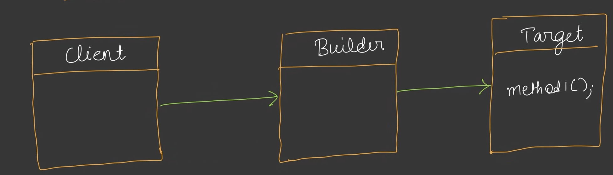

### **Builder with Director**
----------
We can enhance the Simple Builder by giving it superpowers and this purpose is solve by Builder with Director.

Lets see how this is done ->  Lets say `Target` object has some default states such as `D1` or `D2` and so on... and `Client` wants most of the time to get these commonly used states `D1` and `D2` and `Builder` does this job. Now till the above, we could have BUILD either `D1` or `D2`, for this case, we introduce `Director` here **whose work is to manage the Builders.** (basically whatever the preexisting states (states being frequently asked for, or repeatedly its object is being asked for), store that as a method and the moment `Client` asks for that state, you immediately return that state)

Lets understand this by code

#### **Code of Builder with Director**
----------

```java
<--------------This is contents of HttpRequest.java file--------------------------->

// Smae as Previous code of HttpRequest.java 

package builderWithDirector;

import java.util.*;

public class HttpRequest {
    private String url;
    private String method;
    private Map<String, String> headers;
    private Map<String,String> queryParams;
    private String body;
    private int timeout; // in seconds

    // Private constructor - can only be accessed by the Builder
    HttpRequest() {
        headers = new HashMap<>();
        queryParams = new HashMap<>();
        body = "";
    }

    // Method to execute the HTTP request
    public void execute() {
        System.out.println("Executing " + method + " request to " + url);

        if (!queryParams.isEmpty()) {
            System.out.println("Query Parameters:");
            for (Map.Entry<String,String> param : queryParams.entrySet()) {
                System.out.println("  " + param.getKey() + "=" + param.getValue());
            }
        }

        System.out.println("Headers:");
        for (Map.Entry<String,String> header : headers.entrySet()) {
            System.out.println("  " + header.getKey() + ": " + header.getValue());
        }

        if (body != null && !body.isEmpty()) {
            System.out.println("Body: " + body);
        }

        System.out.println("Timeout: " + timeout + " seconds");
        System.out.println("Request executed successfully!");
    }

    // Builder class as a nested class
    public static class HttpRequestBuilder {
        private HttpRequest req;

        public HttpRequestBuilder() {
            req = new HttpRequest();
        }

        // Method chaining
        public HttpRequestBuilder withUrl(String u) {
            req.url = u; return this;
        }

        public HttpRequestBuilder withMethod(String method) {
            req.method = method;
            return this;
        }

        public HttpRequestBuilder withHeader(String key, String value) {
            req.headers.put(key, value);
            return this;
        }

        public HttpRequestBuilder withQueryParams(String key, String value) {
            req.queryParams.put(key, value);
            return this;
        }

        public HttpRequestBuilder withBody(String body) {
            req.body = body;
            return this;
        }

        public HttpRequestBuilder withTimeout(int timeout) {
            req.timeout = timeout;
            return this;
        }

        // Build method to create the immutable HttpRequest object
        public HttpRequest build() {
            // Validation logic can be added here
            if (req.url == null || req.url.isEmpty()) {
                throw new RuntimeException("URL cannot be empty");
            }
            return req;
        }
    }
}
```

Then after introducing Director lets see what changes has came

```java
<----------------This is contents of HttpRequestDirector.java file-------------------->

package builderWithDirector;

public class HttpRequestDirector {
    // We have made the below methods "static" so that you dont need to make HttpRequestDirector object in order to access its method (Simple reasoning behind this is -> How many objects we will be making)

    public static HttpRequest createGetRequest(String url) { // These consists of those default methods which every user wanted (methods that user does not again have to say repeatedly to the Builder using "." operator, user wants to get a preexisting template and using it get the object from it) 
        return new HttpRequest.HttpRequestBuilder()
                .withUrl(url)
                .withMethod("GET")
                .build();
    }

    // As the above example we took is of GET request and as for GET request, body, params does not makes sense so you can just avoid them and make a template of GET request using which user can quickly call and send the GET request. (We dont have to call Builder with "." operator everytime).
    // Similar explanation goes for the below part -> POST request

    // Creates a JSON POST request
    public static HttpRequest createJsonPostRequest(String url, String jsonBody) {
        return new HttpRequest.HttpRequestBuilder()
            .withUrl(url)
            .withMethod("POST")
            .withHeader("Content-Type", "application/json")
            .withHeader("Accept", "application/json")
            .withBody(jsonBody)
            .build();
    }

    // Simply explaining, if you want to send a request where url and Body is required but you know that Method and Headers are going to be same, then just call "createJsonPostRequest" method
    // If you have gone through simplebuilder then you have to create another object which will have all the above values defined again (as thats what we discussed above that Simple Builder also makes the Object Immutable)
}
```

<span style="color:orange">**Basically Director made some pre-existing template so that user or client does not face any problem, user can directly call the frequently used methods template**</span>

Finally the `main` method 

```java
<----------------This is contents of main.java file--------------------------->

package builderWithDirector;

public class Main {
    public static void main(String[] args) {
        // Normal Request from Builder Directly (means Just by using Simple Builder)
        HttpRequest normalRequest = new HttpRequest.HttpRequestBuilder()
            .withUrl("https://api.example.com")
            .withMethod("POST")
            .withHeader("Content-Type", "application/json")
            .withHeader("Accept", "application/json")
            .withQueryParams("key", "12345")
            .withBody("{\"name\": \"Aditya\"}")
            .withTimeout(60)
            .build();

        normalRequest.execute(); // Guaranteed to be in a consistent state

        System.out.println("\n----------------------------\n");

        // Request by using the same request but by using BuilderWithDirector
        HttpRequest getRequest = HttpRequestDirector.createGetRequest("https://api.example.com/users"); // We have directly HttpRequestDirector method instead of first making its object and then using, this is why we made methods present inside "HttpRequestDirector" as "static". (not attached ".build()" method at last as it is already returning the output of ".build()" attached  at the end.)
        getRequest.execute();

        System.out.println("\n----------------------------\n");

        HttpRequest postRequest = HttpRequestDirector.createJsonPostRequest(
            "https://api.example.com/users",
            "{\"name\": \"Aditya\", \"email\": \"aditya@example.com\"}");
        postRequest.execute();
    }
}

// Output ->

// Executing POST request to https://api.example.com
// Query Parameters:
//     key=12345
// Headers:
//     Accept: application/json
//     Content-Type: application/json
// Body: {"name": "Aditya"}
// Timeout: 60 seconds
// Request executed successfully!

// ------------------------------------
// Executing GET request to https://api.example.com/users
// Headers:
// Timeout: 0 seconds
// Request executed successfully!

// ----------------------------------
// Executing POST request to https://api.example.com/users
// Headers:
//     Accept: application/json
//     Content-Type: application/json
// Body: {"name": "Aditya", "email": "aditya@example. com"}
// Timeout: 0 seconds
// Request executed successfully!

```
> :round_pushpin: **Builder with Director gave us <span style="color:orange">**Reusuable Builds**</span> which can be used by the user**


#### **UML Diagram of Builder with Director**
----------

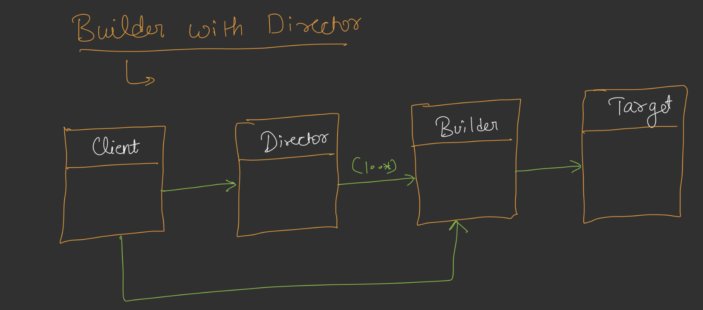

### **Step Builder**
----------

This is the third and last type of Builder which solves all the problem present inside the Step Builder and Builder with Director pattern.

Before discussing about it, lets see first which are the problems which was present in Builder with Director and Simple Builder that Step Builder solves ->

Lets take an example of customised pizze shop where you will have to tell all the steps (basically customise all the components of pizza according to you)

So the pizzamaker will ask about 

1. Pizze Crust type
2. Sauce selection
3. Toppings required
4. Type of Cheese

and that too it should be in the same order as written above

Many times we have objects which we can build **Step by Step** only (i.e. lets say we have object that we want to create, now we are saying that first a particular part of it will get builded then some other part and so on..), there **Step Builder is used**.

The above thing was missing in both Simple Builder and Builder with Director

:bulb:<span style="color:red">**You might ask here question that in the Simple Builder i can add the method or chain the method accroding to the steps then how Step Builder is different ?**</span>

-> We can summarise the Step Builder as below

1. **Create Object step by step** -> though Simple Builder can chain the methods in prescribed manner but Step Builder **forces steps** (i.e. -> In simple builder there is a chance that we can change the chain of methods (mutablity of chain of methods is possible) but in Step builder we can fix the chain of methods).
2. **If required, you can make some field optional and even force the user to give all the field as well** -> Basically the validation you were doing inside `build` method like (if body is not present and so on...), with Step Builder you will not have to write this much `if-else` also (i.e. add lot of validation checks)

#### **Understanding Step Builder**
----------
Before understanding Step Builder, lets first try to recap about a concept called as **Multiple Inheritance.**

Lets take an example -> we have 3 abstract pure class named as `I1`, `I2` and `I3` (in java basically Interface), and there is also a class named as `Builder` whom we inherited to the above 3 said interface.

As in C++ through classes, multiple inheritance exists and for Java, Multiple inheritance exists but only through interfaces hence declared interfaces.

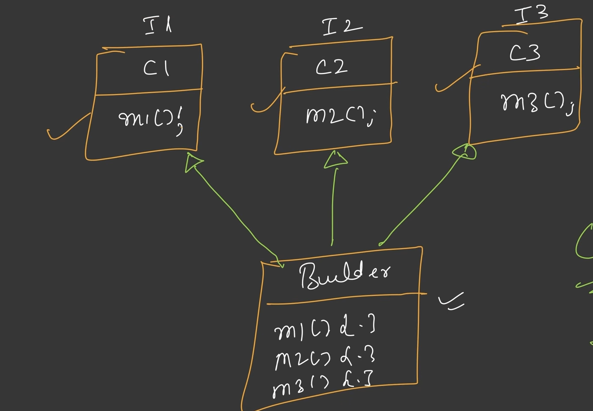

:round_pushpin: <span style="color:green">**Step Builder is the only pattern which uses multiple inheritance**</span>, otherwise we already have discussed above that we should try to avoid inheritance as much as possible.

:bulb: <span style="color:red">**How Step Builder works ?**</span>

-> Lets say `Request` object is what we want to make now you know how you will create it using normal builder, but using step builder, now i want to have methods joined in chain and that too in specific order.

Based on all the variables present in the `Request` class, `Builder` class makes 3 abstract class (or interface) named as `URLStep`, `MethodStep` and `bodyStep`

and to maintain the step, `URLStep` will **return the reference of `MethodStep` (i.e. <span style="color:orange">**"has-a" relationship**</span> with `MethodStep`) and similar will happen with `MethodStep` to `bodyStep` and finally `bodyStep` is having "has-a" relationship with `BuildStep` inside which method `build` exists which will return the object of `Request`.

Now `StepBuilder` inherits all the above 3 interface and starts implementing the methods present inside it.

:bulb: <span style="color:red">**Can you see the benefit of the above ?**</span>

-> Now you have forced the `Client` to follow step by step when making an object of `Request` class. how lets see ->

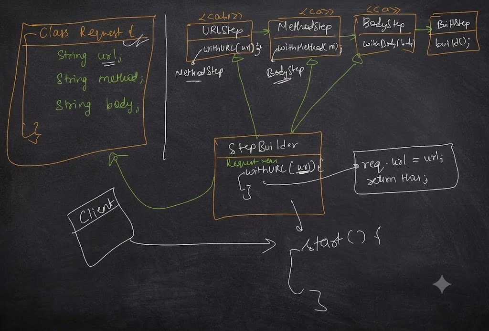

`Client` will first have to call the `start` method present inside the `StepBuilder` in order to make the object of `Request`, now `start` logic is written in such a way that it will first return the object of first step that is `URLStep` class, now the moment `URLStep`'s object is given to the `Client`, it will only be able to access one method as that is only present inside the `URLStep` and that is `withURL` and as this `withURL` method which in turn returns `MethodStep` object, now `Client` again can call only one method `withMethod` as that is only present inside the `MethodStep` class and this again returns `bodyStep` object and so on.....

Coming to the conclusion from the above points, we have restricted the `Client` to use the method and that too in a particular manner or more precisely step by step manner.


#### **Code for Step Builder**
----------
```java
<---------------This is content of HttpRequest.java file---------------------->

package stepBuilder;

import java.util.*;

public class HttpRequest {
    private String url;
    private String method;
    private Map<String, String> headers;
    private Map<String, String> queryParams;
    private String body;
    private int timeout; // in seconds

    // Private constructor - can only be accessed by the Builder
    private HttpRequest() {
        headers = new HashMap<>();
        queryParams = new HashMap<>();
        body = "";
    }

    // Method to execute the HTTP request
    public void execute() {
        System.out.println("Executing " + method + " request to " + url);

        if (!queryParams.isEmpty()) {
            System.out.println("Query Parameters:");
            for (Map.Entry<String, String> param : queryParams.entrySet()) {
                System.out.println("  " + param.getKey() + "=" + param.getValue());
            }
        }

        System.out.println("Headers:");
        for (Map.Entry<String, String> header : headers.entrySet()) {
            System.out.println("  " + header.getKey() + ": " + header.getValue());
        }

        if (!body.isEmpty()) {
            System.out.println("Body: " + body);
        }

        System.out.println("Timeout: " + timeout + " seconds");
        System.out.println("Request executed successfully!");
    }

    // Nested Step interfaces
    interface UrlStep {
        MethodStep withUrl(String url); // Returns MethodStep object
    }

    interface MethodStep {
        HeaderStep withMethod(String method);  // Returns HeaderStep object
    }

    interface HeaderStep {
        OptionalStep withHeader(String key, String value);  // Returns OptionalStep object
    }

    interface OptionalStep {
        OptionalStep withBody(String body);
        OptionalStep withTimeout(int timeout);
        HttpRequest build();
    }

    // Concrete step builder as static nested class
    static class HttpRequestStepBuilder implements UrlStep, MethodStep, HeaderStep, OptionalStep { // Implementing Multiple inheritance in java
        private HttpRequest req;

        private HttpRequestStepBuilder() {
            req = new HttpRequest();
        }

        // UrlStep implementation
        public MethodStep withUrl(String url) {
            req.url = url;
            return this; // Though here "this" should return HttpRequestStepBuilder object as this method is present in the class HttpRequestStepBuilder but as HttpRequestStepBuilder implements/inherits UrlStep, MethodStep, HeaderStep, OptionalStep, so according to the line "CHILD CAN REFER TO THE PARENT CLASS AS WELL" so it can refer to these classes from which it is inheriting. and hence here we have returned the object type as MethodStep so that first it sticks to step by step approach and second it can refer its parent class "MethodStep". 
        }

        // MethodStep implementation
        public HeaderStep withMethod(String method) {
            req.method = method;
            return this;
        }

        // HeaderStep implementation
        public OptionalStep withHeader(String key, String value) {
            req.headers.put(key, value);
            return this;
        }

        // OptionalStep implementation
        public OptionalStep withBody(String body) {
            req.body = body;
            return this;
        }

        public OptionalStep withTimeout(int timeout) {
            req.timeout = timeout;
            return this;
        }

        public HttpRequest build() {
            if (req.url == null || req.url.isEmpty()) {
                throw new RuntimeException("URL cannot be empty");
            }
            return req;
        }

        // Static method to start the building process (acting as start method in the example taken above)
        public static UrlStep getBuilder() { // It gives UrlStep object as that is the FIRST step and we have to start from this class only to maintain the step by step process.
            return new HttpRequestStepBuilder();
        }
    }
}
```

and finally `main.java`

```java
<--------------This is content of main.java file------------------------->

package stepBuilder;

public class Main { // As getBuilder is static method so we have called it just by its name (no onject creation)
    public static void main(String[] args) {
        HttpRequest stepRequest = HttpRequest.HttpRequestStepBuilder.getBuilder()
            .withUrl("https://api.example.com/products")
            .withMethod("POST")
            .withHeader("Content-Type", "application/json")
            .withBody("{\"product\": \"Laptop\", \"price\": 49999}")
            .withTimeout(45)
            .build();

        stepRequest.execute();
    }
}

// Output ->

// Executing POST request to https://api.example.com/products
// Headers:
//     Content-Type: application/json
// Body: {"product": "Laptop", "price": 49999}
// Timeout: 45 seconds
// Request executed successfully! 
```

#### **UML Diagram of Step Builder**
----------

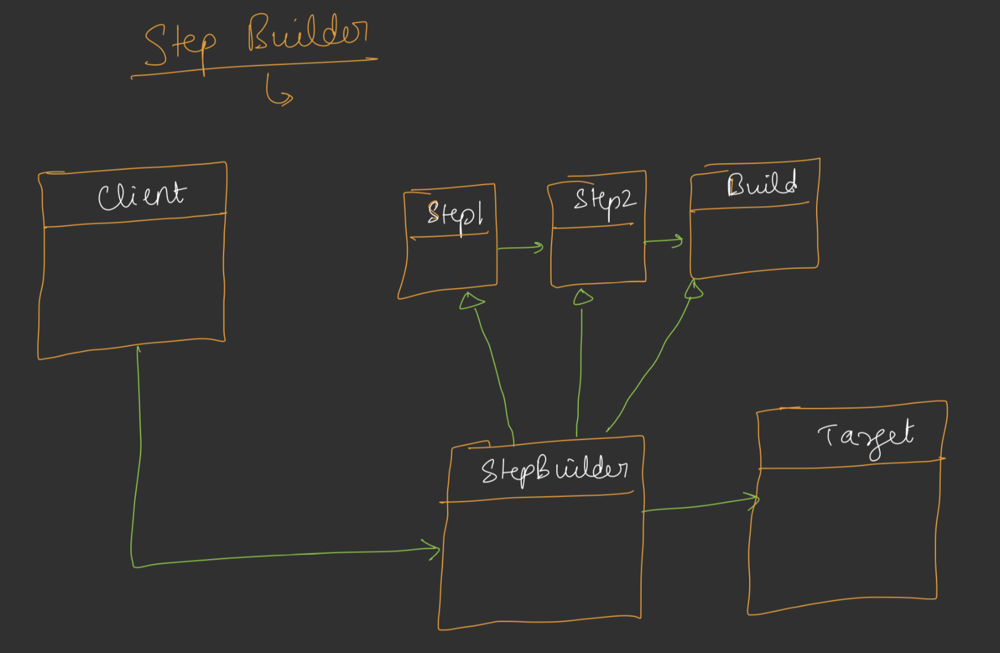

## **Iterator Pattern**
----------
You have definitely heard of the iterators in DSA, in this topic we will get a better insight about them and clear some of the good question regarding it like why normal loop cant do the job ?

Lets assume there is an object, now i want to iterate over this object, what does this mean -> basically object can be anything right so it is linkedlist, binarytree, playlist of anyplayer app etc..

so we know that to traverse over linked list we have logic something like the below

```java
temp = head
while(temp != null){
    temp = temp -> next;
}
```
Similarly for traversing over binary tree, we have Traversal order like -> Level Order Traversal, Depth order traversal

For playlist, if songs are present in simple vector then normal for loop will work, if stored in the map then also you can using loop traverse over it  

But <span style="color:orange">**Do you know that apart from all the above traversal technique, we also have something known as ITERATORs which can be used to traverse over any data structure**</span>

So here we are going to make an interator and in interview, it is very common question that **design your own iterator**

:bulb: <span style="color:red">**Why Iterators was needed if we know traversal logic over any data structure ?**</span>

-> Lets take example of playlist 

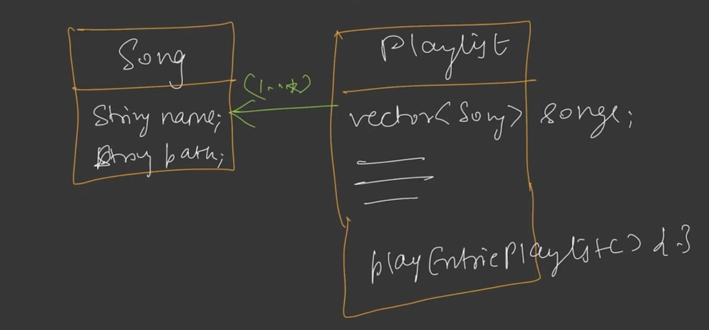

As `Playlist` **"has-a"** `Song` (1 to many relationship), so `Playlist` will have `Songs` and to store them lets suppose Array is used for storing purpose so `vector<Song>Songs;`, also it will have a method for playing the playlist (basically iterating over the song in the playlist) named as `playEntirePlaylist(){}` now inside this its logic consists of `for` loop for iterating over the playlist, now lets suppose now i want to store the songs in Linked List so can you now guess the problem which arised here-

I will have to change the logic of `playEntirePlaylist(){}` and make the traversal logic change from previous `for` loop to now pointer related traversal.

**You broke the most basic principle of SOLID principle which is SRP (Single Responsiblity Principle)**

> Hence we should <span style="color:orange">**Always keep seperately Object Business logic and Object Traversal logic**</span> if we want to make follow SRP.
>
>> Taking example above -> `Playlist` basically should not know how to traverse over the songs, it should just know that it has to call a method and in return it should get the next song, it should just know about some other class `Iterator` whose some method (like `hasNext()` or `next()`) will be called by it 

**Above is the main reason why iterator is required**

Any method (like for ex -> `getSongById()` or etc..) which requires traversing will be done by `Iterator` class methods (`hasNext()` and `next()`)

Now lets see how we are going to iterate using Iterator 

First we know that we need `Iterator` so a interface will be made with this name and as `Iterator` has work how to iterate over any data structure, hence only two methods (`hasNext()`(will tell whether the next element exists or not) and `next()` (actually gives you the next element if exists))

Before coming to concrete implementation of `Iterator`, we will first go through what type of data structures are we dealing with (i.e. linked list, binary tree, and playlist), so we will make seperate class and declare for all of them in the same way as you declare them in DSA.

**UML Diagram of the above case**

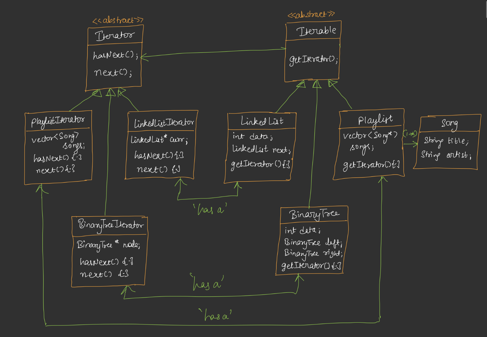

Now in all of the data structure to traverse over them, we dont want the iterator to be declared in them instead we want it to recieve the iterator so for that `getIterator(){}` is present, but whatever things will be given by `getIterator(){}` in all of them, we will have to keep `getIterator` method, instead of doing this we will make another seperate interface named as `Iteratable` inside which there will be method `getIterator()`

Here **"has-a" relationship** exists between `Iterator` and `Iterable` as **`Iterable` gives and `Iterator`.**

and **"is-a" relationship** exists between `Linkedlist` and `Iterable` as **`Linkedlist` can be `Iterable`** (or simply means saying `Linkedlist` can be Iterated), Basically any class that will inherit `Iterable` can be iterated.

Now what does this `getIterator(){}` method will be doing, they will be just returning an Iterator. Now making concrete implementation of iterator like `LinkedlistIterator` and inside it, first it will have reference of `Linkelist` named as `Curr` and second it will override two methods `hasNext()` and `next()` present in the parent class `Iterator`, both the above two methods consists of logic of iterating over linked list.

if you see the `hasNext(){}` logic for `LinkedlistIterator`

```java
if(Curr.next != null){
    return true;
}
return false;
```
similarly `next(){}` logic for `LinkedlistIterator`

```java
Curr = Curr.next;
```
Also as `getIterator(){}` inside `Linkedlist` calling this should call `LinkedlistIterator`'s `next(){}` and `hasNext(){}` method hence **"has-a" relatiship exist between `LinkedlistIterator` and `Linkedlist`** as "`Linkedlist` has `LinkedlistIterator`".

Similar to linked list, all other corresponding iterator work and has been shown above in the UML diagram


### **UML Diagram**
----------

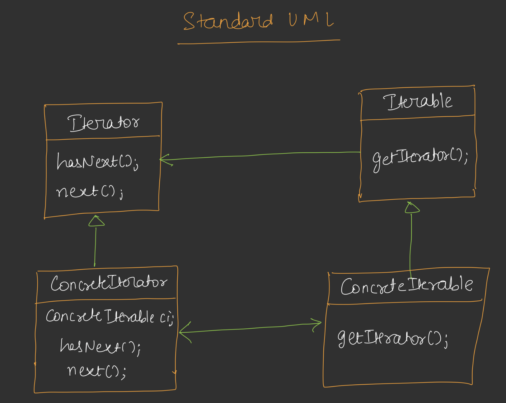

### **Summary**
----------
Iterator **provides a way to access the elements of an aggregate objects sequentially without exposing its underlying implementation**

### **Code**
----------

```java
import java.util.*;

// Iterator and Iterable hiearchy

interface Iterator<T> {
    boolean hasNext();
    T next();  // used generics as if linkedlist is there then it will return linkedllistiterator and so on...
}

interface Iterable<T> {
    Iterator<T> getIterator();
}

// Linked List
class LinkedList implements Iterable<Integer> {
    public int data;
    public LinkedList next;

    public LinkedList(int value) {
        data = value;
        next = null;
    }

    public Iterator<Integer> getIterator() {
        return new LinkedListIterator(this); // Linkedlist Iterator will be given to linkedlist
        // Passed "this" as LinkedlistIterator needs a reference that it should point to which linked list  and in which linked list to loop through
    }
}

// Binary Tree
class BinaryTree implements Iterable<Integer> {
    public int data;
    public BinaryTree left;
    public BinaryTree right;

    public BinaryTree(int value) {
        data = value;
        left = null;
        right = null;
    }

    public Iterator<Integer> getIterator() {
        return new BinaryTreeInorderIterator(this);
    }
}

// Song and Playlist
class Song {
    public String title;
    public String artist;

    public Song(String t, String a) {
        title = t;
        artist = a;
    }
}

class Playlist implements Iterable<Song> {
    public List<Song> songs = new ArrayList<>();

    public void addSong(Song s) {
        songs.add(s);
    }

    public Iterator<Song> getIterator() {
        return new PlaylistIterator(songs);
    }
}

// Concrete Iterators

class LinkedListIterator implements Iterator<Integer> {
    private LinkedList current;

    public LinkedListIterator(LinkedList head) {
        current = head;
    }

    public boolean hasNext() {
        return current.next != null;
    }

    public Integer next() {
        int val = current.data;
        current = current.next;
        return val;
    }
}

class BinaryTreeInorderIterator implements Iterator<Integer> {
    private Deque<BinaryTree> stk = new ArrayDeque<>();

    private void pushLefts(BinaryTree node) {
        while (node != null) {
            stk.push(node);
            node = node.left;
        }
    }

    public BinaryTreeInorderIterator(BinaryTree root) {
        pushLefts(root);
    }

    public boolean hasNext() {
        return !stk.isEmpty();
    }

    public Integer next() {
        BinaryTree node = stk.pop();
        int val = node.data;
        if (node.right != null) {
            pushLefts(node.right);
        }
        return val;
    }
}

class PlaylistIterator implements Iterator<Song> {
    private List<Song> vec;
    private int index = 0;

    public PlaylistIterator(List<Song> v) {
        vec = v;
    }

    public boolean hasNext() {
        return index < vec.size();
    }

    public Song next() {
        return vec.get(index++);
    }
}

// Main
public class IteratorPattern {
    public static void main(String[] args) {
        //------------------------------------------------
        // LinkedList: 1 → 2 → 3
        LinkedList list = new LinkedList(1);
        list.next = new LinkedList(2);
        list.next.next = new LinkedList(3);

        Iterator<Integer> iterator1 = list.getIterator();

        System.out.print("LinkedList contents: ");
        while (iterator1.hasNext()) {
            System.out.print(iterator1.next() + " ");
        }
        System.out.println();

        //------------------------------------------------

        // BinaryTree:
        //    2
        //   / \
        //  1   3
        BinaryTree root = new BinaryTree(2);
        root.left  = new BinaryTree(1);
        root.right = new BinaryTree(3);

        Iterator<Integer> iterator2 = root.getIterator();

        System.out.print("BinaryTree inorder: ");
        while (iterator2.hasNext()) {
            System.out.print(iterator2.next() + " ");
        }
        System.out.println();

        //------------------------------------------------

        // Playlist
        Playlist playlist = new Playlist();
        playlist.addSong(new Song("Admirin You", "Karan Aujla"));
        playlist.addSong(new Song("Husn", "Anuv Jain"));

        Iterator<Song> iterator3 = playlist.getIterator();

        System.out.println("Playlist songs:");
        while (iterator3.hasNext()) {
            Song s = iterator3.next();
            System.out.println("  " + s.title + " by " + s.artist);
        }
    }
}

// Output

// LinkedList contents: 1 2 3
// BinaryTree inorder: 1 2 3
// Playlist songs:
//     Admirin You by Karan Aujla
//     Husn by Anuv Jain
```
### **Real life use case**
----------
**All iterators present in any language uses this pattern only to implement the iterator.**

**TO-DOs**

You can extend the Iterator functionality by introducing `prev()` and `hasPrev()` which will help in backward traversal

Hint -> Include these two in interface `Iterator` and then override these two methods in the concrete implementation of the corresponding data structure iterator with its logic written inside it.

## **Flyweight Pattern**
----------
Before learning about this, keep some points in mind regarding this 

1. This pattern solves a very specific problem (just one usecase) which is saving your RAM (basically making your object lightweight) 
2. Above points explain why it is named as Flyweight (Fly like weight).

Also it is so specific and useful that you can **ask from the interviewer during interview while solving any problem statement that whether RAM is an important resource here**

-> If yes then use this pattern

Coming to the usecase, inside RAM (obviously objects are created here) lets say there is some process which is creating a lot of objects which obviously can slow down the process, so this pattern simply says that you dont have to create this much objects, **Just create object and try to reuse it as much as possible**

**Example of Game**

Take an example of aestroids hitting game where there is a spaceship and that has ability to shoot down the aestriods with its laser gun, now every aestroids is an object and if the game difficulty is Hard then at particular moment of time, there can be a hell lot of aestroids coming towards the spaceship making RAM overwhelm with objects creation.

so overcome with the above problem, we **will reuse the object `Aestroid`**, lets see how this is done

Making `Aestroid` class,

Now according to the Flyweight pattern, whatever the object which is going to be resused, you should break it into two parts 
1. **Intrinsic property**
2. **Extrinsic property**

To understand them lets come back again at the example of the game used above 

<div align="center">

| <div align="center">Intrinsic</div> | <div align="center">Extrinsic</div> |
|---|---|
| Property which remains same to most of the object | Property which will be different for every object present |
| Can be reused | Cannot be reused as different for every other object  |
| Ex -> Length, width, weight, colour, texture (they all can have limited values) | Ex -> posX, posY, velX, velY (all these can dynamically change assuming touchscreen game, all the above property depends on you finger touch, you might can immediately make the space go up which will change velocity and position) |

</div>

Basically Group all the aestroid which have same property into one group so that you can reuse them by returning same object, instead of creating them from scratch

> <span style="color:orange">**Summarising the above task -> take out all the Extrinsic property which are present in the object making it left only with Intrinsic property**</span>
>
>> As you are left only with Intrinsic property in the class (it will now be called as **Flyweight objects**), so now you can **reuse the object made using this class**, <span style="color:orange">**Extrinsic property which has been kept outside will be put in another class**</span>

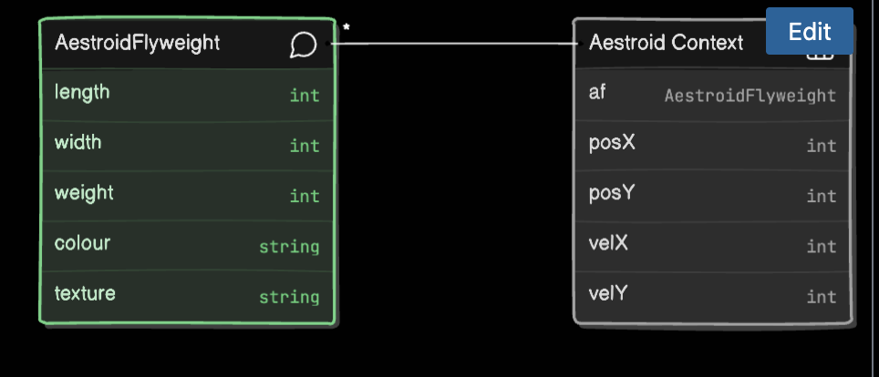

**"has-a" relationship exists here between `AestroidFlyweight` and `AestroidContext`**

So though there will be different object creation for class `AestroidContext` but there will be very limited number of object creation from class `AestroidFlyweight` as many of the objects will have some property hence they will just point to the same object instead of creating them from scratch.

Now how we will make sure that only limited number of objects get created ?

-> For this purpose, we will use **MAP**, for the above case

`map<key, AestroidFlyweight>pool`, we know that keys are unique so we will store the intrinsic property value set inside this something like this 

`length + '/' + width + '/' + weight + '/' + colour + '/' + texture`, using it some of the examples can be or basically the map will look something like the below 

<div align="center">

| <div align="center">Key</div> | <div align="center">AestroidFlyweight</div> |
|---|---|
| 10 / 10 / 1 / red / Hard | Object1 |
| 20 / 30 / 2 / green / Soft | Object2 |
| and so on values set.. | and so on.. |

</div>

Benefit of the above made map is that now if some aestoid requries the value set `10 / 10 / 1 / red / Hard` then just by returning them `Object1` i can avoid the object creation.

Whatever the `Map` part logic has been done that is written inside another class lets name it as `FlyweightFactory` as it is doing the job of creating the Flyweight, its just that it is smart factory (not making objects everytime, make it only when some new type of flyweight comes into the picture)

So now the overall UML diagram looks something like the below

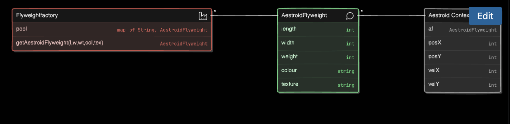

### **UML Diagram**
----------
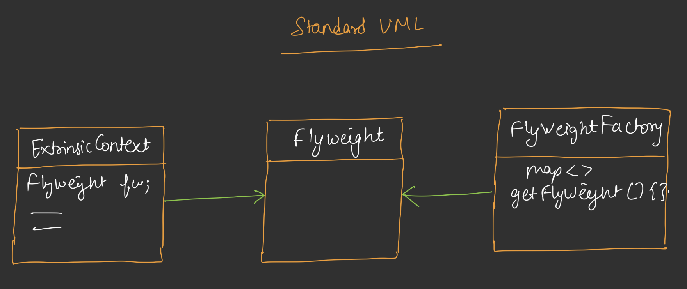

### **Summary**
----------
Flyweight **uses Sharing to support large number of fine grained objects efficiently**

- **Intrinsic state** -> Shared among objects
- **Extrinsic state** -> Supplied by client externally

### **Code**
----------

#### **Without Flyweight**

```java
import java.util.ArrayList;
import java.util.List;

class Asteroid {
    // Without Flyweight means Keeping both Intrinsic and Extrinsic property in same class instead of seperating them
    // Intrinsic properties (same for many asteroids) - DUPLICATED FOR EACH OBJECT
    private int length;                          
    private int width;                          
    private int weight;                          
    private String color;                      
    private String texture;                    
    private String material;                    

    // Extrinsic properties (unique for each asteroid)
    private int posX, posY;                
    private int velocityX, velocityY;            

    public Asteroid(int l, int w, int wt, String col, String tex, 
        String mat, int posX, int posY, int velX, int velY) { // Better way to assign this much value is Builder Pattern but as we are learning here Flyweight Pattern so skipped it
        this.length = l;
        this.width = w;
        this.weight = wt;
        this.color = col;
        this.texture = tex;
        this.material = mat;
        this.posX = posX;
        this.posY = posY;
        this.velocityX = velX;
        this.velocityY = velY;
    }

    public void render() {
        System.out.println("Rendering " + color + ", " + texture + ", " + material 
            + " asteroid at (" + posX + "," + posY 
            + ") Size: " + length + "x" + width
            + " Velocity: (" + velocityX + ", " 
            + velocityY + ")");
    }

    // Calculate approximate memory usage per object
    public static long getMemoryUsage() {
        return Integer.BYTES * 7 +                // length, width, weight, x, y, velocityX, velocityY (total 7 integer values)
               40 * 3;                            // Approximate string data (assuming average 10 chars each) (total 3 string values)
    }
}

class SpaceGame {
    private List<Asteroid> asteroids = new ArrayList<>();

    public void spawnAsteroids(int count) { // Creates Aestroids
        System.out.println("\n=== Spawning " + count + " asteroids ===");

        // Taking Limited values as they are Intrinsic property
        String[] colors = {"Red", "Blue", "Gray"};
        String[] textures = {"Rocky", "Metallic", "Icy"};
        String[] materials = {"Iron", "Stone", "Ice"};
        int[] sizes = {25, 35, 45};

        for (int i = 0; i < count; i++) {
            int type = i % 3;  // basically if 0 aayega to Red, Rocky, Iron, 25 aayeaga value me and so on according to Map.

            asteroids.add(new Asteroid(
                sizes[type], sizes[type], sizes[type] * 10, // basically length = 25, width = 25, weight = 25 * 10 = 250 for one aestroid
                colors[type], textures[type], materials[type],
                100 + i * 50,         // Simple x: 100, 150, 200, 250... // All from here and below are kept simple values but in real life they vary a lot and rapidly not like the concrete values given here like 1, 2 
                200 + i * 30,         // Simple y: 200, 230, 260, 290...
                1,                    // All move right with velocity 1
                2                     // All move down with velocity 2
            ));
        }

        System.out.println("Created " + asteroids.size() + " asteroid objects");
    }

    public void renderAll() {
        System.out.println("\n--- Rendering first 5 asteroids ---");
        for (int i = 0; i < Math.min(5, asteroids.size()); i++) {
            asteroids.get(i).render();
        }
    }

    public long calculateMemoryUsage() {
        return asteroids.size() * Asteroid.getMemoryUsage();
    }

    public int getAsteroidCount() {
        return asteroids.size();
    }
}

public class WithoutFlyWeight {
    public static void main(String[] args) {
        final int ASTEROID_COUNT = 1_000_000;

        System.out.println("\n TESTING WITHOUT FLYWEIGHT PATTERN");
        SpaceGame game = new SpaceGame();

        game.spawnAsteroids(ASTEROID_COUNT);

        // Show first 5 asteroids to see the pattern
        game.renderAll();

        // Calculate and display memory usage
        long totalMemory = game.calculateMemoryUsage();

        System.out.println("\n=== MEMORY USAGE ===");
        System.out.println("Total asteroids: " + ASTEROID_COUNT);
        System.out.println("Memory per asteroid: " + Asteroid.getMemoryUsage() + " bytes");
        System.out.println("Total memory used: " + totalMemory + " bytes");
        System.out.println("Memory in MB: " + totalMemory / (1024.0 * 1024.0) + " MB");
    }
}

// Output 

// === Spawning 1000000 asteroids ===
// Created 1000000 asteroid objects

// --- Rendering first 5 asteroids —--
// Rendering Red, Rocky, Iron asteroid at (100, 200) Size: 25x25 Velocity: (1, 2)
// Rendering Blue, Metallic, Stone asteroid at (150,230) Size: 35x35 Velocity: (1, 2)
// Rendering Gray, Icy, Ice asteroid at (200, 260) Size: 45x45 Velocity: (1, 2)
// Rendering Red, Rocky, Iron asteroid at (250, 290) Size: 25x25 Velocity: (1, 2)
// Rendering Blue, Metallic, Stone asteroid at (300,320) Size: 35x35 Velocity: (1, 2)

// === MEMORY USAGE ===
// Total asteroids: 1000000
// Memory per asteroid: 196 bytes
// Total memory used: 196000000 bytes
// Memory in MB: 186.92 MB
```

#### **With Flyweight**

```java
import java.util.*;

// Flyweight - Stores INTRINSIC state only
class AsteroidFlyweight {
    // Intrinsic properties (shared among asteroids of same type)
    private int length;          
    private int width;           
    private int weight;          
    private String color;       
    private String texture;      
    private String material;    

    public AsteroidFlyweight(int l, int w, int wt, String col, String tex, String mat) {
        this.length = l;
        this.width = w;
        this.weight = wt;
        this.color = col;
        this.texture = tex;
        this.material = mat;
    }

    public void render(int posX, int posY, int velocityX, int velocityY) {
        System.out.println("Rendering " + color + ", " + texture + ", " + material 
            + " asteroid at (" + posX + "," + posY 
            + ") Size: " + length + "x" + width
            + " Velocity: (" + velocityX + ", " 
            + velocityY + ")");
    }

    public static long getMemoryUsage() {
        return Integer.BYTES * 3 +            // length, width, weight
                40 * 3;                       // Approximate string data
    }
}

// Flyweight Factory
class AsteroidFactory {
    private static Map<String, AsteroidFlyweight> flyweights = new HashMap<>();

    public static AsteroidFlyweight getAsteroid(int length, int width, int weight, 
                                                String color, String texture, String material) {

        String key = length + "_" + width + "_" + weight + "_" + color + "_" + texture + "_" + material;

        if (!flyweights.containsKey(key)) { // If key does not exist then make it and then insert it in the map
            flyweights.put(key, new AsteroidFlyweight(length, width, weight, color, texture, material));
        }

        return flyweights.get(key);  // Reuse part
    }

    public static int getFlyweightCount() {
        return flyweights.size();
    }

    public static long getTotalFlyweightMemory() {
        return flyweights.size() * AsteroidFlyweight.getMemoryUsage();
    }

    public static void cleanup() {
        flyweights.clear();
    }
}

// Context - Stores EXTRINSIC state only
class AsteroidContext {
    private AsteroidFlyweight flyweight;
    private int posX, posY; // 8 bytes (position) as int take 4 bytes and there are two values here (posX, posY) same goes for below
    private int velocityX, velocityY; // 8 bytes (velocity)

    public AsteroidContext(AsteroidFlyweight fw, int posX, int posY, int velX, int velY) {
        this.flyweight = fw;
        this.posX = posX;
        this.posY = posY;
        this.velocityX = velX;
        this.velocityY = velY;
    }

    public void render() {
        flyweight.render(posX, posY, velocityX, velocityY);
    }

    public static long getMemoryUsage() {
        return 8 + Integer.BYTES * 4; // approximate pointer + ints
    }
}

class SpaceGameWithFlyweight {
    private List<AsteroidContext> asteroids = new ArrayList<>();

    public void spawnAsteroids(int count) { // Same as that used in WithoutFlyWeight
        System.out.println("\n=== Spawning " + count + " asteroids ===");

        String[] colors = {"Red", "Blue", "Gray"};
        String[] textures = {"Rocky", "Metallic", "Icy"};
        String[] materials = {"Iron", "Stone", "Ice"};
        int[] sizes = {25, 35, 45};

        for (int i = 0; i < count; i++) {
            int type = i % 3;

            AsteroidFlyweight flyweight = AsteroidFactory.getAsteroid(
                sizes[type], sizes[type], sizes[type] * 10,
                colors[type], textures[type], materials[type]
            );

            asteroids.add(new AsteroidContext(
                flyweight,
                100 + i * 50, // Simple x: 100, 150, 200, 250...
                200 + i * 30, // Simple y: 200, 230, 260, 290...
                1, // All move right with velocity 1
                2  // All move down with velocity 2
            ));
        }

        System.out.println("Created " + asteroids.size() + " asteroid contexts");
        System.out.println("Total flyweight objects: " + AsteroidFactory.getFlyweightCount());
    }

    public void renderAll() {
        System.out.println("\n--- Rendering first 5 asteroids ---");
        for (int i = 0; i < Math.min(5, asteroids.size()); i++) {
            asteroids.get(i).render();
        }
    }

    public long calculateMemoryUsage() {
        long contextMemory = asteroids.size() * AsteroidContext.getMemoryUsage();
        long flyweightMemory = AsteroidFactory.getTotalFlyweightMemory();
        return contextMemory + flyweightMemory;
    }

    public int getAsteroidCount() {
        return asteroids.size();
    }
}

public class WithFlyWeight {
    public static void main(String[] args) {
        final int ASTEROID_COUNT = 1_000_000;

        System.out.println("\nTESTING WITH FLYWEIGHT PATTERN");
        SpaceGameWithFlyweight game = new SpaceGameWithFlyweight();

        game.spawnAsteroids(ASTEROID_COUNT);

        // Show first 5 asteroids to see the pattern
        game.renderAll();

        // Calculate and display memory usage
        long totalMemory = game.calculateMemoryUsage();

        System.out.println("\n=== MEMORY USAGE ===");
        System.out.println("Total asteroids: " + ASTEROID_COUNT);
        System.out.println("Memory per asteroid: " + AsteroidContext.getMemoryUsage() + " bytes");
        System.out.println("Total memory used: " + totalMemory + " bytes");
        System.out.println("Memory in MB: " + (totalMemory / (1024.0 * 1024.0)) + " MB");
    }
}

// Output 

// === Spawning 1000000 asteroids ===
// Created 1000000 asteroid contexts
// Total flyweight objects: 3

// —-- Rendering first 5 asteroids —--
// Rendering Red, Rocky, Iron asteroid at (100, 200) Size: 25x25 Velocity: (1, 2)
// Rendering Blue, Metallic, Stone asteroid at (150,230) Size: 35x35 Velocity: (1, 2)
// Rendering Gray, Icy, Ice asteroid at (200, 260) Size: 45x45 Velocity: (1, 2)
// Rendering Red, Rocky, Iron asteroid at (250, 290) Size: 25x25 Velocity: (1, 2)
// Rendering Blue, Metallic, Stone asteroid at (300, 320) Size: 35x35 Velocity: (1, 2)

// === MEMORY USAGE ==
// Total asteroids: 1000000
// Memory per asteroid: 24 bytes
// Total memory used: 24000540 bytes
// Memory in MB: 22.8887 MB
```

Can you see the difference between memory used with Flyweight and without Flyweight ?

### **Real life use case**
----------
Any usecase where there is a repeatition of object creation and that too of same type is going on there this pattern is very helpful to use the resources more efficiently.

Example includes

1. **Open world games** -> In games like GTA5, you can see number of objects looking very similar like peoples, buildings, cars there this pattern is used. (**Basically they create shared objects and from different reference they refer to these shared objects**)
2. **Text Editor** -> In text editor, if you write any text, then its particular one character has many properties like value, font, size etc.. now if you change any of its properties then instead of making a fresh new object of that character (which will lead to class explosion and ultimately RAM breaking), we can just refer it to particular one object consisting of particular set of values. (Font may look different (Extrinsic property) but any alphabet will look same right (Intrinsic property))

## **Prototype Pattern** 
----------
It again solves a particular type of problem.

Lets understand what type of problem does it solve 

Lets take and object named as `a1` made from the `Class A{ }` now to make the `Obj1` we will do `A * a1 = new A()` in cpp and `A a1 = new A()` in java, now i want another object `a2` then you will do the same thing as above, similarly for any other object `aN`, you will do the same thing as above.

Problem is that many times **Object creation is expensive operation.** (ex - maybe object creation happens after db connection, etc..)

So creating object like above way is not going to work.

To understand this pattern in better way, we will take NPCs (Non playable characters) present in any game. At the moment when the game loads you have to create a good amount of objects or NPCs for the game. Basically this pattern says that **Instead of creating a new object from scratch, make a COPY (or PROTOTYPE) of the same object and use it** 

Making a class named as `NPC` inside whose object creation requires expensive operation inside it will be `clone(){}` method implemented as well. now object creation will look something like the below 

```java
NPC n1 = new n1();  // Whatever time is going to be taken for object creation will be taken by this line only, we are just doing an expensive operation one time 
NPC n2 = n1.clone(); // For this part it will not affect much
```

:bulb:<span style="color:red">**How the `Clone()` is going to work**</span>

-> If you have studied about **Copy constructor** then this is what is being implemented in `Clone()`

Constructor is of 3 types 

1. **Default constructor** -> Any constructor which **does not takes any argument**
2. **Parameterised constructor** -> You pass some parameters **inside the constuctor as argument**
3. **Copy constructor** -> Used to **Clone a particular class**, we use exactly this to implement the prototype design

coming back to the UML Diagarm ->

 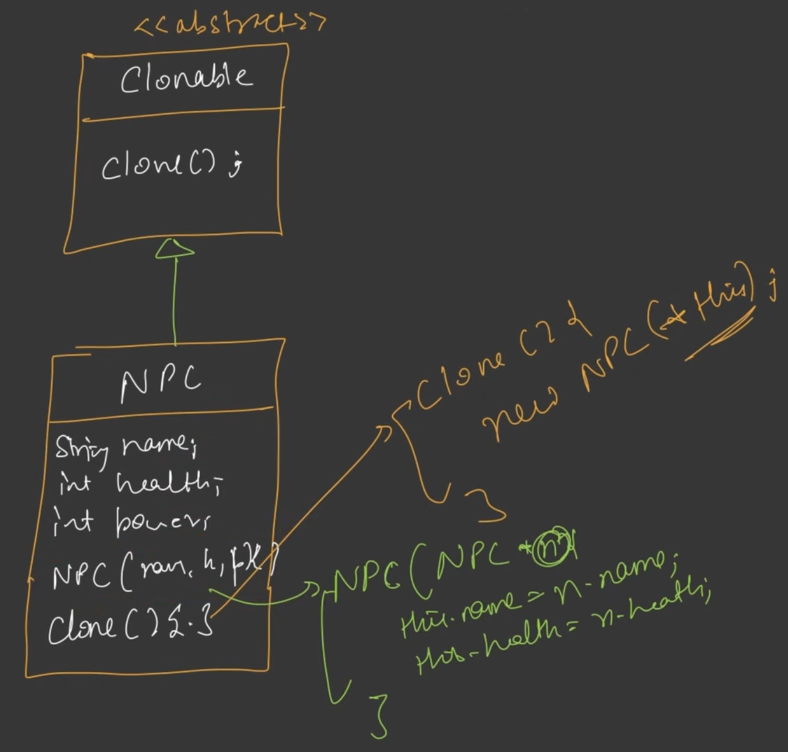

**Purpose of `Clonable` Interface**

-> It is just acting as **Marker**, infact in java, these type of interfaces are termed as **Marker Interfaces**, means **whosever class will inherit this abstract class or interface basically says that that newly made class can be cloned (i.e. Cloning of that class is possible)**

The other `NPC (NPC n){}` is actually the copy constructor in which `NPC` reference is passed into its argument and then just copied the value of everything from the Real constructor (i.e. `NPC(name, heal, pow){}`), code will give better visulisation.

> <span style="color:orange">**Marker Interfaces**</span> -> Interfaces which do not do any operation, they just act as marker used to mark the purpose of the concrete classes that are inheriting this interface.


### **UML Diagram**
----------
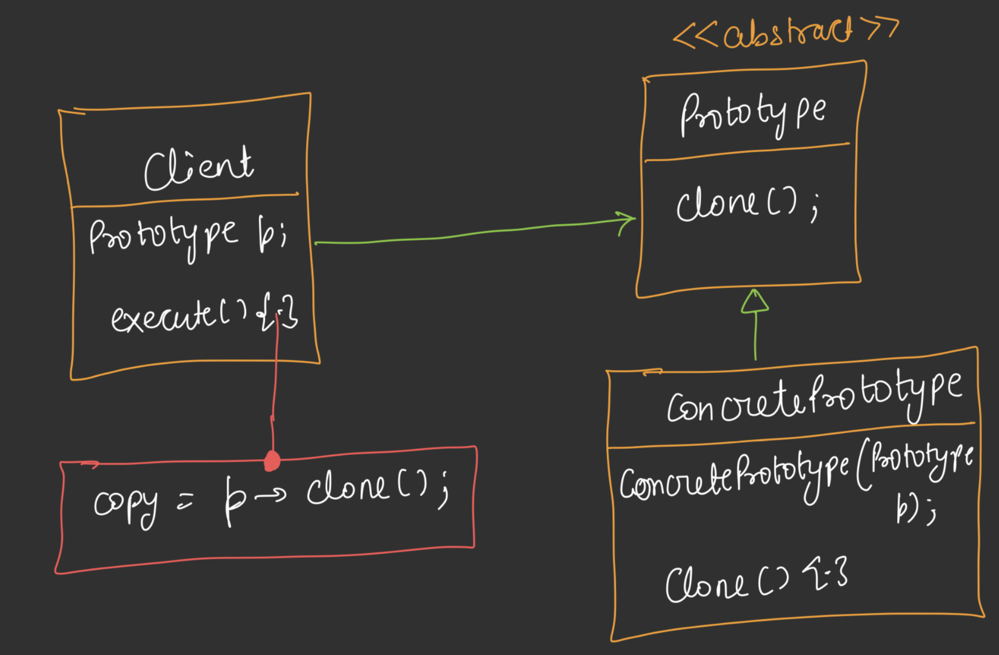

Now you might be thinking of the case that i have cloned an object using the below psudocode

```java
NPC n1 = new NPC("Satyam", 20, 1000000)
NPC n2 = n1.clone();
```
:bulb: <span style="color:red">**But this will copy all the value of `n1` to `n2`, what if i want some changes in `n2` ?**</span>

-> For ex -> I want `n2` just power to be 400000 then in this case, you can use **getters and setters (n2.setPower(40000))**

> <span style="color:orange">**This pattern is very useful in that case where there is many samll objects share very less disimilarity between them (i.e. they are similar to very extens)**</span>


### **Shallow copy V/S Deep copy**
----------

As we have discussed above that we going to copy the object using copy constructor, now **Copy is of two types**

1. **Shallow copy**
2. **Deep copy**

When you are doing 

```java
NPC (NPC n){ // assuming int x and int y present inside the n
    this.x = n.x;
    this.y = n.y;
}
```
now talking about the primitive dataypes (1st image)

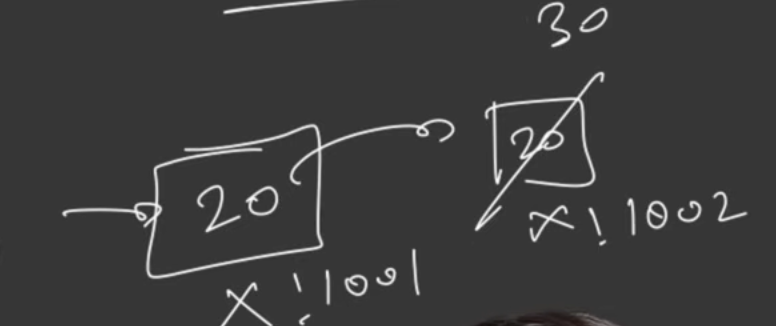 

copying the x present at address 1001 we got x **VALUE being copied at 1002** and now if you change the value of x at 1002 then its value will change at that address only, it will not get reflected on x present at 1001.

But for non-primitive datatypes like object created from a class we have made, lets say `obj1` and `obj2` now **for shallow copy**, as both `obj1` and `obj2` variable `s1` points to the same heap memory so changing in one gets reflected in other also.

But **for Deep copy** -> the two `obj1`, `obj2`'s `s1` gets stored at different place in heap so changing in one does not change the other.

For more information, go to OOPs playlist by kunal kuswaha and understand it in more detailed manner.

### **Summary**
----------
**It lets you create new object by copying (cloning) another instance.**

### **Code**
----------

#### **Without Prototype**
----------
```java
// Simple NPC class — no Prototype
class NPC {
   public String name;
   public int health;
   public int attack;
   public int defense;
   
   // "Heavy" constructor: every field must be provided
   public NPC(String name, int health, int attack, int defense) {
        // Some heavy operation can also exist like below
       // call database
       // complex calc
       this.name = name;
       this.health = health;
       this.attack = attack;
       this.defense = defense;
       System.out.println("Creating NPC '" + name + "' [HP:" + health + ", ATK:" 
            + attack + ", DEF:" + defense + "]");
   }
   
   public void describe() {
       System.out.println("  NPC: " + name + " | HP=" + health + " ATK=" + attack
            + " DEF=" + defense);
   }
}

public class WithoutPrototype {
   public static void main(String[] args) {
       // Base Alien
       NPC alien = new NPC("Alien", 30, 5, 2);
       alien.describe();
       
       // Powerful Alien — must re-pass all stats, easy to make mistakes
       NPC alien2 = new NPC("Powerful Alien", 30, 5, 5);
       alien2.describe();
       
       // If you want 100 aliens, you'd repeat this 100 times…
   }
}

// Output

// Creating NPC 'Alien' [HP:30, ATK:5, DEF:2] 
//     NPC: Alien | HP=30 ATK=5 DEF=2
// Creating NPC 'Powerful Alien' [HP: 30, ATK:5, DEF:5] 
//     NPC: Powerful Alien | HP=30 ATK=5 DEF=5
```

#### **With Prtotype**
----------
```java
// Cloneable (aka Prototype) interface
interface Cloneable {
   Cloneable clone();
}

class NPC implements Cloneable {
   public String name;
   public int health;
   public int attack;
   public int defense;
   
   public NPC(String name, int health, int attack, int defense) {
        // some heavy operation can also exists here like below
       // call database
       // complex calc
       this.name = name; 
       this.health = health; 
       this.attack = attack; 
       this.defense = defense;
       System.out.println("Setting up template NPC '" + name + "'");
   }
   
   // Copy Constructor used by clone()
   public NPC(NPC other) {
       name = other.name;
       health = other.health;
       attack = other.attack;
       defense = other.defense;
       System.out.println("Cloning NPC '" + name + "'");
   }
   
   // the clone method required by Prototype
   public Cloneable clone() {
       return new NPC(this);
   }
   
   public void describe() {
       System.out.println("NPC " + name + " [HP=" + health + " ATK=" + attack 
            + " DEF=" + defense + "]");
   }
   
   // setters to tweak the clone… (if you want to modify object slightly)
   public void setName(String n) { 
       name = n;
   }
   public void setHealth(int h) { 
       health = h;
   }
   public void setAttack(int a) {
        attack = a; 
   }
   public void setDefense(int d){ 
       defense = d;
   }
}

public class PrototypePattern {
   public static void main(String[] args) {
       // 1) build one "heavy" template
       NPC alien = new NPC("Alien", 30, 5, 2);
       
       // 2) quickly clone + tweak as many variants as you like:
       NPC alienCopied1 = (NPC)alien.clone();  // Dynamic casting (if you are getting reference of Parent and you have to insert that in Child then you use Dynamic casting)
       alienCopied1.describe();
       
       NPC alienCopied2 = (NPC)alien.clone();  // Dynamic casting 
       alienCopied2.setName("Powerful Alien"); // Tweaked some value
       alienCopied2.setHealth(50);
       alienCopied2.describe();
       
       // cleanup (not required in java)
       alien = null;
       alienCopied1 = null;
       alienCopied2 = null;
   }
}

// Output

// Setting up template NPC 'Alien'
// Cloning NPC 'Alien'
// NPC Alien [HP=30 ATK=5 DEF=2]
// Cloning NPC 'Alien'
// NPC Powerful Alien [HP=50 ATK=5 DEF=2]
```


### **Real life use case**
----------

Any scenario in which you have to make small objects but creation of these objects is expensive and also these objects are very similar to each other then there you can definitely use this pattern to avoid unnecessary object creation.

1. **NPCs** -> NPCs in games are implemented using this pattern only
2. **DB Connection** -> If object creation happens only when db is connected then instead of every time connecting to a db to create an object, just copy the object which has already been created (with condition that you need similar looking objects only)


## **State Pattern**
---------
Lets take a scenario in which there is an Object which can work in **three states** and this object can change its state from one to other (the moment you perform some method on some states, it gets changed to some other state, there can be the case that performing some method on any state does not change its state)

looks something like the below 

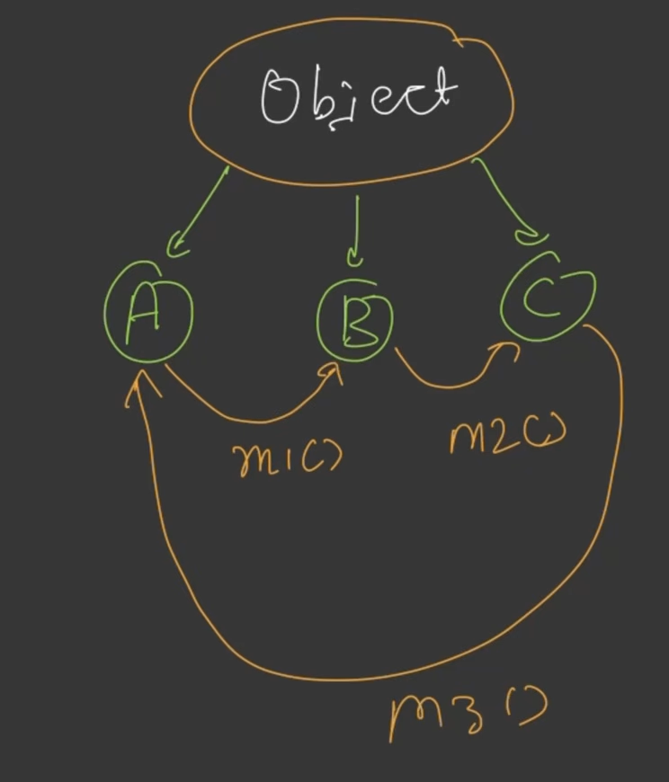 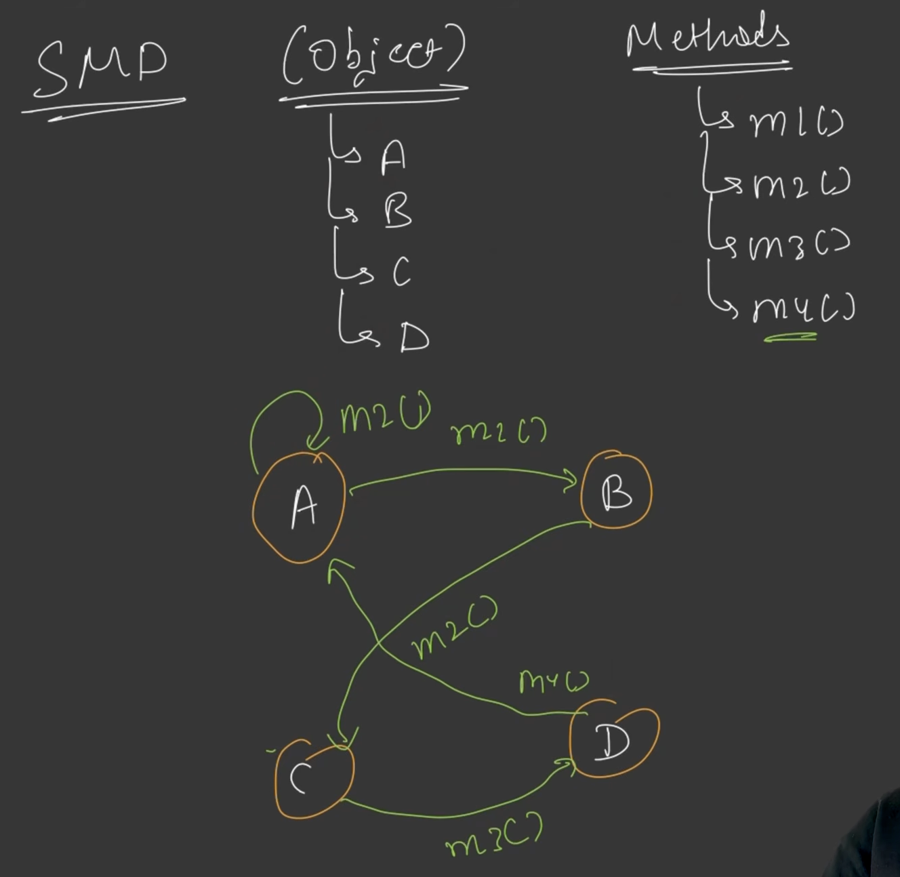


Also known as **State machine diagrams** (see both the above figures, performing a particular method on particular state leads to hopp-in to another state or even self state hopp-in also possible (state does not changed, in the above figure represented by `m2` applied self hop on the state `A`))

> **One thing is for sure while applying state pattern -> Number of objects and state remains FINITE.**

Lets take example of Vending machine in order to understand state pattern but before this ->

:bulb: <span style="color:red">**Why vending machine is taken as example to understand state pattern ?**</span>

-> There are few reasons for this 

1. **It can remain in limited number of states only**
2. **Among those limited states, only limited number of operations can be performed**
3. **Easy to understand**
4 **Loosely coupled**

Coming back to the design part ->

lets break down the states present in it (again it can be made as complex as possible by including many states but for now we are taking a basic vending machine that fulfills the basic requirement and satisfy the definition of a basic vending machine)

When we have done nothing to the vending machine, it is in **No Coin State (or Idle State)**,

after this lets say now i have inserted a coin so making another state named as **HasCoin state**

The moment you will insert the coin, you will select the item you want and that will be dispensed hence making third state as **Dispense state**

and finally there can be **Sold out state** (lets say there is nothing left on the vending machine or the item you chose is not present for this, this state has been made).

Ofcourse, there can be other states like **Payment state etc..** but for now lets take only these 4 states

Now lets try to make the State machine diagram of these states with how vending machine is going to work in these state with the methods that will allow to do this and even make it enable to change the state 

1. as the machine is idle, so it is in `NoCoinState` to go into `HasCoinState` we will use `insertCoin()` method
2. after `HasCoinState` it will go to `DispenseState` using `selectItem()` method
3. after `DispenseState` it is ready to dispense the item and hence by using `dispense()` method either it will go to `SoldOutState` (if that item is not present) or will go to `NoCoinState` (as after dispensing the item the machine will again come back to its normal idle state to let other user perform the above operation again)
4. Now to handle the `SoldOutState`, another method named as `refill()` is introduced so that the moment this method is called, `SoldOutState` will change its state back to `IdleState` displaying to the user, that item has been refilled and is available again 

Now handling some of the edgecases like what if on the `NoCoinState` itself, i call `refill()` or `dispense()` or `selectItem()` method and so on will do on the other state (i.e. calling those methods on the particular state that is not appropriate for the step by step procedure)

-> <span style="color:red">**Answer to the above question is that it will remain in that state only, it will not change its state**</span>

**There are basically 2 scenarios in which one state is not going to transform to other state (or hop to other state)**

1. **That operation cant be performed on that state** -> Ex -> you are calling `dispense()` method on the `HasCoinState` (this operation cant be performed by `HasCoinState` as items cant be dispensed without selecting the items ) so it will return to its own method and will throw error.
2. **Operation can be performed but the output of it comes in such a way that it does not make the state to transform (i.e. make it remain in that state)** -> Ex -> Lets take an exmaple of Vending machine consisting of only water bottles each costing Rs 30. now you have inserted the coin of first Rs 10, now currently it is on `HasCoinState` (as the coin has been inserted) but now it should not change its state to `DispenseState` as the actual price is Rs 30 for the bottle to get dispensed and you have currently inserted Rs 10 so it will remain (will NOT CHANGE the state) in the `HasCoinState` itself and wait for another Rs 10 and lets say now the user again puts Rs 10, so though `insertCoin()` method has been called again (OPERATION can be performed again) still it will remain in its own state as the requriement to go into the next state `DispenseState` is Rs 30 and till now machine has recieved Rs 20 only
 

Summarising all the above things, below is the State machine diagram which follows all the above states and method transformation

`returnCoin()` -> Vending machine will return all the money it took it from you, this operation is important for many reasons like maybe as the items you have selected is soldout so the machine has to return the money it took it from you earlier, similar to this many usecase can be there for this operation.

We are just implementing all the permutations and combinations of operation on a particular state, maybe for some it will change its state and for others it will not be able to change its state.(----- simply means you have returned to the same state)

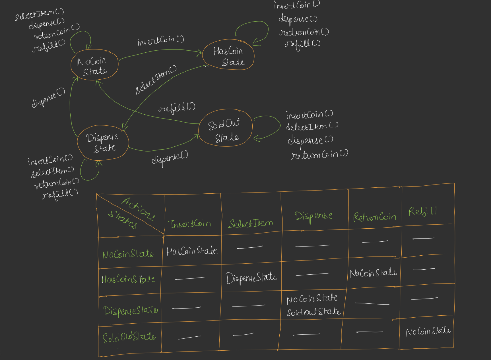

Now based on the State machine diagram, we will be able to understand and make the UML Diagram.

So the 4 states present above will be the concreate class inheriting from the abstract class or interfaces named as `VendingMachineState`, all the methods or more precisely operations in terms of state pattern that will be declared inside `VendingMachineState`

As we have to go from `NoCoinState` to `HasCoinState` so we will keep a reference of `HasCoinState` in `NoCoinState` and same goes for all the other state transformation way. (represented by red line in the below diagram)

Means **One Concrete state will hold the reference of other Concrete state** (this same thing used to happen inside Chain of Responsiblity pattern).

Now we will make `VendingMachine` class whose work is to **Delegate all the task** (means when a particular operation is performed on a particular state this will tell the state that on which state it will go to next)

So in State pattern, two high level classes exist 

1. **State Class ->** `VendingMachineState` and all the class inheriting it will come in this class.
2. **Context Class ->** This will tell the state class that on which a particular state a state should go if some operation has been performed on it, here `VendingMachine` is working as Context class. (**This simply means that all the methods that has been defined and declared in the State class that all methods will be defined and declared inside Context class also**)

Hence, `VendingMachine` will have **"has-a"** relationship with `VendingMachineState` and thus will have reference of `VendingMachineState` inside `VendingMachine`.

<span style="color:orange">**Work of `VendingMachine` class is just one thing -> the reference of `VendingMachineState` named as `state` which it has took inside itself, it is updating this `state` value repeatedly**</span>

**UML Diagram of the above case**

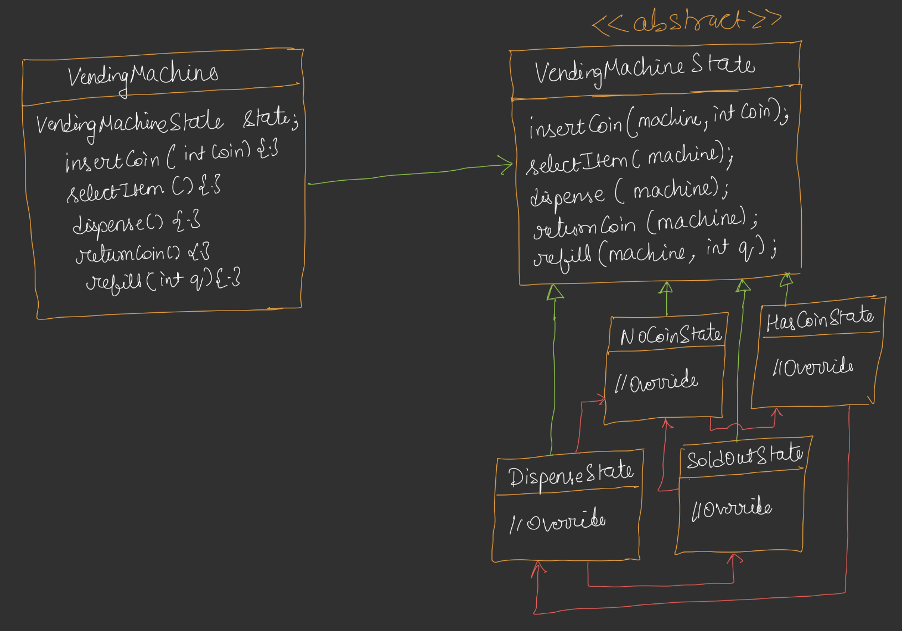

### **UML Diagram**
----------

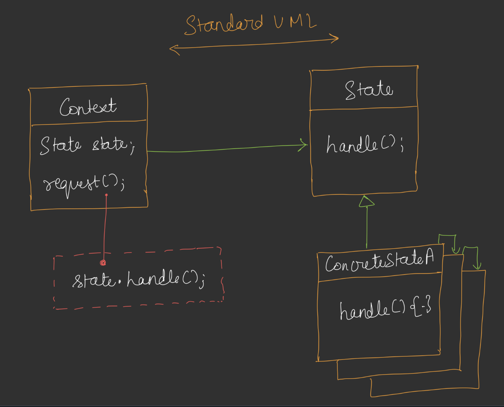

Lets try to understand better by going through the code

### **Code**
----------
```java
// Abstract State Interface
interface VendingState { // Same as VendingMachineState we have took above (just renamed it)
    VendingState insertCoin(VendingMachine machine, int coin);
    VendingState selectItem(VendingMachine machine);
    VendingState dispense(VendingMachine machine);
    VendingState returnCoin(VendingMachine machine);
    VendingState refill(VendingMachine machine, int quantity);
    String getStateName(); // Just for better visualisation, you can ignore this 
} // They all are going to return VendingState's referece thats why kept VendingState 

// Passed VendingMachine as a parameter in each as we already have discussed that VendingMachine is a dumb object it does not know what to do all it knows is that the moment its method is called, it will call the state's method, now State only knows what changes need to be done inside VendingMachine and which state to return to it hence to make these changes, it needs to have reference of VendingMachine hence takes reference of VendingMachine named as machine inside each parameter and returns VendingState reference as final

// Context Class - Vending Machine
class VendingMachine {
    private VendingState currentState; // Reference of VendingState
    private int itemCount;
    private int itemPrice;
    private int insertedCoins; // User has inserted how many coins (total amount put in by the user)
    
    // Despite all the above variables, we are also holding all the concrete state class refernce (reason has been discussed below)
    // State objects (we'll initialize these)
    private VendingState noCoinState;
    private VendingState hasCoinState;
    private VendingState dispenseState;
    private VendingState soldOutState;
    
    public VendingMachine(int itemCount, int itemPrice) {
        this.itemCount = itemCount;
        this.itemPrice = itemPrice;
        this.insertedCoins = 0; 
        
        // Create state objects (we created each state one object and kept it)
        // Reason -> Whenever VendingState gives new state or reference, it should not give a new made object instead it returns these only (will see how this will return).
        noCoinState = new NoCoinState();
        hasCoinState = new HasCoinState();
        dispenseState = new DispenseState();
        soldOutState = new SoldOutState();
        
        // Set initial state
        if (itemCount > 0) {
            currentState = noCoinState;
        } else {
            currentState = soldOutState;
        }
    }
    
    // Delegate to current state and update state based on return value
    // As VendingMachine reference needs to be passed hence "this" is used means it is passing its own reference
    public void insertCoin(int coin) {
        currentState = currentState.insertCoin(this, coin);
    }
    
    public void selectItem() {
        currentState = currentState.selectItem(this);
    }
    
    public void dispense() {
        currentState = currentState.dispense(this);
    }
    
    public void returnCoin() {
        currentState = currentState.returnCoin(this);
    }
    
    public void refill(int quantity) {
        currentState = currentState.refill(this, quantity);
    }
        
    // Print the status of Vending Machine
    public void printStatus() {
        System.out.println("\n--- Vending Machine Status ---");
        System.out.println("Items remaining: " + itemCount);
        System.out.println("Inserted coin: Rs " + insertedCoins);
        System.out.println("Current state: " + currentState.getStateName() + "\n");
    }
    
    // Getters for states as we need to update the stats present in this class refered as State Objects above
    public VendingState getNoCoinState() { 
        return noCoinState;
    }
    public VendingState getHasCoinState() { 
        return hasCoinState;
    }
    public VendingState getDispenseState() { 
        return dispenseState; 
    }
    public VendingState getSoldOutState() { 
        return soldOutState;
    }
    
    // Data access methods
    public int getItemCount() { 
        return itemCount; 
    }
    public void decrementItemCount() { 
        itemCount--; 
    }
    public void incrementItemCount(int count) {
        itemCount += count;
    }
    public void incrementItemCount() {
        itemCount += 1;
    }
    public int getInsertedCoin() { 
        return insertedCoins;
    }
    public void setInsertedCoin(int coin) { 
        insertedCoins = coin;
    }
    public void addCoin(int coin) { 
        insertedCoins += coin;
    }
    public int getPrice() {
        return this.itemPrice;
    }
    public void setPrice(int itemPrice) {
        this.itemPrice = itemPrice;
    }
}

// Concrete State: No Coin Inserted
class NoCoinState implements VendingState {
    public VendingState insertCoin(VendingMachine machine, int coin) {
        machine.setInsertedCoin(coin); // Rs 10
        System.out.println("Coin inserted. Current balance: Rs " + coin);
        return machine.getHasCoinState(); // Transition to HasCoinState means now VendingMachine operates at HasCoinState.
    }
    
    public VendingState selectItem(VendingMachine machine) {
        System.out.println("Please insert coin first!");
        return machine.getNoCoinState(); // Stay in same state
    }
    
    public VendingState dispense(VendingMachine machine) {
        System.out.println("Please insert coin and select item first!");
        return machine.getNoCoinState(); // Stay in same state
    }
    
    public VendingState returnCoin(VendingMachine machine) {
        System.out.println("No coin to return!");
        return machine.getNoCoinState(); // Stay in same state
    }

    public VendingState refill(VendingMachine machine, int quantity) {
        System.out.println("Items refilling");
        machine.incrementItemCount(quantity);
        return machine.getNoCoinState(); // Stay in same state
    }
    
    public String getStateName() {
        return "NO_COIN";
    }
}

// Concrete State: Coin Inserted
class HasCoinState implements VendingState {
    public VendingState insertCoin(VendingMachine machine, int coin) {
        machine.addCoin(coin);
        System.out.println("Additional coin inserted. Current balance: Rs " + machine.getInsertedCoin());
        return machine.getHasCoinState(); // Stay in same state as we can take more coin unless the item worth is not fulfilled
    }
    
    public VendingState selectItem(VendingMachine machine) {
        if (machine.getInsertedCoin() >= machine.getPrice()) { // Only when the item worth is fulfilled, it should change to dispense state
            System.out.println("Item selected. Dispensing...");
            
            int change = machine.getInsertedCoin() - machine.getPrice();
            if (change > 0) {
                System.out.println("Change returned: Rs " + change);
            }
            machine.setInsertedCoin(0);
            
            return machine.getDispenseState(); // Transition to DispenseState
        } 
        else {
            int needed = machine.getPrice() - machine.getInsertedCoin();
            System.out.println("Insufficient funds. Need Rs " + needed + " more.");
            return machine.getHasCoinState(); // Stay in same state
        }
    }
    
    public VendingState dispense(VendingMachine machine) {
        System.out.println("Please select an item first!");
        return machine.getHasCoinState(); // Stay in same state
    }
    
    public VendingState returnCoin(VendingMachine machine) {
        System.out.println("Coin returned: Rs " + machine.getInsertedCoin());
        machine.setInsertedCoin(0);
        return machine.getNoCoinState(); // Transition to NoCoinState
    }

    public VendingState refill(VendingMachine machine, int quantity) {
        System.out.println("Can't refil in this state");
        return machine.getHasCoinState(); // Stay in same state
    }
    
    public String getStateName() {
        return "HAS_COIN";
    }
}

// Concrete State: Item Sold
class DispenseState implements VendingState {
    public VendingState insertCoin(VendingMachine machine, int coin) {
        System.out.println("Please wait, already dispensing item. Coin returned: Rs " + coin);
        return machine.getDispenseState();  // Stay in same state
    }
    
    public VendingState selectItem(VendingMachine machine) {
        System.out.println("Already dispensing item. Please wait.");
        return machine.getDispenseState(); // Stay in same state
    }
    
    public VendingState dispense(VendingMachine machine) {
        System.out.println("Item dispensed!");
        machine.decrementItemCount();
        
        if (machine.getItemCount() > 0) {
            return machine.getNoCoinState(); // Transition to NoCoinState
        } 
        else {
            System.out.println("Machine is now sold out!");
            return machine.getSoldOutState(); // Transition to SoldOutState
        }
    }
    
    public VendingState returnCoin(VendingMachine machine) {
        System.out.println("Cannot return coin while dispensing item!");
        return machine.getDispenseState(); // Stay in same state
    }

    public VendingState refill(VendingMachine machine, int quantity) {
        System.out.println("Can't refil in this state");
        return machine.getDispenseState(); // Stay in same state
    }

    public String getStateName() {
        return "DISPENSING";
    }
}

// Concrete State: Sold Out
class SoldOutState implements VendingState {
    public VendingState insertCoin(VendingMachine machine, int coin) {
        System.out.println("Machine is sold out. Coin returned: Rs " + coin);
        return machine.getSoldOutState(); // Stay in same state
    }
    
    public VendingState selectItem(VendingMachine machine) {
        System.out.println("Machine is sold out!");
        return machine.getSoldOutState(); // Stay in same state
    }
    
    public VendingState dispense(VendingMachine machine) {
        System.out.println("Machine is sold out!");
        return machine.getSoldOutState(); // Stay in same state
    }
    
    public VendingState returnCoin(VendingMachine machine) {
        System.out.println("Machine is sold out. No coin inserted.");
        return machine.getSoldOutState(); // Stay in same state
    }

    public VendingState refill(VendingMachine machine, int quantity) {
        System.out.println("Items refilling");
        machine.incrementItemCount(quantity);
        return machine.getNoCoinState();
    }
    
    public String getStateName() {
        return "SOLD_OUT";
    }
}

// Main class for Vending Machine
public class VendingMachineMain {
    public static void main(String[] args) {
        System.out.println("=== Water Bottle VENDING MACHINE ===");
        
        int itemCount = 2;
        int itemPrice = 20;

        VendingMachine machine = new VendingMachine(itemCount, itemPrice);
        machine.printStatus();
        
        // Test scenarios - each operation potentially changes state
        // Comments added below shows the expected output after running that particular line of code
        System.out.println("1. Trying to select item without coin:");
        machine.selectItem();  // Should ask for coin, no state change
        machine.printStatus();
        
        System.out.println("2. Inserting coin:");
        machine.insertCoin(10);  // State changes to HAS_COIN
        machine.printStatus();
        
        System.out.println("3. Selecting item with insufficient funds:");
        machine.selectItem();  // Insufficient funds, stays in HAS_COIN
        machine.printStatus();
        
        System.out.println("4. Adding more coins:");
        machine.insertCoin(10);  // Add more money, stays in HAS_COIN
        machine.printStatus();
        
        System.out.println("5. Selecting item Now");
        machine.selectItem();  // State changes to SOLD
        machine.printStatus();
        
        System.out.println("6. Dispensing item:");
        machine.dispense(); // State changes to NO_COIN (items remaining)
        machine.printStatus();
        
        System.out.println("7. Buying last item:");
        machine.insertCoin(20);  // State changes to HAS_COIN
        machine.selectItem();  // State changes to SOLD
        machine.dispense(); // State changes to SOLD_OUT (no items left)
        machine.printStatus();
        
        System.out.println("8. Trying to use sold out machine:");
        machine.insertCoin(5);  // Coin returned, stays in SOLD_OUT

        System.out.println("9. Trying to use sold out machine:");
        machine.refill(2);
        machine.printStatus(); // State changes NO_COIN
    }
}

// Output ->

// === Water Bottle VENDING MACHINE ==

// -- Vending Machine Status ---
// Items remaining: 2
// Inserted coin: Rs 0
// Current state: NO_COIN

// 1. Trying to select item without coin:
// Please insert coin first!

// - Vending Machine Status ---
// Items remaining: 2
// Inserted coin: Rs 0
// Current state: NO_COIN

// 2. Inserting coin:
// Coin inserted. Current balance: Rs 10

// -- Vending Machine Status —-
// Items remaining: 2
// Inserted coin: Rs 10
// Current state: HAS_COIN

// 3. Selecting item with insufficient funds:
// Insufficient funds. Need Rs 10 more.

// --- Vending Machine Status ---
// Items remaining: 2
// Inserted coin: R§ 10
// Current state: HAS_COIN

// 4. Adding more coins:
// Additional coin inserted. Current balance: Rs 20

// -- Vending Machine Status ---
// Items remaining: 2
// Inserted coin: Rs 20
// Current state: HAS_COIN

// 5. Selecting item Now
// Item selected. Dispensing...

// --- Vending Machine Status ---
// Items remaining: 2
// Inserted coin: Rs 0
// Current state: DISPENSING

// 6. Dispensing item:
// Item dispensed!

// --- Vending Machine Status ---
// Items remaining: 1
// Inserted coin: Rs 0
// Current state: NO_COIN

// 7. Buying last item:
// Coin inserted. Current balance: Rs 20
// Item selected. Dispensing...
// Item dispensed!
// Machine is now sold out!

// --- Vending Machine Status ---
// Items remaining: 0
// Inserted coin: Rs 0
// Current state: SOLD_OUT

```

### **Summary**
----------
State pattern **allows an object to alter its behaviour when its internal state changes. The Object will appear to change the class.**

If this pattern will not be used, then a hell lot of `if-else` will be declared as a lot of permutation and combination occurs for the state and operations that can be performed on these states.

### **Real life use case**
----------

Any problem consisting of limited number of states and limited number of operations there state pattern shines and could be used.

1. **Vending Machine or ATM**
2. **Blog/Documentation Writing ->** Your blog can be on different states like **Publish, Archive, Deleted, etc..**

## **Memento Pattern**
----------
This also solves a particular type of problem which is **If you want to save the snapshot or state of the object then you will use this design pattern**

Lets consider an object named as `Ob1` now it changes its state `Ob1'` then again to `Ob1''` and you want to save these states so that if you are at `Ob1''''..n` then if you want to know which is the next state of `Ob1'`, then using the snapshot you can see which is next (even previous state can also be used).

Reason for saving the state are many things like 

**Undo feature** -> Suppose the current state is giving error or behaving mysteriously then you can just rollout back to the previous state so you will just take out that snapshot and then put it back again in that object.

So **Whenever the state of your object changes, this pattern will take and save screenshot of that state so that whenever you need to rollback, you can using that snapshot again come back to that state**

For understanding Memento Design Pattern, you need to remember these 3 keyword :-

1. **Memento** -> Every object snapshot 
2. **Originator** -> Actual original object whose state changes
3. **Caretaker** -> Manages every mementos (lists of memento or single memnto), term only justifies, takes care of mementos.

Understanding them and the pattern in depth, lets take a practical example ->

**DB Transaction Management** -> You have different types of database (SQl, NoSQL, etc...).

Now in SQL database, table consists of rows and columns and if you are doing some CRUD operation and due to some reason (ex - network issue, api call issue, etc..), the transaction fails then there will be some inconsistency in the database (i.e. Inconsistent state). So to solve this problem we **rollback** to the previous state so that by doing transaction again, we can remove this inconsistency so that you can again apply that query and then you can update the database. This is called **Atomicity**.

Same goes true for NoSQL database as well.

Basically this happens behind the hood 

```java
begin_transaction(){
    if(Evrything is fine){
        update the database
        commit();
    }else {
        rollback the database
        rollback();
    }
}
```
Now in the above Memento comes into the picture the moment you some changes, it takes a snapshot and saves it and caretaker will save this memento.

Further expanding the above problem with first making the class named as `Database`, inside it `map<string, string>mp1` acts as the table (which can be present in any SQL or NoSQL Db) whose value if gets changed then snapshot is being taken.

`createMemento(){}` will be used to take snapshot at particular state and `restore(Memento m){}` will be used to restore the state or go back to that state(here `m`) where you want to rollback.

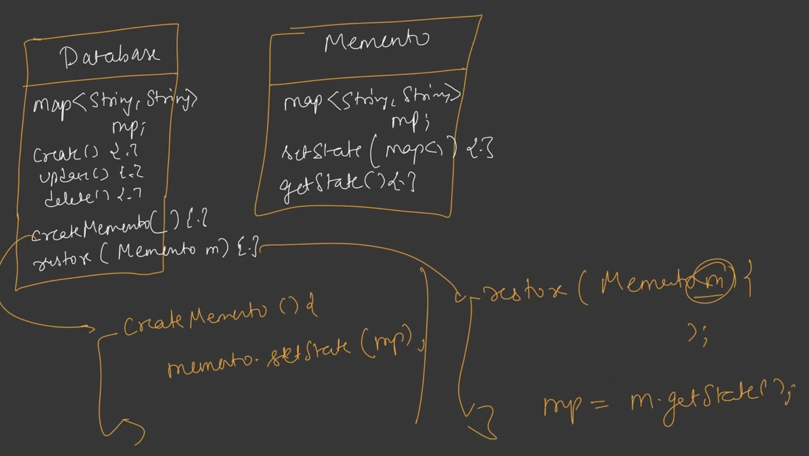

Next for Memento related stuff, making another object named as `Memento` and it will also have `map<string, string>mp` as it only has to take the snapshot, `setState(map mp){}` will take the map which you want to get saved (here `mp1`) and then it will save it in the map present inside it (here `mp`). Inside `createMemento(){}`, its implementation will be something like 

```java
createMemento(){
    memento.setState(mp1) // this mp1 will be taken and then save in mp
}
```
`getState(){}` will return the map present inside the `Memento` (here `mp`)

if we see the implementation of `restore(Memento m){}` then it will be something like

```java
restore(Memento m){
    mp1 = m.getState(); // getState will here return map mp which will lead to updation of mp1 map hence restored
}
```

Now introducing `Caretaker`, as its stores `Memento` so it must have reference of `Memento`, now here we are taking and saving only one `Memento` but there are cases where `List` of `Memento` is required 

To explain the above para in a better way -> It is just implementing the fact that we are going to store only one `Memento` as in database case, if something inconsistent happens, you will just go 1 step back[as that was the most consistent state present before error came] (i.e. the one `Memento` stored in `Caretaker`), we will not go something like 25 step back rollback

But there are situation where you have to a particular state only there storing list of `Memento` is taken.

**UML Diagram of the above case**

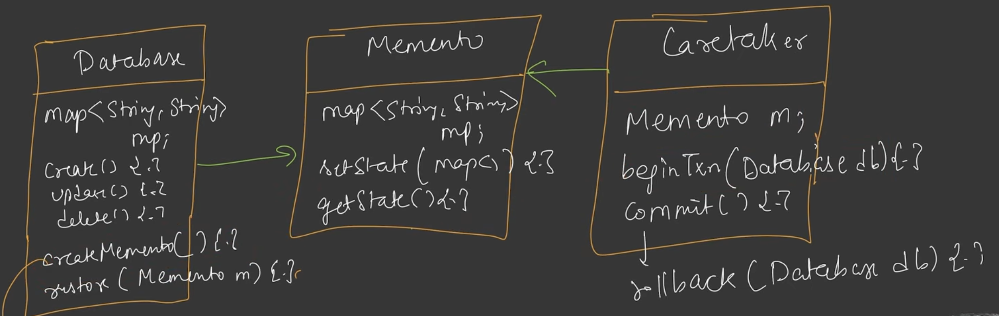

`beginTxn(Database db){}` will tell on which database the transaction is going to happen (internally it calls the `db` taken its `createMemento` method and saves it in the `m` variable of `Memento`, rest after `createMemento` method you know the flow as discussed above). This simply means that `Caretaker` has previous state of `Database` stored without even having knowledge of how the previous state of `Database` looks like as this information is present in `Memento` class.

`commit(){}` whenever this will be called, `Caretaker` will understand that memento reference present inside it (i.e. `m`) is **no longer needed** as transaction has successfully passed hence no need for rollback so no need for saving the memento

method looks something like 

```java
commit(Memento m){
    m.delete()
}
```
`rollback(Database db){}` whenever this method will be called, it will call the `restore` method of `Database` (i.e. `db.restore(m)` will send the `Memento` present with `Caretaker` that is `m`) and the moment `restore` method is called, it calls `getState(){}` method of `Memento` and rest all things happens same as discussed above.

`Caretaker` will have **"has-a"** relationship with `Memento`.

Summarising, `Client` first will call `beginTxn`, the `db` passed inside will call `createMemento` method, memento gets created and that will gets stored inside `Caretaker` (means before making any change in database, a snapshot has been taken). The moment snapshot has been created now the client is eligible to perform any CRUD operation, once these operation are done, then `Client` will decide whether the database is in consistent state if Yes, then call `commit()` method of `Caretaker` and delete the memento present  and if No, then call `rollback()` of `Caretaker`.


 ### **UML Diagram**
 ----------

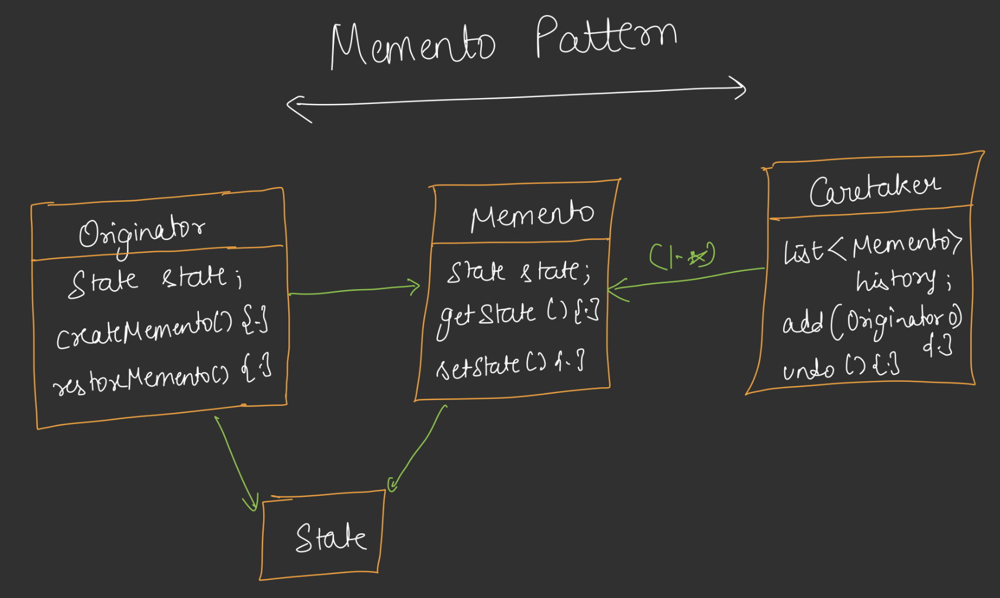

 
 ### **Summary**
 ----------
 **It provides an ability to take snapshot of an object at vaious point in time and provide undo capabilities to a previous state**
 
 ### **Code**
 ----------
 ```java
 import java.util.*;

// Memento - Stores database state snapshot
class DatabaseMemento {
   private Map<String, String> data;
   
   public DatabaseMemento(Map<String, String> dbData) { // Moment this memnto is created it will take Map, Basically took a map from its constructor and then override with its own map
       this.data = new HashMap<>(dbData); // Overriding logic
   }
   
   public Map<String, String> getState() {
       return data;
   }
}

// Originator - The database whose state we want to save/restore
class Database {
   private Map<String, String> records;
   
   public Database() {
       records = new HashMap<>();
   }
   
   // Insert a record
   public void insert(String key, String value) {
       records.put(key, value);
       System.out.println("Inserted: " + key + " = " + value);
   }
   
   // Update a record
   public void update(String key, String value) {
       if (records.containsKey(key)) {
           records.put(key, value);
           System.out.println("Updated: " + key + " = " + value);
       } else {
           System.out.println("Key not found for update: " + key);
       }
   }
   
   // Delete a record
   public void remove(String key) {
       if (records.containsKey(key)) {
           records.remove(key);
           System.out.println("Deleted: " + key);
       } else {
           System.out.println("Key not found for deletion: " + key);
       }
   }
   
   // Create memento - Save current state
   public DatabaseMemento createMemento() {
       System.out.println("Creating database backup...");
       return new DatabaseMemento(records);
   }
   
   // Restore from memento - Rollback to saved state
   public void restoreFromMemento(DatabaseMemento memento) {
       records = new HashMap<>(memento.getState());
       System.out.println("Database restored from backup!");
   }
   
   // Display current database state
   public void displayRecords() {
       System.out.println("\n--- Current Database State ---");
       if (records.isEmpty()) {
           System.out.println("Database is empty");
       } else {
           for (Map.Entry<String, String> record : records.entrySet()) {
               System.out.println(record.getKey() + " = " + record.getValue());
           }
       }
       System.out.println("-----------------------------\n");
   }
}

// Caretaker - Manages the memento (transaction manager)
class TransactionManager {
   private DatabaseMemento backup;   // Reference of DatabaseMemento
   
   public TransactionManager() { // Initially there will be no backup
       backup = null;
   }
   
   // Begin transaction - create backup
   public void beginTransaction(Database db) {
       System.out.println("=== BEGIN TRANSACTION ===");
       backup = db.createMemento();
   }
   
   // Commit transaction - discard backup
   public void commitTransaction() {
       System.out.println("=== COMMIT TRANSACTION ===");
       if (backup != null) {
           backup = null;
       }
       System.out.println("Transaction committed successfully!");
   }
   
   // Rollback transaction - restore from backup
   public void rollbackTransaction(Database db) {
       System.out.println("=== ROLLBACK TRANSACTION ===");
       if (backup != null) {
           db.restoreFromMemento(backup);
           backup = null;
           System.out.println("Transaction rolled back!");
       } else {
           System.out.println("No backup available for rollback!");
       }
   }
}

public class MementoPattern {
   public static void main(String[] args) {
       Database db = new Database();
       TransactionManager txManager = new TransactionManager();
      
       //success scenario
       txManager.beginTransaction(db);
       db.insert("user1", "Aditya");
       db.insert("user2", "Rohit");
       txManager.commitTransaction();

       db.displayRecords();

       // Failed scenario
       txManager.beginTransaction(db); // Current db ka content save kr le means user1, user2 ka data save kr liya db me
       db.insert("user3", "Saurav"); // Now two more came
       db.insert("user4", "Manish");

       db.displayRecords();
       
       // Some error lets say for some reasons 
       System.out.println("ERROR: Something went wrong during transaction!");
       txManager.rollbackTransaction(db);
       
       db.displayRecords();
   }
}

// // Output

// === BEGIN TRANSACTION ===
// Creating database backup...
// Inserted: user1 = Aditya
// Inserted: user2 = Rohit
// === COMMIT TRANSACTION ===
// Transaction committed successfully!

// -- Current Database State —-
// user1 = Aditya
// user2 = Rohit
// -------------------------

// === BEGIN TRANSACTION ===
// Creating database backup...
// Inserted: user3 = Saurav
// Inserted: user4 = Manish

// -- Current Database State --
// user1 = Aditya
// user2 = Rohit
// user3 = Saurav
// user4 = Manish
// ----------------------

// ERROR: Something went wrong during transaction!
// === ROLLBACK TRANSACTION ===
// Database restored from backup!
// Transaction rolled back!

// -- Current Database State —  // As this was the previous memento present
// user1 = Aditya
// user2 = Rohit
 ```
 
 ### **Real life use case**
 ----------
1. **DB Transaction** -> Already discussed above in detail
2. **Version control system** -> Version control system like Git where you have to rollback to previous state is implemented by this design pattern.

## **Visitor Pattern**
----------
Imagine there is class named as `Class A` which has two methods

```java
Class A{
    m1(){}
    m2(){}
}

// Now lets say some requirements came leading to addition of m3(){} method, then after some time some other requirements came leading to addition of m4(){} method and so on... 

Class A{
    m1(){}
    m2(){}
    m3(){}
    m4(){}
    ----
    ----
}
```

Can you see the problem rising here, it is breaking some of the very important principle of SOLID and some other problems like

1. **OCP** -> Repeatedly modifying the same Class leading to violation of OCP.
2. **SRP** -> Same class is handling many things hence violating single responsiblity principle.
3. **Class is getting complex** -> If you have to do unit testing, then it will be very complex to do it.

Imagine there is a DocumentElement which handles Textfile, Image, Video, so making a class named as `DocumentElement` and all types of Document element will be its child class like `Textfile`, `Image` and `Video`. Now the problem which was coming above is coming here also (i.e. different requirements are coming repeatedly hence methods are getting added)

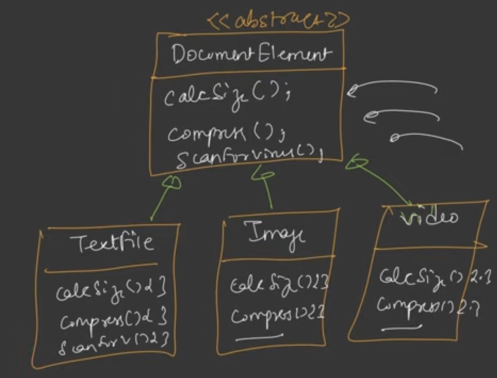

As the Parent class `DocumentElement` is growing, its child class `Textfile`, `Image` and `Video` is also growing and hence the above problem is arising here also.

> <span style="color:orange">**Remember what design pattern says -> EXTRACT WHAT CHANGES AND THEN ENCAPSULATE IT**</span>

Taking an assumption here that Types of DocumentElement (i.e. Textfile, Image and Video) are not going to change, meaning that in future, there will not be coming some new DocumentElement types. Only three types will be there and if we will do then also it will be very rare (no frequent change), Only the above 3 usecase exists only.

So **Operations are going to be frequently changed but the type of file is not going to change frequently**

So remove the operations and encapsulate it and hence introducing visitor pattern here now

Made a seperate class for frequent changing element (i.e. operation here) named as `IVisitor` and inside it made same number of methods as the number of types present(as here 3 types of DocumentElement are present hence 3 method will be made) all with the same name `visit` (we are using **Method overloading here**) but will take the type objects as parameter.

As `IVisitor` is an abstract class/interface so making its concrete class

**UML Diagram of the above case**

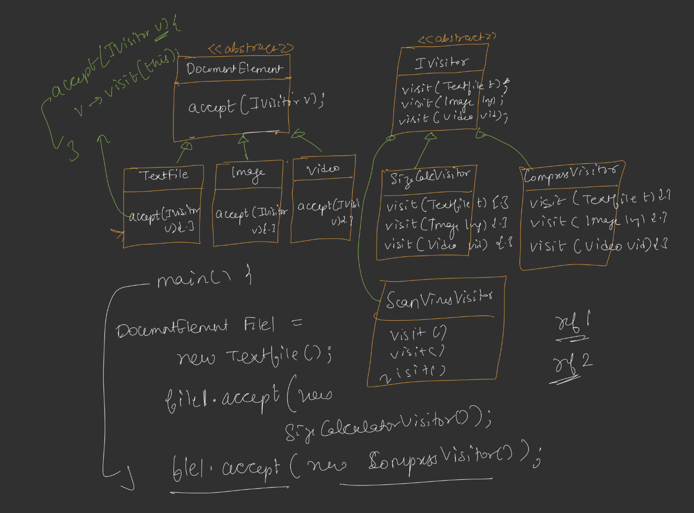

All the methods or more precisely operations that we have removed from `DocumentElement` that we are going to store it as Concrete sub classes.

All the concrete class (basically operations) inheriting `IVisitor` now will implement the 3 `visit` methods.

> <span style="color:orange">**Basically whatever operation which was present previously, we used it as a Class now.**</span>

On `DocumentElement` level, we will have only 1 method that is `accept` which takes `IVisitor` as argument, and the classes inheriting it (i.e. types of DocumentElement (Textfile, Image and Video)), they will just implement this method `accept` by taking `IVisior` object named as `v` as shown above in the UML Diagram.

Summarising, lets now take a Client (basically `main()` code) who wants to use this application, then 

```java
main(){
    DocumentElement file1 = new TextFile();  // created a particular type of DocumentElement
    // Now i want some operation to be performed on file1 like Filesize calculator
    // Doing the above task
    // file1 has only 1 method accept so
    file1.accept(new SizeCalcVisitor);  // Passed sizecalculator visitor as that only we need to calculate and accept accepts IVisitor type only

}
```
Now internally `accept(IVisitor v){}` is going to have something like below

```java
accept(IVisitor v){
    v.visit(this);  // it will call v's (which is of IVisitor type) accept method with reference passing as this
}
```

So code workflow is something like the below

v's visit gets called (as SizeCalcVisitor has been passed so) -> SizeCalcVisitor's visit method will get called (now it has 3 visit method which to call) -> as reference has been given as "this" (which means itself and it itself is a TextFile hence) visit method consisting of TextFile in the argument will get exectued -> Inside visit method, there will be logic to calculate Size of Textfile, that will get executed simple

The same above code flow will go for other operations.

### **UML Diagram**
----------
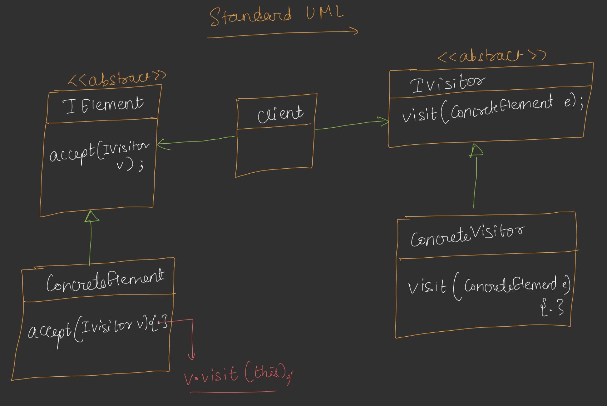

### **Double Dispatch**
----------
**It says 2 references together are deciding which method is going to be called.**

Understanding the above line by taking the example of `DocumentElement`, 

```java
DocumentElement file1 = new TextFile();
file1.accept(new SizeCalcVisitor());  // we have passed a reference of SizeCalcVisitor hence this will become REFERENCE 1 (SizeCalcVisitor)
// Using the above line we came to know that whose accept will be called (i.e. TextFile one as file1 is TextFile)

// TextFile visit method is taking another Visitor as reference
accept(IVisitor v) // so this will be become REFERENCE 2 (IVisitor), and this reference will decide from SizeCalcVisitor, which visit method will get called.
```
Hence, Double Dispatch is the entity that says that two references are deciding together that which visitor and its(visitor) which method are going to get called.

> So <span style="color:orange">**Visitor Pattern uses Double Dispatch**</span>

### **Difference between Strategy and Visitor Pattern**
----------

Before understanding the difference, first understand why this comparison is required ?

-> Strategy Pattern says a particular type of Strategy can have multiple type of behaviour and Visitor Pattern says  a particular Element can have multiple type of operations.

Can you see the similarity between these two (they are very similar when it comes for the objective they fulfill), that's why difference is important to understand between them

**Now understand the difference between Strategy Pattern and Visitor Pattern**

Taking the classic example of Robot one taken in strategy pattern

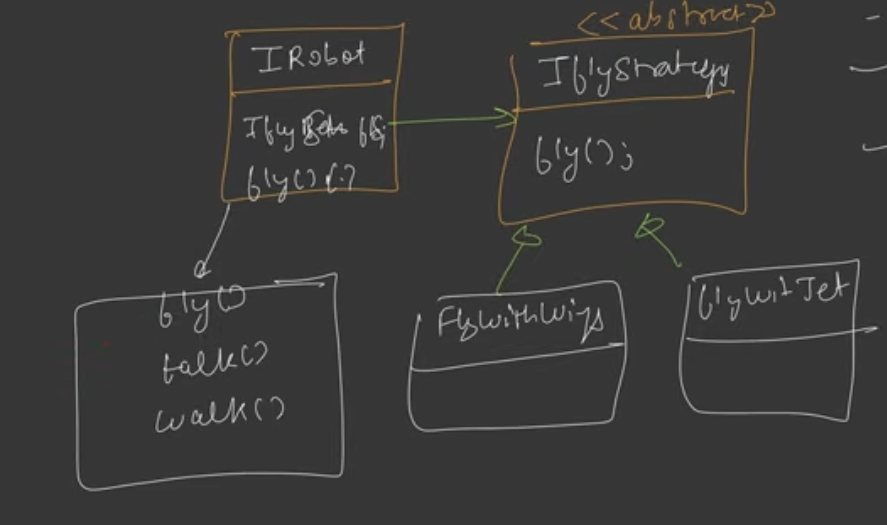

Strategy Pattern says the number of behaviour (or operations in visitor pattern term) **will remain same** (here a Robot can only `fly`, `walk` and `talk`), **But how it will fly, walk or talk, that can increase** (ex -> flywithwings, normalwalk, ducktalk, etc..), hence we use strategy pattern here.

Also again we are assuming that number of behaiour is not going to change. (i.e. new behaviour like swim is not going to come, as if it will come then we have modify the class `IRobot` by adding `swim` thus breaking OCP)

> So <span style="color:orange">**Whenever you know that number of behaviours is going to REMAIN CONSTANT, just the way of doing that behaviour is going to change, then use STRATEGY PATTERN.**</span>

On the other hand, Visitor Design Pattern says that number of behaviours is **not only fix** (i.e. currently robot is executing `fly`, `walk`, `talk` later it may even execute `swim` and so on..)**But its way of executing the behaviour should be ONE and only one.**

We will just make a normal interface `IRobot` and put a SINGLE method called as `accept(Visitor v)` which will take a `Visitor` named as `v`which will implement different behaviour (here `Visitor` will be `flyVisitor`, `walkVisitor`, `talkVisitor` similarly if some other behaviour comes in future lets say `swim` then make `swimVisitor`)

> Hence <span style="color:orange">**Whenever you know that number of behaviours is CHANGING REPEATEDLY, but the way of doing that behaviour will remain same (here only `accept` method will do whole work), then use VISITOR PATTERN**</span>

> :round_pushpin: <span style="color:skyblue">**Thats why it is always said that using both these patterns will solve any application most common problem which is Tight Coupling**</span>

### **Summary**
----------
This pattern allows to add new operation to existing classes without changing the structure. It seperates the operation from the object it operates.

### **Code**
----------
```java
abstract class FileSystemItem {
    protected String name;
    
    public FileSystemItem(String itemName) {
        this.name = itemName;
    }
    
    public String getName() {
        return name;
    }
    
    public abstract void accept(FileSystemVisitor visitor);
}

class TextFile extends FileSystemItem {
    private String content;
    
    public TextFile(String fileName, String fileContent) {
        super(fileName);
        this.content = fileContent;
    }
    
    public String getContent() {
        return content;
    }
    
    @Override
    public void accept(FileSystemVisitor visitor) {
        visitor.visit(this); // this here means TextFile so TextFile reference will get passed 
    }
}

class ImageFile extends FileSystemItem {
    
    public ImageFile(String fileName) {
        super(fileName);
    }
    
    @Override
    public void accept(FileSystemVisitor visitor) {
        visitor.visit(this);
    }
}

class VideoFile extends FileSystemItem {
    public VideoFile(String fileName) {
        super(fileName);
    }
    
    @Override
    public void accept(FileSystemVisitor visitor) {
        visitor.visit(this);
    }
}

// Visitor Interface
interface FileSystemVisitor {
    void visit(TextFile file);
    void visit(ImageFile file);
    void visit(VideoFile file);
}

// 1. Size calculation visitor
class SizeCalculationVisitor implements FileSystemVisitor {
    @Override
    public void visit(TextFile file) {
        System.out.println("Calculating size for TEXT file: " + file.getName());
    }
    
    @Override
    public void visit(ImageFile file) {
        System.out.println("Calculating size for IMAGE file: " + file.getName());
    }
    
    @Override
    public void visit(VideoFile file) {
        System.out.println("Calculating size for VIDEO file: " + file.getName());
    }
}

// 2. Compression Visitor
class CompressionVisitor implements FileSystemVisitor {
    @Override
    public void visit(TextFile file) {
        System.out.println("Compressing TEXT file: " + file.getName());
    }
    
    @Override
    public void visit(ImageFile file) {
        System.out.println("Compressing IMAGE file: " + file.getName());
    }
    
    @Override
    public void visit(VideoFile file) {
        System.out.println("Compressing VIDEO file: " + file.getName());
    }
}

// 3. Virus Scanning Visitor
class VirusScanningVisitor implements FileSystemVisitor {
    @Override
    public void visit(TextFile file) {
        System.out.println("Scanning TEXT file: " + file.getName());
    }
    
    @Override
    public void visit(ImageFile file) {
        System.out.println("Scanning IMAGE file: " + file.getName());
    }
    
    @Override
    public void visit(VideoFile file) {
        System.out.println("Scanning VIDEO file: " + file.getName());
    }
}

public class VisitorPattern {
    public static void main(String[] args) {

        FileSystemItem img1 = new ImageFile("sample.jpg");

        img1.accept(new SizeCalculationVisitor());
        img1.accept(new CompressionVisitor());
        img1.accept(new VirusScanningVisitor());

        FileSystemItem vid1 = new VideoFile("test.mp4");
        vid1.accept(new CompressionVisitor());
    }
}

// Output

// Calculating size for IMAGE file: sample.jpg
// Compressing IMAGE file: sample.jpg
// Scanning IMAGE file: sample.jpg
// Compressing VIDEO file: test.mp4
```
### **Real life use case**
----------
Just remember this -> Whenever you know that number of behaviours is CHANGING REPEATEDLY, but the way of doing that behaviour will remain same (here only `accept` method will do whole work), then use VISITOR PATTERN.

1. **Game rendering engine** -> In games there are many operation which are getting increased thorughout the time like map renders, ability unlock, new elements addition, etc.., so you dont want to change the classes frequently.
2. **Compiler** -> Not to go in deep but when you will learn compiler design in any language, they consist of something called as ASTs which are nothing but Trees denoting the operation or code you have written and traversing on them, compiler calls different visit method for different operation(like keyword, syntax, etc..) present in AST.

## **Mediator Pattern**
----------
Lets suppose there are some objects interacting among them, to make this possible one object needs to have reference of the all the other objects whom it wants to communicate with as you can see below

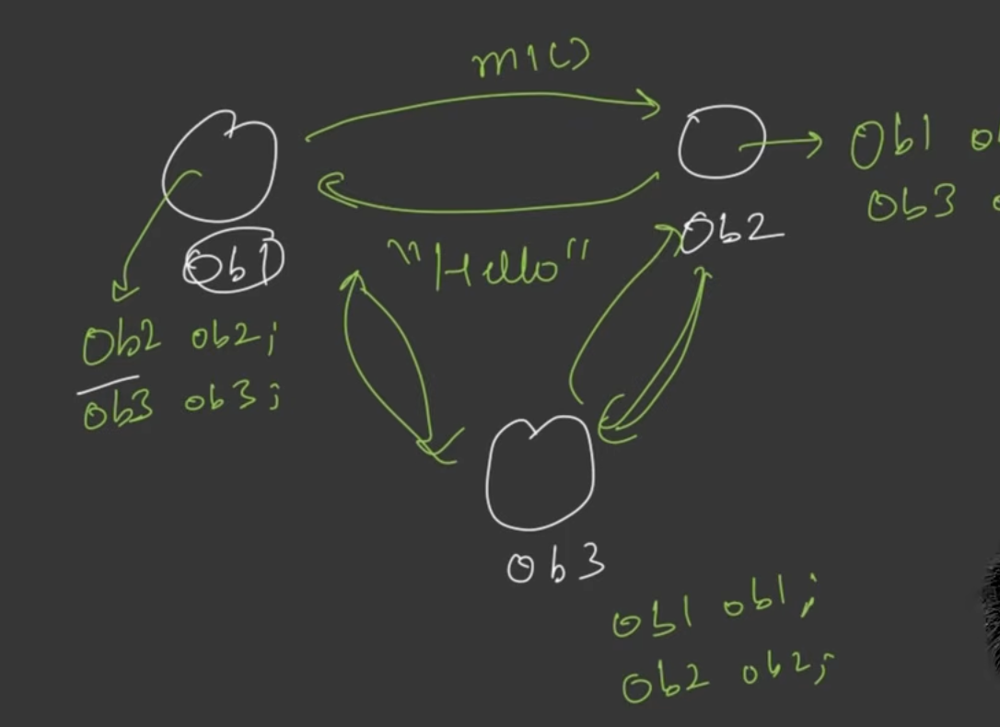

But now can you see the problem, the moment some new object comes and if an object has to communicate with it, it has to store the reference of that object and hence there will be a lot of references stored in a particular class. (it will keep on increasing)

If you have `n` objects then you need `n-1` interactions for every object to communicate with other object in that network.

**Tight Coupling** is the problem we are facing above and to solve this problem only we have Mediator design pattern.

Lets see how this design is implemented :-

Assuming 4 objects named as `ob1`, `ob2`, `ob3` and `ob4` and you have to make them communicate so first way we have already seen above, coming to the second way or Mediator way 

Introduce a **Mediator** object in between and its work is to make one object communicate with the other object.

:bulb: **How this plays and important role ?**

-> Now every object will have just reference of `Mediator` object and then lets suppose `ob1` has to send some message to `ob4` so it will send it to `Mediator` with the method content something like the below

```java
send(ob4, msg);
```
`Mediator` will understand whom to send as that object reference has been passed as argument (i.e. `ob4` here) along with `msg` it has to deliver to `ob4`, and as `Mediator` has reference of every objects present so it will forward the msg to the corresponding place.


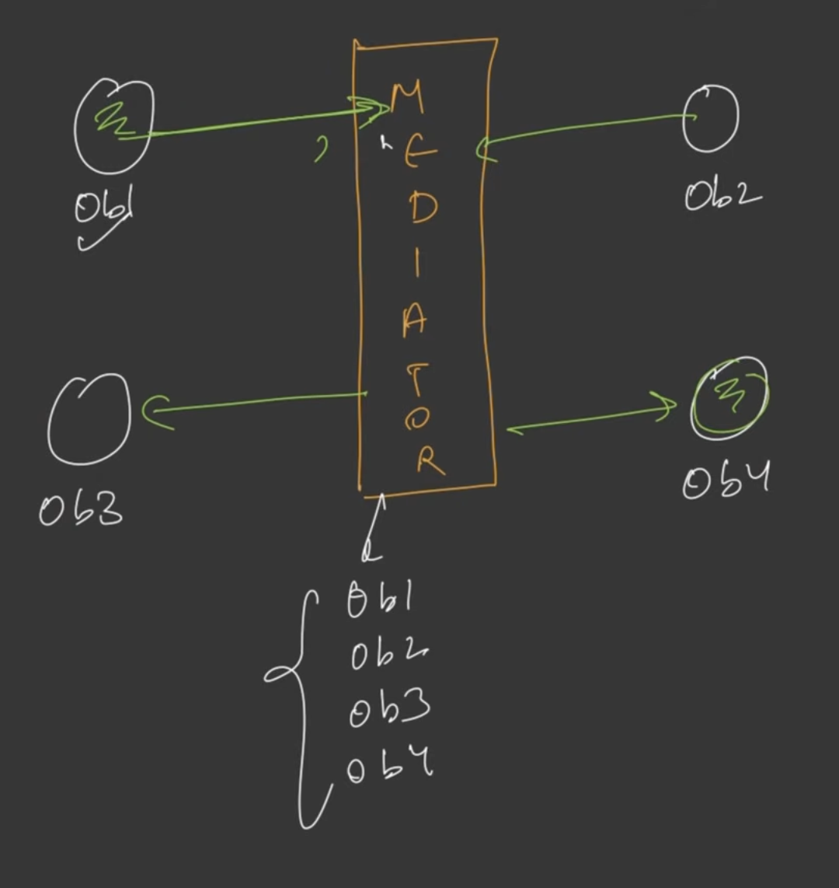

UML Diagram of the above case

Lets take a practical design example to understand it better which is ChatRoom

Assuming that mediator pattern does not exists, then trying to make UML starting off with `User` class which will have list of `Users` (`vector<User>users;`) so that one user can get refernce about the other user. Now chatRoom can have two types of functionality (either a particular user can broadcast the message (`sendAll(msg){..}` method) or it can send the message to a particular user only(`sendNormal(msg, username_to_sent){....}`), noone other than it), for getting the message it will also have `recieve(msg, name){..}` (`name` will tell from which user the `msg` has came.)

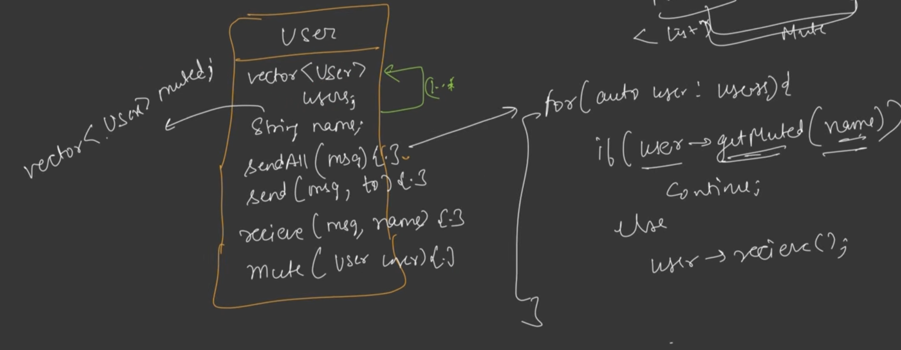

Now `sendAll(msg){..}` will work something like the below ->

It will go through all the `User` present in the list named as `users` and then will call every `User`'s `recieve` method, so every `User` will then get the message with name that who sent the message.

similary `sendNormal(msg, username_to_sent){...}` will work something like the below ->

It will go through the list `users` and then will check which `User` has name = `username_to_sent` and then it will call its `recieve` method.


**Problem with the above approach**

-> The moment you will start making object of the class `User` by doing `User u1 = new User()` and so on different `User` like `u2`, `u3`.., the list `users` made above will keep on increasing and also for every `User` it will have list of `n-1` users (assuming there are `n` users), so it will have problem like :-

1. **Memory usage is more** -> As this much list are getting made, memory consumption is going to increase.
2. **Complex object interaction** -> Lets consider a case that in the chatroom, and user `u1` has muted `u2` (means `u1` dont want any message to get displayed when it is sent by `u2`), then you will have to break the **OCP Principle** as you have to now go through every user and then insert a new list `vector<User>mute` (so that a particular user can store all the muted user he has kept so that if some muted person broadcast or send personal msg to this user then using `muted` list, its message can get ignored), with `mute(User user){..}` that will insert the `user` in the `mute` list. <span style="color:green">**[See the code -> Without Mediator] for the above case and explanation**</span>


Now we will introduce the Mediator Pattern in between and make the object interact using this mediator pattern.

Starting off with making interface  `IMediator` and then we will make the concrete mediator inheriting it 

Talking about `IMediator` methods, so what mediator can do, obviously it can 

1. Broadcast message (`sendAll (String from, String msg){}` method)
2. Private message (`sendTo(String from, String to, String msg){}` method)
3. To register new coming objects (`register(Colleagues c)` method) // Colleagues term is used for the objects that are getting mediated.

now making the `IColleagues` class and then getting its method :-

1. It should know through which it is getting mediated and hence (`IMediator mediator`), 2 users must know about the mediator hence stored reference of `IMediator`
2. Broadcasting message (`sendAll(msg)` method), it will have this method which it will send to the mediator and then mediator will broadcast this message to all.
3. Private message sending (`sendTo(to, msg)` method), so that it can send to the mediator to send it further to the user he/she wants to send.

The above two methods `sendAll....` and `sendTo...` will call the `IMediator`'s `sendAll...` and `sendTo..`

4. Recieving message (`recieve(from, msg)` method)


**UML Diagram of the above case and explanation**

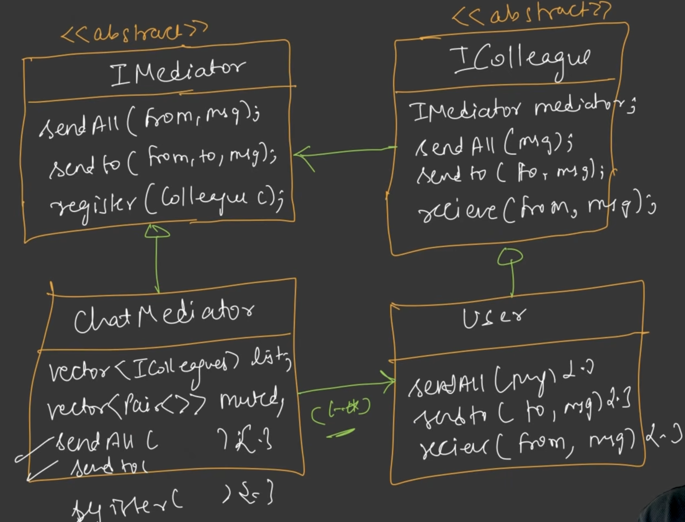

Finally making the concrete class `ChatMediator` (will have list of all the objects as it needs to store all the reference of the class `User`) inheriting `IMediator` and `User` inheriting `IColleagues`

Now whenever you have to add some new functionality like `mute` then you just have to make and maintain only one list that is `vector<Pair<String, String>>muted` ("who" muted "whom" pair is getting stored here) inside `ChatMediator`, rest all overriding all the methods present inside `IMediator` as it is inheriting it, and similar to this `User` will also override all the methods present inside `IColleagues` as it is inheriting it.

<span style="color:green">**See the code -> With Mediator for beter understanding of this pattern**</span>

:bulb:<span style="color:red">**You might be thinking that this is very similar to Observer pattern as they both are doing same work**</span>

-> You might have the above question arised in your mind as see the similarity 

Here `Mediator` is same as `Observable` in Observer pattern and `Colleagues` is same as `Observer` in Observer pattern.

### **Difference between Observer and Mediator Pattern**
----------
Difference is very small but yes they are almost similar due to the similar work they perform.

<div align="center">

| <div align="center">Observer Pattern</div> | <div align="center">Mediator Pattern</div> |
|---|---|
| Its main work is not to make two observers or objects interact, its main work is that whenever its (Observable) state will change then all the observers should get notified about this state change | Its main work is to act as a mediator and then make the two objects interact through them or using mediator |
| Intent -> Moment state changes, all should get notified | Intent -> Make two objects interact with each other|
| Ex -> Notification system, etc.. | Ex -> ChatRoom, etc.. |

</div>


### **UML Diagram**
----------
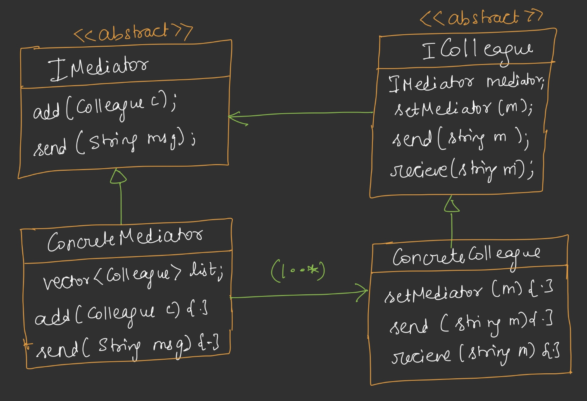

### **Summary**
----------
It **defines an object that encapsulate how a set of objects interact, and promote loose coupling by preventing them from referring to each other.**

### **Code**
----------

#### **Without Mediator**


```java
import java.util.*;

// Each User knows all the others directly.
// If you have N users, you wind up wiring N*(N–1)/2 connections, or simply saying N-1 users information 
// and every new feature (mute, private send, logging...) lives in User too.

class User {
    private String name;
    private List<User> peers;  // list of all the user this user wants to have interaction with
    private List<String> mutedUsers; // list of all the user this user wants to not get message from (just stored the name hence String datatype is used, you can even take User)
    
    public User(String n) {
        name = n;
        peers = new ArrayList<>();
        mutedUsers = new ArrayList<>();
    }
    
    // must manually connect every pair → N^2 wiring
    public void addPeer(User u) {
        peers.add(u);
    }
    
    // duplication: everyone has its own mute list
    public void mute(String userToMute) {
        mutedUsers.add(userToMute);
    }
    
    // broadcast to all peers
    public void send(String msg) {
        System.out.println("[" + name + " broadcasts]: " + msg);
        for (User peer : peers) {
            
            // if they have muted me dont send.
            if(!peer.isMuted(name)) {
                peer.receive(name, msg);
            }
        }
    }
    
    public boolean isMuted(String userName) {
        for(String name : mutedUsers) {
            if(name.equals(userName)) {
                return true;
            }
        }
        return false;
    }
    
    // private send - duplicated in every class
    public void sendTo(User target, String msg) {
        System.out.println("[" + name + "→" + target.name + "]: " + msg);
        if(!target.isMuted(name)) {
            target.receive(name, msg);
        }
    }
    
    public void receive(String from, String msg) {
        System.out.println("    " + name + " got from " + from + ": " + msg);
    }
}

public class WithoutMediator {
    public static void main(String[] args) {
        // create users
        User user1 = new User("Rohan");
        User user2 = new User("Neha");
        User user3 = new User("Mohan");
        
        // wire up peers (each knows each other) → n*(n-1)/2 connections
        user1.addPeer(user2);   
        user2.addPeer(user1);

        user1.addPeer(user3);   
        user3.addPeer(user1);
        
        user2.addPeer(user3); 
        user3.addPeer(user2);
        
        // mute example: Mohan mutes Rohan (Hence Rohan add Mohan to its muted list).
        user1.mute("Mohan");
        
        // broadcast
        user1.send("Hello everyone!");
        
        // private
        user3.sendTo(user2, "Hey Neha!");
    }
}

// Output 

// [Rohan broadcasts]: Hello everyone!   
//      Neha got from Rohan: Hello everyone!
//      Mohan got from Rohan: Hello everyone!
// [Mohan-Neha]: Hey Neha!
//      Neha got from Mohan: Hey Neha!  
```

#### **With Mediator**

```java
import java.util.*;

// ─────────────── Mediator Interface ───────────────
interface IMediator {
    void registerColleague(Colleague c);
    void send(String from, String msg);
    void sendPrivate(String from, String to, String msg);
}

// ─────────────── Colleague Interface ───────────────
abstract class Colleague {
    protected IMediator mediator;  
    
    public Colleague(IMediator m) {
        mediator = m;
        mediator.registerColleague(this); // This same is done in Observer pattern, the moment any Colleague is made, it inside his own constructor called register by passing its own reference. (means the moment colleague got created, mediator got its reference (i.e. got stored inside the list))
    }
    
    public abstract String getName();
    public abstract void send(String msg); // For Braodcasting message 
    public abstract void sendPrivate(String to, String msg);
    public abstract void receive(String from, String msg);
}

// Simple Pair class
class Pair<T, U> {
    public final T first;
    public final U second;
    
    public Pair(T first, U second) {
        this.first = first;
        this.second = second;
    }
}

// ─────────────── Concrete Mediator ───────────────
class ChatMediator implements IMediator {
    private List<Colleague> colleagues;
    private List<Pair<String, String>> mutes; // (muter, muted) "who" muted "whom" list stored by Mediator  
    
    public ChatMediator() {
        colleagues = new ArrayList<>();
        mutes = new ArrayList<>();
    }
    
    public void registerColleague(Colleague c) {
        colleagues.add(c);
    }
    
    public void mute(String who, String whom) {
        mutes.add(new Pair<>(who, whom));
    }
    
    public void send(String from, String msg) {
        System.out.println("[" + from + " broadcasts]: " + msg);
        for (Colleague c : colleagues) {
            // Don't send msg to itself.
            if (c.getName().equals(from)) {
                continue;
            }

            boolean isMuted = false;
            // Ignore if person is muted (basically checking that the person whom we are sending the message has blocked me or not)
            for (Pair<String, String> p : mutes) {
                if (from.equals(p.second) && c.getName().equals(p.first)) {
                    isMuted = true;
                    break;
                }
            }
            if (!isMuted) {
                c.receive(from, msg);
            }
        }
    }
    
    public void sendPrivate(String from, String to, String msg) {
        System.out.println("[" + from + "→" + to + "]: " + msg);
        for (Colleague c : colleagues) {
            if (c.getName().equals(to)) {
                for (Pair<String, String> p : mutes) {
                    //Dont send if muted
                    if (from.equals(p.second) && to.equals(p.first)) {
                        System.out.println("\n[Message is muted]\n");
                        return;
                    }
                }
                c.receive(from, msg);
                return;
            }
        }
        System.out.println("[Mediator] User \"" + to + "\" not found]");
    }
}

// ─────────────── Concrete Colleague ───────────────
class User extends Colleague {
    private String name;
    
    public User(String n, IMediator m) {
        super(m);
        name = n;
    }
    
    @Override
    public String getName() {
        return name;
    }
    
    @Override
    public void send(String msg) {
        mediator.send(name, msg);
    }
    
    @Override
    public void sendPrivate(String to, String msg) {
        mediator.sendPrivate(name, to, msg);
    }
    
    @Override
    public void receive(String from, String msg) {
        System.out.println("    " + name + " got from " + from + ": " + msg);
    }
}

// ─────────────── Demo ───────────────
public class MediatorPattern {
    public static void main(String[] args) {
        ChatMediator chatRoom = new ChatMediator();
        
        // Can you just see now you dont have to create any connection by yourself as you were doing in previous by addPeers and so on..
        // Now no user has to know about the other user so Abstraction also achieved.
        User user1 = new User("Rohan", chatRoom);
        User user2 = new User("Neha", chatRoom);
        User user3 = new User("Mohan", chatRoom);
        
        // Rohan mutes Mohan
        chatRoom.mute("Rohan", "Mohan");
        
        // broadcast from Rohan
        user1.send("Hello Everyone!");
        
        // private from Mohan to Neha
        user3.sendPrivate("Neha", "Hey Neha!");
    }
}

// Output

// [Rohan broadcasts]: Hello Everyone! E
//      Neha got from Rohan: Hello Everyone!
//      Mohan got from Rohan: Hello Everyone!
// [Mohan-Neha]: Hey Neha!
//      Neha got from Mohan: Hey Neha!
```

### **Real life use case**
----------
1. **ChatRooms**
2. **Matchmaking Apps** -> Any website or app (like chess.com) in which multiple users are playing and interacting with each other through messages (they dont have their reference like phone number, email or something else still they are able to send and recieve the message).

# **Anti Pattern**

Till now we have learnt about the SOLID principle, these principle make sure that your code is not tightly coupled but we have also learnt that its not any hard and fast rule to implement it, sometimes we have to take some tradeoffs so that our rules become simpler.

Then we came to know about design patterns and realised that it is going to solve most of the problems but now we are going to learn about Anti Patterns.

**Anti Patterns** -> Things which you do by mistake in your code due to which you have to face some problem in the future.

Lets discuss some of the Anti Patterns :-

## **God Object**
----------

It tells that if you have class or object and you have given too much responsiblities, then you call this object **God Object** due to which the code becomes tightly coupled. If in the future, some problem comes in this object then it will lead to failure of most of the feature. It is breaking SRP as well as making the code vulnerable to error.

### **Solution to the above problem**
----------

Client and Orchestration object(or basically god object here) which we have should be made in such a way that it does not handle things by itself, instead it delegates the things to other objects.

## **Sphagetti Code**
----------

Making your code too much complicated such that it does not have any entry or exit point, all things are getting complicated and whole code is tightly coupled, also leading to error prone.

## **Hard coding things**
----------

Many times we hard code many things or values be it passing some concrete values inside the constructor or setting the concrete values to variable. **Avoid it as much as possible, use only when you know that the value is not going to change**

## **Gold plating or Over engineering**
----------

If you have made a system using oops best practice, solid principle, and all design patterns used at perfect place then you will end up making a system which in general called as over engineered system. **This will also have a problem -> you are basically handling the case or scenarios which are never going to arise.**


## **DRY**
----------

**DRY stands for Dont Repeat Yourself** -> You saw that `m1` code is very similar to `m2` and so with `m3` so you just took out the code from `m1` and copy pasted to `m2` and `m3` but now the problem will arise, lets suppose `m1` code got changed then you have to change in `m2` and `m3` as well thus breaking OCP principle.

### **Solution to the above problme**
----------
Remove the repeated code and put them into some other utility class or hiearchy, method  (basically make it seperate logic)

## **Constructor Overloading**
----------
If you have gone through Builder design pattern, there also this things has been discussed and solution to this problem is using **Builder design pattern**

## **Over use of getters-setters**
----------

Now a days what is happening is that, we are writing getters and setters for every variable without even knowing that whether we need getters and setters for that variable or not. 

## **Premature Optimisation**
----------

Instead of first making the code optimised, first focus on making it work.

> <span style="color:orange">**Make it work then make it fast.**</span>

## **Overuse of Inheritance**
----------

We have already discussed at the starting why inheritance is bad ? and to solve this we have seen and introduced many design patterns like strategy, visitor, etc...


## **Null Object Pattern**
----------
This is a very small pattern that just indicates that you should avoid `null` check (ex ->`if(ob1 == null)`) as much as possible.

Throughout whole journey of OOPs, we have learned that **Replace Conditionals with Polymorphism.** and this pattern tries to follow this suggestion only.

You can understand better with the UNL Diagram made below 

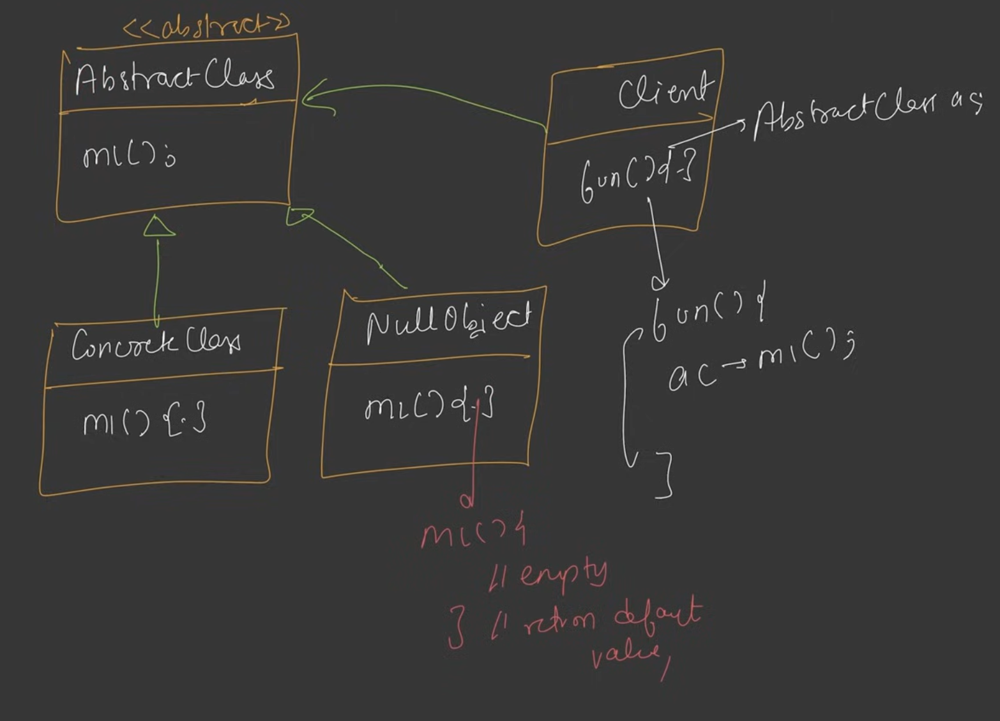

We have an abstract class named as `AbstractClass` inside which consists of method `m1`, now concrete class will override this method and along with this a concrete class named as `NullObject` is also made for Null Object pattern implementation.

inside `m1` of `NullObject` below logic will be present

```java
m1(){
    // Either it will have nothing means Empty 
    // Or it will return default value
}
```

Now you will understand why we need to make `NullObject` for this, lets say `Client` has a method `fun` and will have reference of `AbstractClass` to call the functions of it. Now you dont have to check inside `fun` method while calling `m1` method that it is NULL of not, it will always have a reference so instead of NULL check we have returned `NullObject` class object. This will not throw any exception or error, **Basically LSP principle will note get violated.**

Summarising, Apart from concrete classes, keep another class `NullObject` which will either return nothing or will return default value (like return 0, return " ").

You have already used this pattern inside Strategy pattern, Command pattern, figure out how this pattern is getting implemented in these patterns.


 

 


 


 
